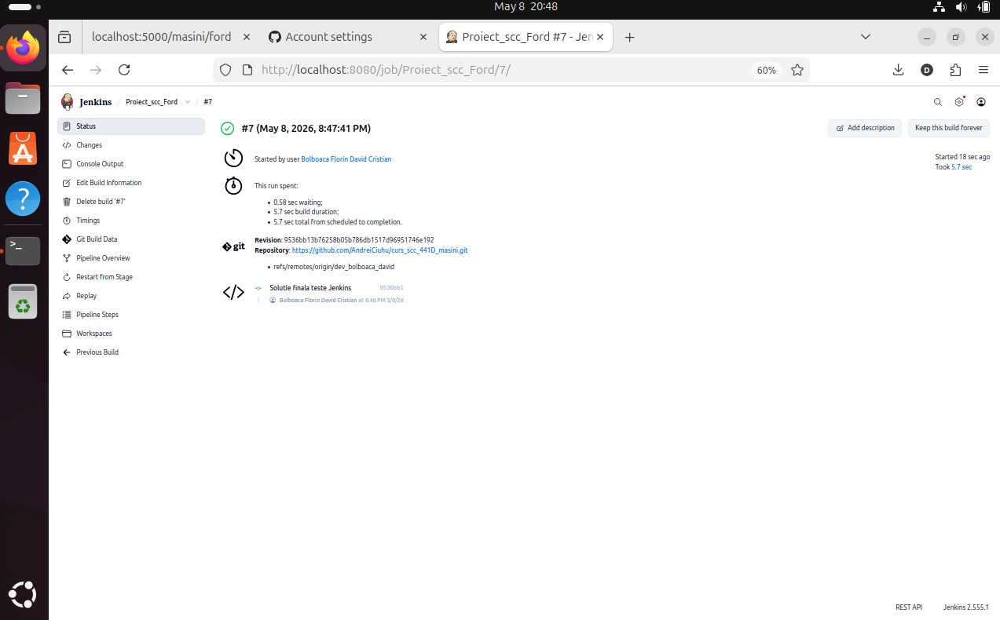

# curs_scc_441D_masini

# Dezvoltator: Bolboaca Florin David Cristian
# Tema masini aleasa: Ford

## Functionalitate adaugata
Functionalitate pentru marca Ford in cadrul temei Masini
Fisiere adaugate:
-app/lib/biblioteca_masini.py - functiile descriere_ford() si culoare_ford()
-app/routes/ford.py - blueprint cu rutele Ford
-app/test/test_ford.py - unit teste

Rute adaugate:
-/masini/ford - pagina elementului
-/masini/ford/culoare - apeleaza culoarea
-/masini/ford/descriere - apeleaza descrierea

## Stadiul implementarii
-Cod
-Teste
-Jenkinsfile
-Dockerfile

## Testare manuala
Aplicatia a fost pornita local si rutele au fost accesate din browser.

## Testare cu Jenkins
Testele au fost rulate cu Jenkins si au trecut.

## Fisier Jenkins
Pipeline declarativ cu doua stage-uri: Install dependencies si Run tests.

## Integrare
PR creat pentru integrarea din dev_bolboaca_david in main_bolboaca_david.
Status: in asteptare review.

## Containerizare
Am creat si rulat imaginea docker cu succes.

## Ce mai este de facut
-Astept review pentru PR
-De pus screenshots
-De facut review la un coleg

## Testare manuală

## Testare cu Jenkins

## Containerizare

## Stadiul proiectelor grupei

| Element | Dezvoltator | Implementare | Testare | Integrare |
| :--- | :--- | :---: | :---: | :---: |
| Ford | Bolboacă David | X | X | X |
