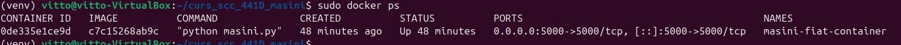
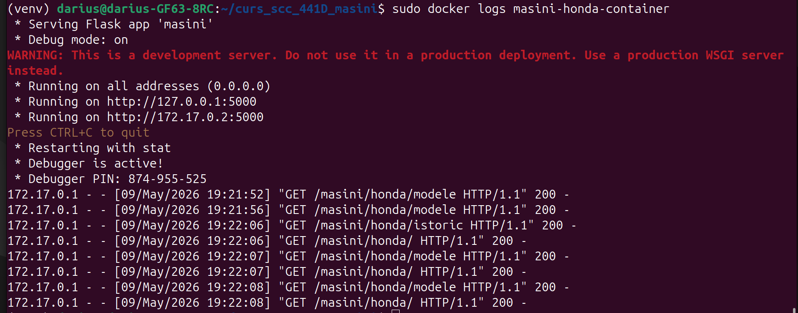
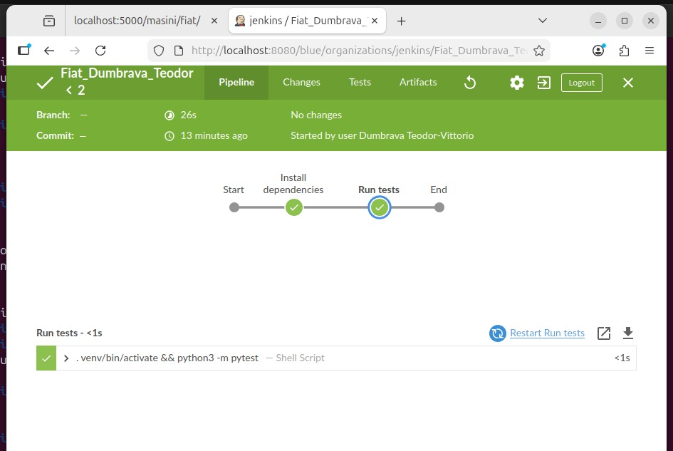

# Proiect SCC - Mașini - Fiat

## Date student

Student: Dumbrava Teodor  
Grupa: 441D  
Tema: Mașini  
Element ales: Fiat  

---

## Funcționalitate adăugată

În cadrul proiectului am adăugat funcționalitate pentru marca auto **Fiat**.

Funcționalitatea este implementată în aplicația Flask a proiectului și permite afișarea unor informații despre marca Fiat.

Au fost create două funcții în fișierul:

```txt
app/lib/biblioteca_masini.py
```

Funcțiile adăugate sunt:

```python
descriere_fiat()
modele_fiat()
```

### Descriere funcții

Funcția `descriere_fiat()` returnează o scurtă descriere a mărcii Fiat.

Funcția `modele_fiat()` returnează câteva modele cunoscute ale producătorului Fiat.

---

## Rute adăugate

În aplicația Flask au fost adăugate următoarele rute:

```txt
/masini/fiat
/masini/fiat/descriere
/masini/fiat/modele
```

Ruta principală `/` conține link-uri către funcționalitatea Fiat.

### Rute disponibile

- `/masini/fiat` - afișează pagina principală pentru Fiat
- `/masini/fiat/descriere` - afișează descrierea mărcii Fiat
- `/masini/fiat/modele` - afișează modele cunoscute Fiat

---

## Fișiere modificate/adăugate

Pentru funcționalitatea Fiat au fost modificate sau adăugate următoarele fișiere:

```txt
masini.py
app/__init__.py
app/lib/__init__.py
app/lib/biblioteca_masini.py
app/routes/fiat.py
app/test/test_fiat.py
Jenkinsfile
Dockerfile
README.md
```

---

## Testare locală

A fost creat fișierul de test:

```txt
app/test/test_fiat.py
```

Testele verifică:

- dacă funcția `descriere_fiat()` returnează un text care conține marca Fiat;
- dacă funcția `modele_fiat()` returnează modele cunoscute precum Fiat 500, Fiat Panda și Fiat Tipo.

Testele au fost rulate local cu următoarea comandă:

```bash
pytest
```

Rezultat obținut:

```txt
2 passed
```

---

## Jenkins

A fost adăugat fișierul:

```txt
Jenkinsfile
```

Pipeline-ul Jenkins conține următoarele etape:

1. instalarea dependențelor din `requirement.txt`;
2. rularea testelor automate cu `pytest`.

Pipeline-ul Jenkins a fost rulat cu succes pe branch-ul:

```txt
dev_dumbrava_teodor
```

Rezultat Jenkins:

```txt
2 passed
Finished: SUCCESS
```

---

## Docker

A fost adăugat fișierul:

```txt
Dockerfile
```

Acesta este folosit pentru containerizarea aplicației Flask.

Imaginea Docker a fost construită cu următoarea comandă:

```bash
sudo docker build -t masini-fiat-dumbrava .
```

Containerul Docker a fost pornit cu următoarea comandă:

```bash
sudo docker run -d --name masini-fiat-container -p 5000:5000 masini-fiat-dumbrava
```

Containerul a fost verificat cu:

```bash
sudo docker ps
```

Aplicația rulată în container poate fi accesată în browser la:

```txt
http://localhost:5000
```

Rutele Fiat accesibile în browser sunt:

```txt
http://localhost:5000/masini/fiat
http://localhost:5000/masini/fiat/descriere
http://localhost:5000/masini/fiat/modele
```

Logurile containerului au fost verificate cu:

```bash
sudo docker logs masini-fiat-container
```

În loguri se observă cererile HTTP realizate de browser către aplicația rulată în container.

---

## Capturi de ecran realizate

### Testare locală cu pytest


### Construirea imaginii Docker


### Container Docker pornit



### Aplicația rulată în browser din container


### Logurile containerului



### Jenkins build SUCCESS



---
## Integrare GitHub

Codul a fost adăugat pe branch-ul personal de dezvoltare:

```txt
dev_dumbrava_teodor
```

A fost creat și branch-ul personal de integrare:

```txt
main_dumbrava_teodor
```

Următorul pas este crearea unui Pull Request din:

```txt
dev_dumbrava_teodor
```

către:

```txt
main_dumbrava_teodor
```

După review, modificările pot fi integrate în branch-ul principal al proiectului.

---

## Pull Request-uri verificate

Momentan nu au fost adăugate review-uri pentru Pull Request-urile colegilor.

---

## Stadiu proiect

| Componentă | Status |
|---|---|
| Funcționalitate Fiat | Finalizată |
| Rute Flask | Finalizate |
| Teste locale | Finalizate |
| Jenkinsfile | Finalizat |
| Jenkins build | SUCCESS |
| Dockerfile | Finalizat |
| Imagine Docker | Creată |
| Container Docker | Pornit și testat |
| Documentație README | Finalizată |
| Pull Request `dev_dumbrava_teodor -> main_dumbrava_teodor` | Finalizat |
| Review coleg | Finalizat |
| Merge în `main_dumbrava_teodor` | Finalizat |
| Pull Request `main_dumbrava_teodor -> main` | Urmează |

---
## Ce mai este de făcut

- creare Pull Request din `main_dumbrava_teodor` către `main`;
