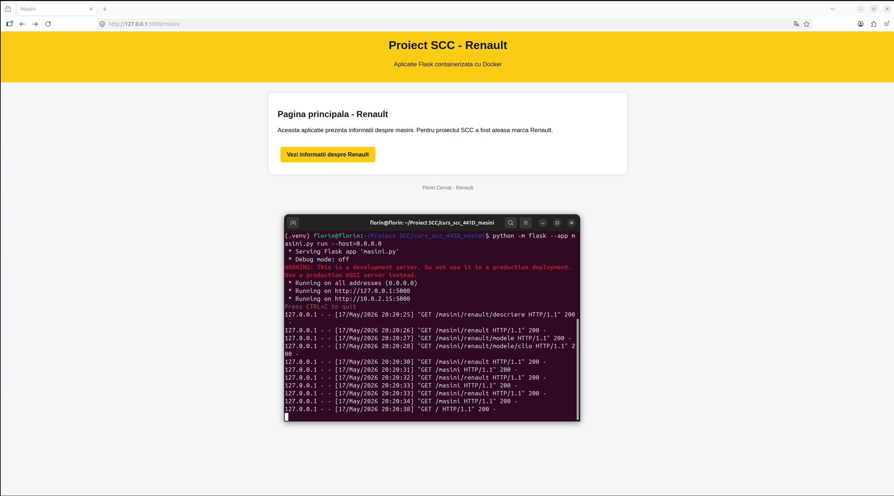
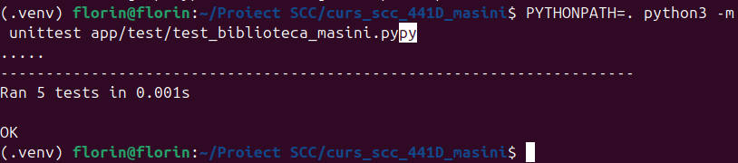
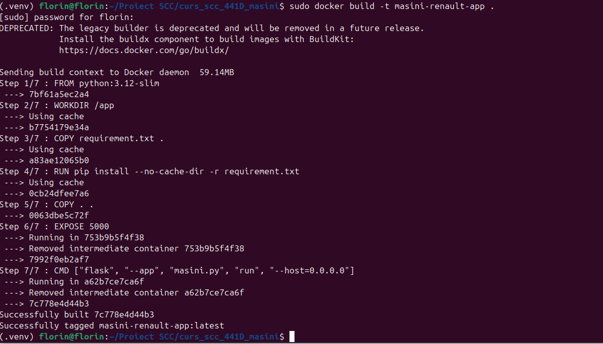
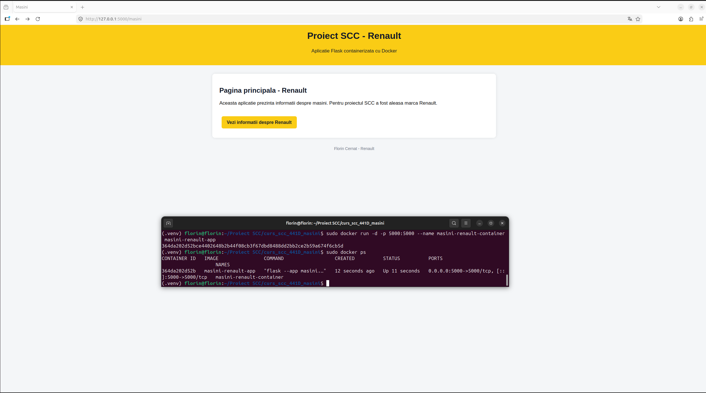

# Proiect SCC - Renault

## Dezvoltator

Nume: Florin Cernat  
Branch principal: main_Florin_Cernat  
Branch dezvoltare: dev_Florin_Cernat  
Marca aleasa: Renault

---

## Descriere proiect

Acest proiect este o aplicatie web simpla realizata in Flask pentru disciplina Servicii Cloud si Containerizare.

Aplicatia prezinta marca Renault si contine o interfata web simpla cu pagini pentru descrierea marcii si pentru mai multe modele Renault.

Modelele incluse sunt:

- Renault Clio
- Renault Megane
- Renault Captur
- Renault Austral
- Renault Arkana
- Renault Talisman

Pentru fiecare model sunt afisate informatii despre caroserie, culori disponibile, motorizari, dotari si utilizare recomandata.

---

## Functionalitate implementata

Au fost implementate:

- functii in `app/lib/biblioteca_masini.py`
- rute Flask in `app/routes/renault.py`
- interfata web simpla pentru navigare
- teste unitare
- Dockerfile pentru containerizare
- Jenkinsfile pentru rularea automata a pipeline-ului

---

## Rute disponibile

| Ruta | Descriere |
|---|---|
| `/` | Pagina principala a aplicatiei |
| `/masini` | Pagina principala Renault |
| `/masini/renault` | Pagina marcii Renault |
| `/masini/renault/descriere` | Descriere Renault |
| `/masini/renault/modele` | Lista modele Renault |
| `/masini/renault/modele/clio` | Detalii Renault Clio |
| `/masini/renault/modele/megane` | Detalii Renault Megane |
| `/masini/renault/modele/captur` | Detalii Renault Captur |
| `/masini/renault/modele/austral` | Detalii Renault Austral |
| `/masini/renault/modele/arkana` | Detalii Renault Arkana |
| `/masini/renault/modele/talisman` | Detalii Renault Talisman |

---

## Fisiere modificate/adaugate

- `app/lib/biblioteca_masini.py`
- `app/lib/__init__.py`
- `app/routes/renault.py`
- `app/test/test_biblioteca_masini.py`
- `masini.py`
- `Dockerfile`
- `Jenkinsfile`
- `.gitignore`
- `README.md`

---

## Stadiul implementarii

- [x] Cod Flask
- [x] Interfata web
- [x] Functii biblioteca
- [x] Rute Renault
- [x] Teste unitare
- [x] Dockerfile
- [x] Jenkinsfile
- [x] Testare locala
- [x] Testare Docker
- [ ] Testare Jenkins
- [ ] Pull Request
- [ ] Review Pull Request

---

## Testare locala

Aplicatia a fost pornita local cu:

    python -m flask --app masini.py run --host=0.0.0.0

Au fost testate in browser rutele principale:

    http://127.0.0.1:5000/masini
    http://127.0.0.1:5000/masini/renault
    http://127.0.0.1:5000/masini/renault/descriere
    http://127.0.0.1:5000/masini/renault/modele
    http://127.0.0.1:5000/masini/renault/modele/megane
    http://127.0.0.1:5000/masini/renault/modele/talisman

Rezultat: aplicatia a functionat corect.

Screenshot testare locala:

---

## Teste unitare

Testele au fost rulate cu:

    PYTHONPATH=. python3 -m unittest app/test/test_biblioteca_masini.py

Rezultat:

    Ran 5 tests
    OK

Screenshot teste unitare:

---

## Docker

Imaginea Docker a fost construita cu:

    sudo docker build -t masini-renault-app .

Containerul a fost pornit cu:

    sudo docker run -d -p 5000:5000 --name masini-renault-container masini-renault-app

Containerul a fost verificat cu:

    sudo docker ps

Aplicatia a fost testata in browser si a functionat corect.

Screenshot Docker build/container:

Screenshot aplicatie rulata din Docker:

---

## Jenkins

Fisierul `Jenkinsfile` contine un pipeline cu urmatoarele etape:

1. Build Docker image
2. Run tests in Docker
3. Run container

Screenshot Jenkins PASS:

[poza aici]

---

## Git si integrare

Dezvoltarea a fost realizata pe branch-ul:

    dev_Florin_Cernat

Pull Request planificat:

    dev_Florin_Cernat -> main_Florin_Cernat

Status PR: in asteptare.

---

## Review PR

Momentan nu am realizat un review la PR-ul unui coleg.

---

## Surse informatie

- Wikipedia - pentru descrierea generala Renault
- Auto-Data - pentru structura informatiilor tehnice si exemple de motorizari

Informatiile au fost simplificate pentru scopul proiectului.

---

## Ce mai este de facut

- rularea pipeline-ului in Jenkins
- adaugarea screenshot-ului Jenkins PASS
- crearea Pull Request-ului
- realizarea unui review pentru un PR al unui coleg
