# Proiect SCC 2026 - Mașini (Grupa 441D)

Acest repository conține toate contribuțiile individuale realizate în cadrul acestui proiect. Fiecare secțiune din acest document corespunde unui branch individual de forma `main_nume_prenume` și include documentația aferentă contribuției respective.

Scopul acestui README este de a oferi o imagine de ansamblu asupra întregului proiect, centralizând într-un singur fișier informațiile tehnice, explicațiile, capturile de ecran și resursele documentare adăugate de fiecare membru. Tema aleasă este: Mașini.

## Cuprins

- [Andronie Laurentiu](#andronie-laurentiu)
- [Aniculesei Mihnea](#aniculesei-mihnea)
- [Anton Darius](#anton-darius)
- [Baroiu Silvian](#baroiu-silvian)
- [Bolboaca David](#bolboaca-david)
- [Ciuhureanu Andrei](#ciuhureanu-andrei)
- [Cubic Vlad](#cubic-vlad)
- [Dragomir Tiberiu](#dragomir-tiberiu)
- [Dumbrava Teodor](#dumbrava-teodor)
- [Fierea Cosmin](#fierea-cosmin)
- [Gavra Dragos](#gavra-dragos)
- [Ispas Ariana](#ispas-ariana)
- [Malanca Gabriel](#malanca-gabriel)
- [Maravela Viorel](#maravela-viorel)
- [Marinescu Silviu](#marinescu-silviu)
- [Neacsu Roxana](#neacsu-roxana)
- [Nistor Flaviu](#nistor-flaviu)
- [Pamfir Cosmin](#pamfir-cosmin)
- [Poting Stefan](#poting-stefan)
- [Sterpan Alexandru](#sterpan-alexandru)
- [Varlam Cosmin](#varlam-cosmin)
- [Vlad Alexandru](#vlad-alexandru)

---

## Andronie Laurentiu

> Documentație preluată din branch-ul `main_andronie_laurentiu`.

### curs_scc_441D_masini

Aplicatie Flask pentru proiectul de curs Servicii Cloud si Containerizare.

#### Functionalitate adaugata

- Tema: masini
- Element ales: Lamborghini
- Dezvoltator: Laur Andronie
- Functii adaugate in `app/lib/biblioteca_masini.py`:
  - `culoare_lamborghini()`
  - `descriere_lamborghini()`

#### Rute disponibile

- `/` - pagina principala
- `/masini` - ruta pentru tema
- `/masini/lamborghini` - ruta pentru elementul ales
- `/masini/lamborghini/culoare` - informatii despre culori Lamborghini
- `/masini/lamborghini/descriere` - descriere Lamborghini

#### Testare

Testele sunt in `app/test/test_masini.py` si pot fi rulate cu:

```bash
python3 -m unittest discover -s app/test
```

#### Rulare locala

```bash
python masini.py
```

Aplicatia porneste pe `http://localhost:5000`.

#### Containerizare

Construire imagine:

```bash
docker build -t curs_scc_441d_masini .
```

Rulare container:

```bash
docker run -p 5000:5000 curs_scc_441d_masini
```

#### Stadiu

- Cod functionalitate: adaugat
- Teste pytest: adaugate
- Jenkinsfile: configurat
- Dockerfile: configurat
- Integrare PR: de completat dupa creare PR
- Review PR-uri: de completat cu ID-urile PR-urilor revizuite

---

## Aniculesei Mihnea

> Documentație preluată din branch-ul `main_aniculesei_mihnea`.

### curs_scc_441D_masini

### Functionalitate Kia — Aniculesei Mihnea

#### Functionalitate adaugata
Fisiere adaugate:
- `app/lib/biblioteca_masini.py` - functiile `modele_kia()` si `detalii_kia()`
- `app/routes/kia.py` - blueprint cu rutele Kia
- `app/test/test_biblioteca_masini.py` - unit teste

Rute adaugate:
- `/` - pagina principala cu lista masinilor disponibile
- `/masini/kia` - pagina elementului Kia
- `/masini/kia/modele` - lista modele Kia via API Ninjas
- `/masini/kia/detalii?model=<nume>` - detalii tehnice pentru un model specific


#### Stadiul implementarii
- [x] Cod adaugat
- [x] Teste adaugate
- [x] Jenkinsfile configurat
- [x] Dockerfile creat

#### Testare

##### Testare manuala
Aplicatia a fost pornita local si rutele au fost accesate din browser.


##### Testare cu Jenkins
Testele au fost rulate cu Jenkins si au trecut.


#### Fisier Jenkins
Pipeline declarativ cu 4 stage-uri:
- Install dependencies
- Run tests
- Build image
- Deploy

#### Containerizare
Imaginea creata:


Containerul creat:


Browser care acceseaza aplicatia din container:


Consola cu log-uri container:


#### Integrare
PR creat din `dev_aniculesei_mihnea` in `main_aniculesei_mihnea`.
Status: Finalizat.


#### Ce mai este de facut
- Integrare in main

---

## Anton Darius

> Documentație preluată din branch-ul `main_anton_darius`.

### Proiect SCC - Masini - Honda

#### Informatii student

- **Nume:** Anton Darius
- **Grupa:** 441D
- **Cont GitHub:** AntonDarius921
- **Tema proiectului:** Masini
- **Marca aleasa:** Honda
- **Repository:** curs_scc_441D_masini
- **Branch de dezvoltare:** dev_anton_darius
- **Branch personal principal:** main_anton_darius

---

#### Descriere proiect

Acest proiect face parte din activitatea de la disciplina **Servicii Cloud si Containerizare**.

Scopul proiectului este realizarea unei aplicatii web simple in Flask si utilizarea unor unelte folosite frecvent in dezvoltarea software, precum:

- Git si GitHub;
- branch-uri personale de dezvoltare;
- Pull Request-uri;
- Jenkins pentru testare automata;
- Docker pentru containerizarea aplicatiei;
- documentare prin fisierul README.md.

Pentru grupa **441D**, tema proiectului este **Masini**.

In cadrul acestui proiect, am ales marca **Honda** si am implementat trei pagini web dedicate acesteia.

---

#### Functionalitate adaugata

Pentru marca Honda au fost create urmatoarele pagini:

| Pagina | Ruta |
|---|---|
| Pagina principala Honda | `/masini/honda/` |
| Istoric Honda | `/masini/honda/istoric` |
| Modele Honda | `/masini/honda/modele` |

Paginile contin informatii despre marca Honda, istoricul acesteia si cateva modele reprezentative.

---

#### Rute implementate

##### 1. Pagina principala Honda

```text
/masini/honda/
```

Aceasta pagina prezinta marca Honda si cateva caracteristici generale, precum fiabilitatea, eficienta si modelele populare.

##### 2. Pagina Istoric Honda

```text
/masini/honda/istoric
```

Aceasta pagina contine informatii despre aparitia si evolutia marcii Honda.

##### 3. Pagina Modele Honda

```text
/masini/honda/modele
```

Aceasta pagina prezinta cateva modele cunoscute Honda, precum Civic, Accord si CR-V.

---

#### Fisiere adaugate/modificate

Pentru implementarea functionalitatii Honda au fost adaugate sau modificate urmatoarele fisiere:

```text
masini.py
app/__init__.py
app/lib/__init__.py
app/lib/biblioteca_masini.py
app/routes/__init__.py
app/routes/honda.py
app/test/__init__.py
app/test/test_honda.py
Dockerfile
Jenkinsfile
.gitignore
README.md
```

---

#### Structura implementarii

```text
curs_scc_441D_masini/
│
├── masini.py
├── Dockerfile
├── Jenkinsfile
├── README.md
├── .gitignore
│
├── app/
│   ├── __init__.py
│   │
│   ├── lib/
│   │   ├── __init__.py
│   │   └── biblioteca_masini.py
│   │
│   ├── routes/
│   │   ├── __init__.py
│   │   └── honda.py
│   │
│   └── test/
│       ├── __init__.py
│       └── test_honda.py
│
└── docs/
    └── images/
        ├── docker_images.png
        ├── docker_ps.png
        ├── docker_logs.png
        ├── browser_honda_home.png
        ├── browser_honda_istoric.png
        ├── browser_honda_modele.png
        └── jenkins_success.png
```

---

#### Implementare Flask

Aplicatia Flask este pornita din fisierul:

```text
masini.py
```

In acest fisier a fost inregistrat blueprint-ul pentru Honda:

```python
from app.routes.honda import honda_bp

app.register_blueprint(honda_bp)
```

Rutele pentru Honda sunt definite in fisierul:

```text
app/routes/honda.py
```

Functiile care returneaza informatiile despre Honda sunt definite in:

```text
app/lib/biblioteca_masini.py
```

---

#### Testare locala

Pentru testarea rutelor Honda a fost creat fisierul:

```text
app/test/test_honda.py
```

Testele verifica daca paginile Honda raspund corect cu status code `200`.

Comanda folosita pentru rularea testelor:

```bash
python3 -m unittest discover -s app/test -p "test_*.py"
```

Rezultat obtinut:

```text
Ran 3 tests in 0.007s

OK
```

---

#### Rulare locala

Pentru rularea aplicatiei local, se foloseste comanda:

```bash
python3 masini.py
```

Aplicatia poate fi accesata in browser la:

```text
http://localhost:5000/masini/honda/
```

Pagini disponibile:

```text
http://localhost:5000/masini/honda/
http://localhost:5000/masini/honda/istoric
http://localhost:5000/masini/honda/modele
```

---

#### Jenkins

A fost adaugat fisierul:

```text
Jenkinsfile
```

Acesta creeaza un mediu virtual Python, instaleaza dependinta Flask si ruleaza testele unitare.

Branch folosit pentru Jenkins:

```text
dev_anton_darius
```

Branch specifier folosit in Jenkins:

```text
*/dev_anton_darius
```

Comanda rulata de Jenkins pentru teste:

```bash
venv/bin/python -m unittest discover -s app/test -p "test_*.py"
```

Rezultat Jenkins:

```text
Ran 3 tests

OK

Finished: SUCCESS
```

Pipeline-ul Jenkins a fost rulat cu succes, iar testele unitare au trecut.

---

#### Docker

Pentru containerizarea aplicatiei a fost adaugat fisierul:

```text
Dockerfile
```

Imaginea Docker a fost construita cu:

```bash
sudo docker build -t masini-honda-anton-darius .
```

Containerul a fost pornit cu:

```bash
sudo docker run -d --name masini-honda-container -p 5000:5000 masini-honda-anton-darius
```

Containerul a fost verificat cu:

```bash
sudo docker ps
```

Aplicatia rulata in container a fost accesata in browser la:

```text
http://localhost:5000/masini/honda/
```

Logurile containerului au fost verificate cu:

```bash
sudo docker logs masini-honda-container
```

In loguri apar request-uri de forma:

```text
GET /masini/honda/ HTTP/1.1" 200
GET /masini/honda/istoric HTTP/1.1" 200
GET /masini/honda/modele HTTP/1.1" 200
```

Acest lucru confirma ca paginile Honda pot fi accesate din browser prin containerul Docker.

---

#### Capturi de ecran

##### Imagine Docker


##### Container Docker pornit

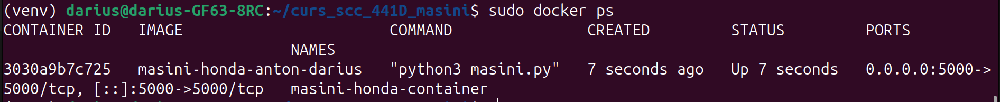

##### Pagina principala Honda

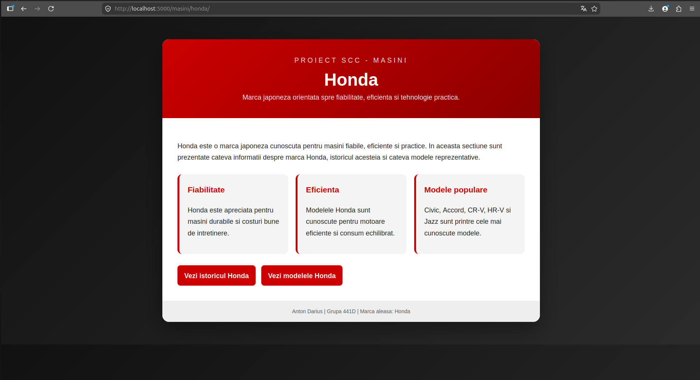

##### Pagina Istoric Honda

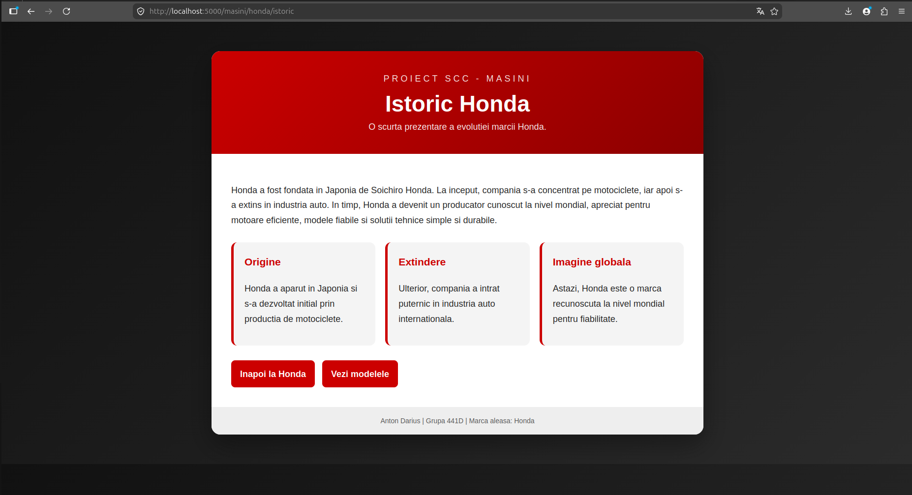

##### Pagina Modele Honda

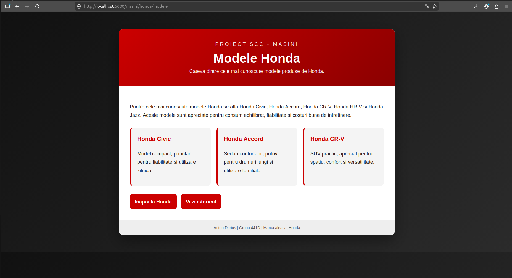

##### Loguri Docker


##### Jenkins - teste rulate cu succes

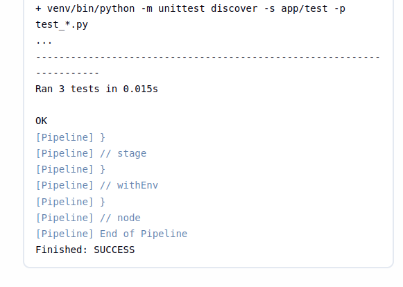

---

#### Git si GitHub

Modificarile au fost realizate pe branch-ul personal de dezvoltare:

```text
dev_anton_darius
```

Pentru salvarea modificarilor au fost folosite comenzile:

```bash
git add .
git commit -m "Adauga functionalitate Honda"
git push origin dev_anton_darius
```

Urmeaza crearea unui Pull Request din:

```text
dev_anton_darius
```

catre:

```text
main_anton_darius
```

---

#### Pull Request

Pull Request-ul va fi creat pentru integrarea modificarilor din branch-ul de dezvoltare in branch-ul personal principal.

```text
Sursa: dev_anton_darius
Destinatie: main_anton_darius
```

Status:

```text
Urmeaza creare PR si review.
```

---

#### Status proiect

| Cerinta | Status |
|---|---|
| Functionalitate Honda | Finalizat |
| Pagina principala Honda | Finalizat |
| Pagina Istoric Honda | Finalizat |
| Pagina Modele Honda | Finalizat |
| Teste unitare | Finalizat |
| Rulare locala | Finalizat |
| Jenkinsfile | Finalizat |
| Rulare Jenkins | Finalizat |
| Dockerfile | Finalizat |
| Imagine Docker | Finalizat |
| Container Docker | Finalizat |
| Accesare aplicatie din container | Finalizat |
| Loguri Docker | Finalizat |
| Capturi de ecran | Finalizat |
| Documentatie README | Finalizat |
| Pull Request | Urmeaza |

---

#### Concluzii

In cadrul proiectului am implementat functionalitatea pentru marca **Honda** in aplicatia Flask a grupei 441D.

Au fost adaugate trei pagini web, teste unitare pentru verificarea rutelor, fisier Jenkinsfile pentru testare automata si Dockerfile pentru containerizarea aplicatiei.

Aplicatia ruleaza local si in container Docker, iar paginile Honda pot fi accesate din browser.

Testele unitare au fost rulate cu succes local si prin Jenkins.

---

## Baroiu Silvian

> Documentație preluată din branch-ul `main_baroiu_silvian`.

### curs_scc_441D_masini# curs_scc_441D_masini

### Funcționalitate Toyota — Baroiu Silvian

#### 1. Descriere generală

În cadrul proiectului Servicii Cloud și Containerizare — grupa 441D — tema Mașini, am avut ca sarcină implementarea funcționalității pentru elementul Toyota.

Implementarea respectă structura agreată la nivel de grup și acoperă rutele Flask, funcțiile din biblioteca aplicației, testele unitare, containerizarea cu Docker și automatizarea prin Jenkins.
---

#### 2. Funcționalitate adăugată

Pentru elementul Toyota au fost realizate următoarele:

-implementarea funcțiilor culoare_toyota() și descriere_toyota() în app/lib/biblioteca_masini.py;
-definirea Blueprint-ului Flask în noul fișier app/routes/toyota.py;
-înregistrarea Blueprint-ului în aplicația principală masini.py;
-scrierea testelor unitare în app/test/test_biblioteca_masini.py;
-configurarea Dockerfile pentru containerizarea aplicației;
-configurarea Jenkinsfile pentru rularea automată a pipeline-ului;
-actualizarea documentației în README.md.

---

#### 3. Fișiere adăugate sau modificate

- app/lib/biblioteca_masini.py
- app/routes/toyota.py
- app/test/test_biblioteca_masini.py
- masini.py
- Dockerfile
- Jenkinsfile
- requirement.txt
- README.md
- docs/screenshots/

---

---

#### Structura implementării

Structura proiectului pentru funcționalitatea **Toyota** este următoarea:

```text
curs_scc_441D_masini/
│
├── masini.py
├── Dockerfile
├── Jenkinsfile
├── README.md
├── requirement.txt
├── .gitignore
│
├── app/
│   ├── routes/
│   │   ├── __init__.py
│   │   ├── test.py
│   │   ├── toyota.py
|   |   └── masini.py
│   │
│   ├── lib/
│   │   ├── __pycache__.py
│   │   └── biblioteca_masini.py
│   │
│   └── test/
|       ├── __pycache__.py
│       ├── __init__.py
│       └── test_biblioteca_masini.py
│
└── docs/
    └── screenshots/ ************************************************************************
        ├── 00_pornire_locala.png
        ├── 01_testare_unitara.png
        ├── 02_browser_toyota.png
        ├── 03_browser_culoare.png
        ├── 04_browser_descriere.png
        ├── 05_docker_images.png
        ├── 06_docker_ps.png
        ├── 07_browser_container_toyota.png
        ├── 08_docker_logs.png
        ├── 09_jenkins_success.png
        └── 10_blue_ocean_pipeline.png
```

În biblioteca_masini.py se găsesc funcțiile culoare_toyota() și descriere_toyota(), care returnează informațiile specifice mărcii Toyota.
Fișierul toyota.py definește Blueprint-ul și expune următoarele rute:

- /masini
- /masini/toyota
- /masini/toyota/culoare
- /masini/toyota/descriere

Testele unitare sunt grupate în test_biblioteca_masini.py, iar capturile de ecran din docs/screenshots/ documentează vizual fiecare etapă a procesului.
---

#### 4. Rute implementate

| Rută | Descriere |
|---|---|
| `/` | Pagina principală a aplicației |
| `/masini` | Pagina temei generale „Mașini” |
| `/masini/toyota` | Pagina principală pentru elementul Toyota|
| `/masini/toyota/model` | Afișează informațiile despre un anumit model returnate de funcția `culoare_toyota()` si de functia `descriere_toyota()` |

---

#### 5. Stadiul implementării

| Componentă | Status |
|---|---|
| Cod aplicație | Implementat |
| Funcții în bibliotecă | Implementat |
| Rute Flask | Implementat |
| Teste unitare | Implementat |
| Dockerfile | Configurat |
| Jenkinsfile | Configurat |
| Containerizare | Testată |
| Pipeline Jenkins | Rulat cu succes |
| Documentație | Completată |

---

### Testare

#### 6. Testare manuală locală

Aplicația a fost pornită local și rutele Toyota au fost verificate direct din browser.

Comanda de pornire:

```bash
PYTHONPATH=app flask --app masini run
```

În captura următoare se observă pornirea aplicației Flask local, pe portul `5000`.


Rutele testate manual au fost:

- `http://127.0.0.1:5000/masini/toyota`
- `http://127.0.0.1:5000/masini/toyota/model(gr_supra)`

##### Pagina Toyota 
Pagina `/masini/toyota` afișează elementul ales și butoanele către informațiile specifice.


##### Pagina „Model Toyota”

Pagina `/masini/Toyota/gr_supra` afișează rezultatul funcției `descriere_Toyota()`.


---

#### 7. Testare unitară

Testele unitare au fost implementate în fișierul:

```text
app/test/test_biblioteca_masini.py
```

Comandă de rulare:

```bash
PYTHONPATH=. python -m unittest discover -s app/test
```

Rezultatul obținut a fost `OK`, fiind rulate două teste unitare pentru funcțiile Toyota.


---

#### 8. Containerizare cu Docker

Aplicația a fost containerizată folosind Docker.

Imaginea Docker a fost construită cu comanda:

```bash
sudo docker build -t masini-app .
```

Imaginea Docker `masini-app` a fost creată cu succes și apare în lista imaginilor locale.


Containerul a fost pornit astfel:

```bash
sudo docker run -d -p 5000:5000 --name masini-container masini-app
```

Containerul `masini-container` a fost pornit și a expus aplicația pe portul `5000`.


Aplicația rulată în container a fost accesată din browser la ruta:

```text
http://127.0.0.1:5000/masini/Toyota
```


Logurile containerului confirmă cererile HTTP cu status 200 pentru rutele Toyota.


---

#### 9. Testare cu Jenkins

Pipeline-ul a fost rulat pe branch-ul:

```text
dev_baroiu_silvian
```

Toate etapele au fost finalizate cu succes, rezultatul final fiind SUCCESS.


##### Vizualizare pipeline în Blue Ocean

În Blue Ocean se observă că toate etapele pipeline-ului au fost executate cu succes:

- `Install dependencies`
- `Run tests`
- `Build image`
- `Deploy`


---

#### 10. Fișier Jenkins

Fișierul `Jenkinsfile` definește un pipeline declarativ pentru automatizarea testării și containerizării aplicației.

Etapele pipeline-ului sunt:

| Stage | Rol |
|---|---|
| `Install dependencies` | Creează mediul Python și instalează dependențele din `requirement.txt` |
| `Run tests` | Rulează testele unitare din `app/test` |
| `Build image` | Construiește imaginea Docker `masini-app` |
| `Deploy` | Pornește containerul `masini-container` |

---

#### 11. Integrare GitHub

Dezvoltarea a avut loc pe branch-ul:

```text
dev_baroiu_silvian
```

Integrarea se va face printr-un Pull Request către:

```text
main_baroiu_silvian
```

Fluxul de lucru:

```text
dev_baroiu_silvian -> main_baroiu_silvian
```

Status:
Pull Request-ul va fi trimis spre review utilizatorului:

```text
@Varlam-Cosmin
```

Review-ul este reciproc — colegul va verifica funcționalitatea Toyota implementată de mine, iar eu voi revizui Pull Request-ul său.

Status integrare:

```text
În așteptare review și aprobare.
În așteptare creare Pull Request, review și aprobare.
```

---

---

## Bolboaca David

> Documentație preluată din branch-ul `main_bolboaca_david`.

### curs_scc_441D_masini

### Dezvoltator: Bolboaca Florin David Cristian
### Tema masini aleasa: Ford

#### Functionalitate adaugata
Functionalitate pentru marca Ford in cadrul temei Masini
Fisiere adaugate:
-app/lib/biblioteca_masini.py - functiile descriere_ford() si culoare_ford()
-app/routes/ford.py - blueprint cu rutele Ford
-app/test/test_ford.py - unit teste

Rute adaugate:
-/masini/ford - pagina elementului
-/masini/ford/culoare - apeleaza culoarea
-/masini/ford/descriere - apeleaza descrierea

#### Stadiul implementarii
-Cod
-Teste
-Jenkinsfile
-Dockerfile

#### Testare manuala
Aplicatia a fost pornita local si rutele au fost accesate din browser.

#### Testare cu Jenkins
Testele au fost rulate cu Jenkins si au trecut.

#### Fisier Jenkins
Pipeline declarativ cu doua stage-uri: Install dependencies si Run tests.


#### Integrare
PR creat pentru integrarea din dev_bolboaca_david in main_bolboaca_david.
Status: in asteptare review.

#### Containerizare
Am creat si rulat imaginea docker cu succes.

#### Ce mai este de facut
-Astept review pentru PR
-De pus screenshots
-De facut review la un coleg

#### Testare manuală
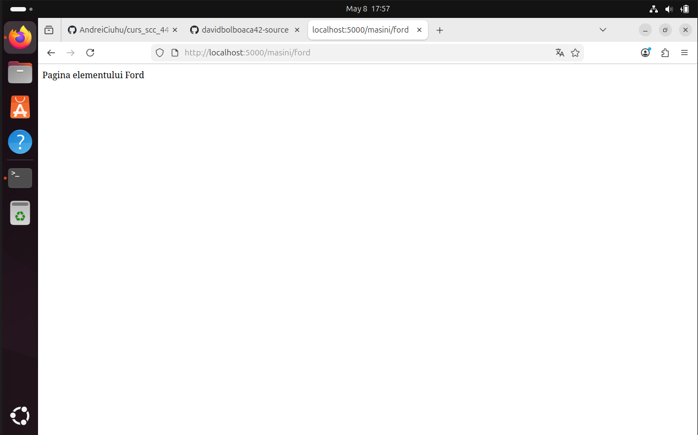


#### Testare cu Jenkins


#### Containerizare
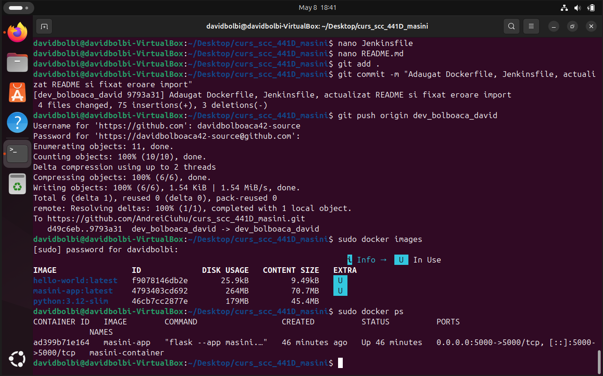


#### Stadiul proiectelor grupei

| Element | Dezvoltator | Implementare | Testare | Integrare |
| :--- | :--- | :---: | :---: | :---: |
| Ford | Bolboacă David | X | X | X |

---

## Ciuhureanu Andrei

> Documentație preluată din branch-ul `main_ciuhureanu_andrei`.

### curs_scc_441D_masini

#### Documentație

#### 1. Informații generale

Repository: `curs_scc_441D_masini`  
Grupă: `441D`  
Temă proiect: `Mașini`  
Dezvoltator: `Andrei Ciuhureanu`  
Branch dezvoltare: `dev_ciuhureanu_andrei`  
Element ales: `Audi`  

Aplicația este realizată în Python, folosind framework-ul Flask. Scopul proiectului este dezvoltarea unei aplicații web simple, colaborative, în care fiecare student adaugă o funcționalitate proprie, teste unitare, configurare Jenkins și containerizare Docker.

Funcționalitatea implementată este legată de marca auto **Audi**. Aplicația permite afișarea unei pagini dedicate mărcii Audi, precum și afișarea unor informații despre modele și motorizări.

---

#### 2. Funcționalitatea adăugată

În cadrul branch-ului `dev_ciuhureanu_andrei`, a fost adăugată funcționalitate pentru elementul **Audi**, corespunzător temei generale **Mașini**.

Funcționalitatea constă în:

- adăugarea unei pagini principale pentru aplicația de mașini;
- adăugarea unei pagini dedicate mărcii Audi;
- adăugarea unei pagini pentru afișarea modelelor Audi;
- adăugarea unei pagini pentru afișarea motorizărilor Audi;
- implementarea funcțiilor specifice în fișierul `app/lib/biblioteca_masini.py`;
- adăugarea testelor unitare pentru funcțiile implementate;
- configurarea fișierului `Jenkinsfile`;
- adăugarea fișierului `Dockerfile` pentru containerizarea aplicației;
- documentarea funcționalității în acest fișier `README.md`.

---

#### 3. Structura proiectului

Structura principală a proiectului este:

```text
curs_scc_441D_masini/
│
├── app/
│   ├── lib/
│   │   ├── biblioteca_masini.py
│   │   └── teste.py
│   │
│   └── tests/
│       └── teste.py
│
├── masini.py
├── Dockerfile
├── Jenkinsfile
├── quickrequirements.txt
├── pytest.ini
├── activeaza_venv
├── activeaza_venv_jenkins
├── dockerstart.sh
├── ruleaza_aplicatia
└── README.md
```

Fișierul principal al aplicației este:

```text
masini.py
```

Fișierul în care sunt definite funcțiile specifice temei este:

```text
app/lib/biblioteca_masini.py
```

Fișierul de testare este:

```text
app/tests/teste.py
```

---

#### 4. Rute implementate

Aplicația Flask conține următoarele rute:

| Rută | Descriere |
|---|---|
| `/` | Pagina principală a aplicației |
| `/audi` | Pagina dedicată mărcii Audi |
| `/audi/model` | Pagina care afișează modelele Audi |
| `/audi/motoare` | Pagina care afișează motorizările Audi |

Exemple de accesare în browser:

```text
http://127.0.0.1:5011/
http://127.0.0.1:5011/audi
http://127.0.0.1:5011/audi/model
http://127.0.0.1:5011/audi/motoare
```

---

#### 5. Funcțiile implementate

Funcțiile specifice elementului Audi sunt definite în fișierul:

```text
app/lib/biblioteca_masini.py
```

Funcțiile implementate sunt:

```text
gaseste_informatii_modele()
gaseste_informatii_motor()
```

Funcția `gaseste_informatii_modele()` returnează o listă cu modele Audi.

Funcția `gaseste_informatii_motor()` returnează o listă cu motorizări Audi.

Aceste funcții sunt apelate în aplicația principală, în rutele dedicate:

```text
/audi/model
/audi/motoare
```

---

#### 6. Stadiul implementării

| Cerință | Status |
|---|---|
| Branch-urile personale create | Realizat |
| Fișierul principal Flask `masini.py` | Realizat |
| Funcționalitate pentru mașina Audi | Realizat |
| Două funcții specifice temei alese | Realizat |
| Patru rute Flask | Realizat |
| Teste unitare | Realizat |
| Fișier `Jenkinsfile` | Realizat |
| Fișier `Dockerfile` | Realizat |
| Containerizare Docker | Realizat |
| Testare manuală | Realizat |
| Testare cu Jenkins | Realizat |
| README.md completat | Realizat |
| Pull Request către branch-ul personal main | Realizat (PR#33) |
| Review Pull Request de la coleg | Realizat (de kubitz1) |

---

#### 7. Rularea locală a aplicației

Pentru rularea locală a aplicației se creează și se activează mediul virtual Python.

Comenzi pentru activarea mediului virtual:

```bash
chmod +x activeaza_venv
source activeaza_venv
```

După activarea mediului virtual, aplicația se poate porni cu:

```bash
chmod +x ruleaza_aplicatia
./ruleaza_aplicatia
```

Alternativ, aplicația poate fi pornită direct cu Flask:

```bash
export FLASK_APP=masini
flask run -p 5011 --reload
```

Aplicația va fi disponibilă în browser la adresa:

```text
http://127.0.0.1:5011
```

##### Capturi verificare manuală

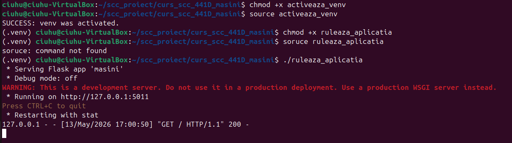
<p align="center">Figura 7.1 Rularea comenzilor în terminalul local</p>


<p align="center">Figura 7.2 Ruta principală</p>


<p align="center">Figura 7.3 Ruta /audi</p>

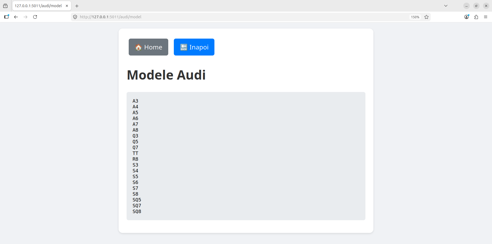
<p align="center">Figura 7.4 Ruta /audi/model</p>


<p align="center">Figura 7.5 Ruta /audi/motoare</p>

---

#### 8. Testele făcute

Testele unitare sunt definite în fișierul:

```text
app/tests/teste.py
```

Acestea verifică funcțiile implementate în biblioteca aplicației.

Comandă pentru rularea testelor:

```bash
pytest app/tests/teste.py
```

Rezultatul așteptat este:

```text
PASS
```

Testele verifică dacă funcțiile returnează datele așteptate pentru modelele și motorizările Audi.


<p align="center">Figura 8.1 Testarea locală cu pytest</p>

---

#### 9. Fișierul Jenkins configurat

Pentru automatizarea testării și a procesului de build, branch-ul conține fișierul:

```text
Jenkinsfile
```

Pipeline-ul Jenkins conține următoarele etape:

1. instalarea dependențelor;
2. rularea testelor unitare;
3. construirea imaginii Docker;
4. pornirea containerului Docker.

Fișierul Jenkins este folosit pentru validarea automată a codului adăugat pe branch-ul de dezvoltare.

##### Capturi Jenkins


<p align="center">Figura 9.1 Pipeline-ul Jenkins configurat</p>

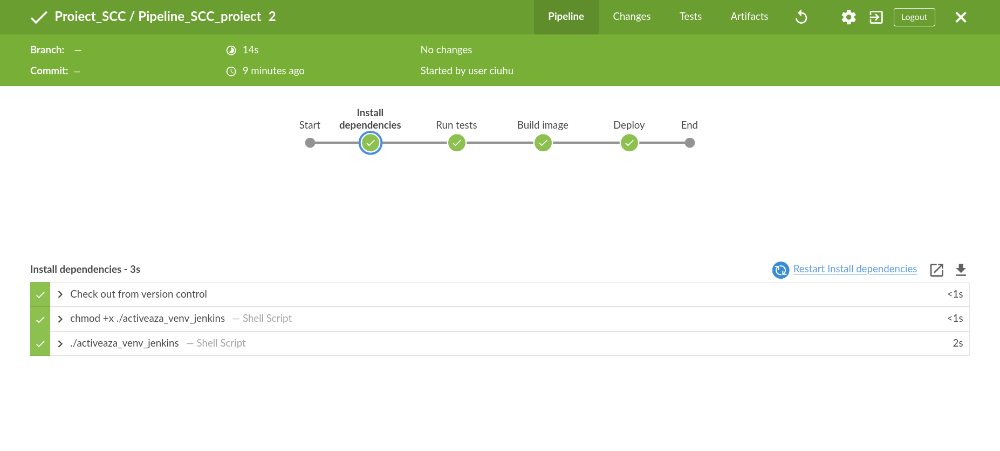
<p align="center">Figura 9.2 Instalarea dependențelor</p>

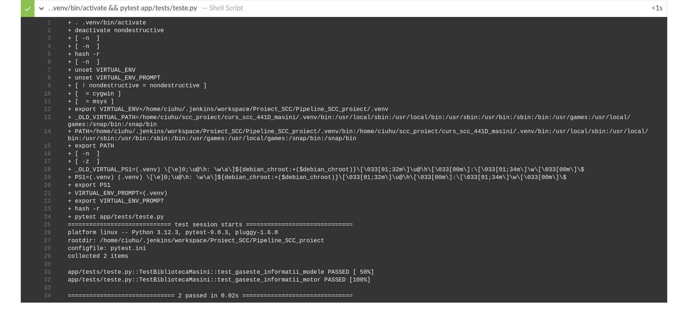
<p align="center">Figura 9.3 Rularea testelor in Jenkins</p>


<p align="center">Figura 9.4 Construirea imaginii Docker</p>

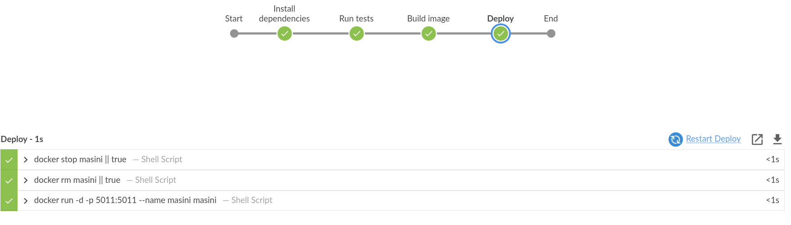
<p align="center">Figura 9.5 Pornire container</p>

---

#### 10. Containerizarea aplicației

Pentru containerizarea aplicației a fost adăugat fișierul:

```text
Dockerfile
```

Imaginea Docker se construiește cu:

```bash
docker build -t masini .
```

Containerul se pornește cu:

```bash
docker run -d -p 5011:5011 --name masini masini
```

Dacă există deja un container cu același nume, acesta poate fi oprit și șters cu:

```bash
docker stop masini
docker rm masini
```

După aceea, containerul poate fi pornit din nou:

```bash
docker run -d -p 5011:5011 --name masini masini
```

Pentru verificarea imaginilor Docker:

```bash
docker images
```

Pentru verificarea containerelor active:

```bash
docker ps
```

Pentru verificarea logurilor containerului:

```bash
docker logs masini
```

Aplicația rulată în container se accesează în browser la:

```text
http://127.0.0.1:5011
```

##### Capturi containerizare


<p align="center">Figura 10.1 Imaginea Docker</p>


<p align="center">Figura 10.2 Creare și pornire container</p>

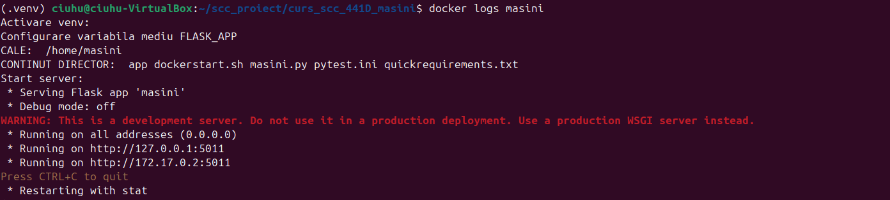
<p align="center">Figura 10.3 Mesajele afișate în consola containerului</p>

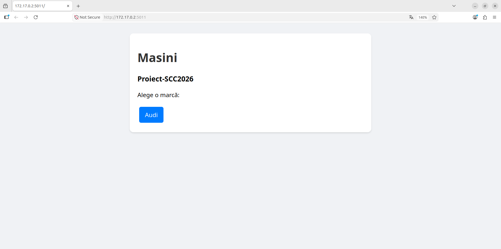
<p align="center">Figura 10.4 Accesarea aplicației rulate din container</p>

---

#### 11. Integrarea prin Git și Pull Request

Codul a fost adăugat în branch-ul personal de dezvoltare:

```text
dev_ciuhureanu_andrei
```

Integrarea trebuie realizată prin Pull Request din branch-ul:

```text
dev_ciuhureanu_andrei
```

către branch-ul:

```text
main_ciuhureanu_andrei
```

După verificare și aprobare, documentația și proiectul vor fi integrate în branch-ul `main_ciuhureanu_andrei`.

##### Status integrare

| Element | Status |
|---|---|
| Cod adăugat în branch-ul de dezvoltare | Realizat |
| README.md adăugat/completat | Realizat |
| Pull Request către branch-ul personal main | Realizat (PR#33) |
| Review de la coleg | Realizat (de kubitz1) |

---

#### 12. Pull Request-uri la care am făcut review


| ID Pull Request | Autor | Branch sursă | Branch destinație | Status |
|---|---|---|---|---|
| #6 | kubitz1 | dev_Cubic_Vlad | main_Cubic_Vlad | Aprobat |
| #15 | gavradragos | dev_gavra_dragos | main_gavra_dragos | Aprobat |

---

#### 13. Ce mai este de făcut

Pentru finalizarea completă a proiectului mai trebuie realizate următoarele acțiuni:

- [x] Crearea Pull Request-ului din `dev_ciuhureanu_andrei` către `main_ciuhureanu_andrei` (PR#33);
- [x] Obținerea review-ului de la cel puțin un coleg (kubitz1);

---

## Cubic Vlad

> Documentație preluată din branch-ul `main_Cubic_Vlad`.

### curs_scc_441D_masini
### Functionalitate BMW - Vlad Cubic

#### Functionalitate adaugata

Am implementat integrarea cu un serviciu extern pentru a gestiona si prelua datele tehnice ale marcii BMW, respectand arhitectura proiectului (Grupa 441D).

Fisiere adaugate si modificate:
* app/lib/biblioteca_masini.py - implementarea functiilor modele_bmw() si detalii_bmw() folosind modulul requests pentru apeluri API.
* app/routes/bmw.py - blueprint-ul asociat rutelor web specifice.
* app/test/test_biblioteca_masini.py - crearea unit testelor folosind framework-ul unittest si functionalitatea de mock pentru decuplarea de API-ul extern.
* Dockerfile - instructiunile de build pentru imaginea de container bazata pe Python.
* Jenkinsfile - definirea pipeline-ului declarativ pentru automatizarea procesului de CI/CD.

Rute adaugate:
* / - pagina principala cu lista masinilor disponibile
* /masini/bmw - pagina de prezentare a producatorului BMW
* /masini/bmw/modele - lista modelelor BMW preluata via API Ninjas
* /masini/bmw/detalii?model=<nume> - detalii tehnice specifice pentru modelul interogat

#### Stadiul implementarii

* [x] Cod adaugat
* [x] Teste adaugate
* [x] Jenkinsfile configurat
* [x] Dockerfile creat

#### Testare

##### Testare manuala
Aplicatia a fost pornita in mediul de dezvoltare local. Toate rutele au fost accesate si validate din browser. Testele unitare au fost rulate in consola cu succes.

<details>
  <summary>Vezi captura de ecran: Testare manuala</summary>
  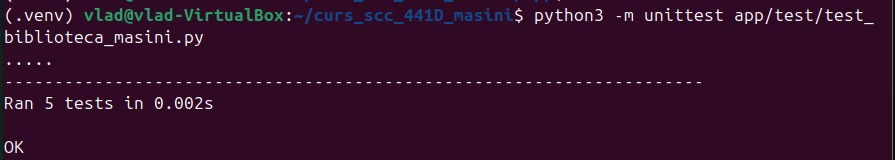
</details>

##### Testare cu Jenkins
Automatizarea testarii a fost confirmata prin executia cu succes a pipeline-ului. Testele au fost rulate si au trecut (status PASS).

<details>
  <summary>Vezi captura de ecran: Executie Jenkins</summary>
  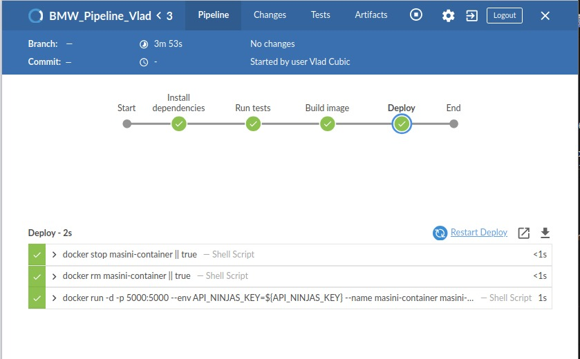
</details>

#### Fisier Jenkins

A fost utilizat un pipeline declarativ structurat in 4 stage-uri:
1. Install dependencies
2. Run tests
3. Build image
4. Deploy

#### Containerizare

Aplicatia a fost containerizata si izolata cu succes. Se pot vizualiza mai jos dovezile executiei.

<details>
  <summary>Vezi captura de ecran: Imagine creata</summary>
  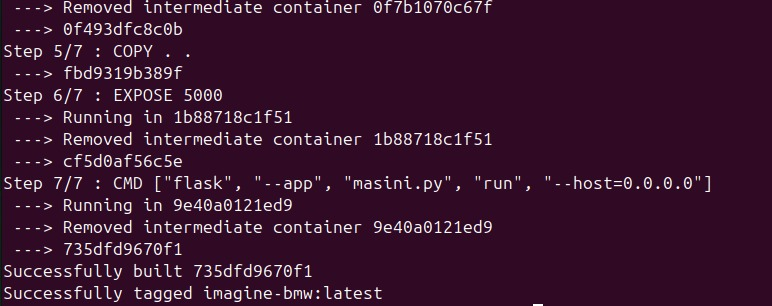
</details>

<details>
  <summary>Vezi captura de ecran: Container creat si functional</summary>
  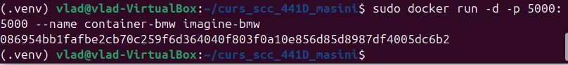
  
</details>

<details>
  <summary>Vezi captura de ecran: Browser accesand aplicatia din container</summary>
  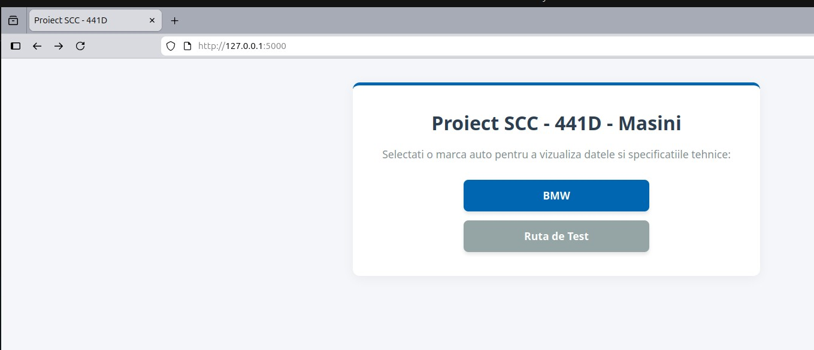
</details>

<details>
  <summary>Vezi captura de ecran: Consola cu log-uri</summary>
  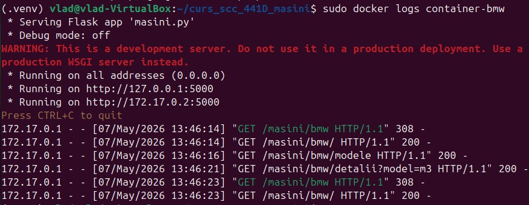
</details>

<details>
  <summary>Vezi captura de ecran: Curatare resurse dupa testare</summary>
  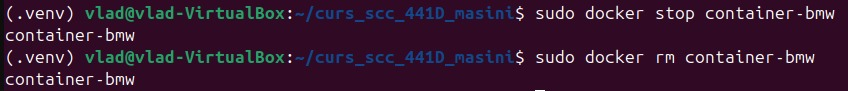
</details>

#### Integrare

PR creat din branch-ul dev_Cubic_Vlad in main. Status: Aprobat si integrat cu succes (Merged).

#### Pull Request-uri la care am facut review

Am acordat review (Approve) pentru PR-ul unui coleg din grupa, respectand cerintele de verificare incrucisata.

#### Ce mai este de facut

Proiectul este finalizat 100% si nu mai exista task-uri restante. 
Toate etapele de dezvoltare, testare automata, containerizare și integrare a codului si a documentatiei prin PR au fost realizate si validate cu succes. Proiectul este gata pentru evaluare.

---

## Dragomir Tiberiu

> Documentație preluată din branch-ul `main_Dragomir_Tiberiu`.

### curs_scc_441D_masini

---

## Dumbrava Teodor

> Documentație preluată din branch-ul `main_dumbrava_teodor`.

### Proiect SCC - Mașini - Fiat

#### Date student

Student: Dumbrava Teodor  
Grupa: 441D  
Tema: Mașini  
Element ales: Fiat  

---

#### Funcționalitate adăugată

În cadrul proiectului am adăugat funcționalitate pentru marca auto **Fiat**.

Funcționalitatea este implementată în aplicația Flask a proiectului și permite afișarea unor informații despre marca Fiat.

Au fost create două funcții în fișierul:

```txt
app/lib/biblioteca_masini.py
```

Funcțiile adăugate sunt:

```python
descriere_fiat()
modele_fiat()
```

##### Descriere funcții

Funcția `descriere_fiat()` returnează o scurtă descriere a mărcii Fiat.

Funcția `modele_fiat()` returnează câteva modele cunoscute ale producătorului Fiat.

---

#### Rute adăugate

În aplicația Flask au fost adăugate următoarele rute:

```txt
/masini/fiat
/masini/fiat/descriere
/masini/fiat/modele
```

Ruta principală `/` conține link-uri către funcționalitatea Fiat.

##### Rute disponibile

- `/masini/fiat` - afișează pagina principală pentru Fiat
- `/masini/fiat/descriere` - afișează descrierea mărcii Fiat
- `/masini/fiat/modele` - afișează modele cunoscute Fiat

---

#### Fișiere modificate/adăugate

Pentru funcționalitatea Fiat au fost modificate sau adăugate următoarele fișiere:

```txt
masini.py
app/__init__.py
app/lib/__init__.py
app/lib/biblioteca_masini.py
app/routes/fiat.py
app/test/test_fiat.py
Jenkinsfile
Dockerfile
README.md
```

---

#### Testare locală

A fost creat fișierul de test:

```txt
app/test/test_fiat.py
```

Testele verifică:

- dacă funcția `descriere_fiat()` returnează un text care conține marca Fiat;
- dacă funcția `modele_fiat()` returnează modele cunoscute precum Fiat 500, Fiat Panda și Fiat Tipo.

Testele au fost rulate local cu următoarea comandă:

```bash
pytest
```

Rezultat obținut:

```txt
2 passed
```

---

#### Jenkins

A fost adăugat fișierul:

```txt
Jenkinsfile
```

Pipeline-ul Jenkins conține următoarele etape:

1. instalarea dependențelor din `requirement.txt`;
2. rularea testelor automate cu `pytest`.

Pipeline-ul Jenkins a fost rulat cu succes pe branch-ul:

```txt
dev_dumbrava_teodor
```

Rezultat Jenkins:

```txt
2 passed
Finished: SUCCESS
```

---

#### Docker

A fost adăugat fișierul:

```txt
Dockerfile
```

Acesta este folosit pentru containerizarea aplicației Flask.

Imaginea Docker a fost construită cu următoarea comandă:

```bash
sudo docker build -t masini-fiat-dumbrava .
```

Containerul Docker a fost pornit cu următoarea comandă:

```bash
sudo docker run -d --name masini-fiat-container -p 5000:5000 masini-fiat-dumbrava
```

Containerul a fost verificat cu:

```bash
sudo docker ps
```

Aplicația rulată în container poate fi accesată în browser la:

```txt
http://localhost:5000
```

Rutele Fiat accesibile în browser sunt:

```txt
http://localhost:5000/masini/fiat
http://localhost:5000/masini/fiat/descriere
http://localhost:5000/masini/fiat/modele
```

Logurile containerului au fost verificate cu:

```bash
sudo docker logs masini-fiat-container
```

În loguri se observă cererile HTTP realizate de browser către aplicația rulată în container.

---

#### Capturi de ecran realizate

##### Testare locală cu pytest

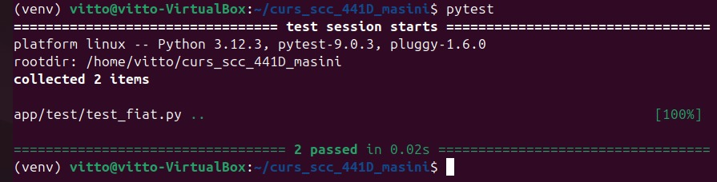

##### Construirea imaginii Docker

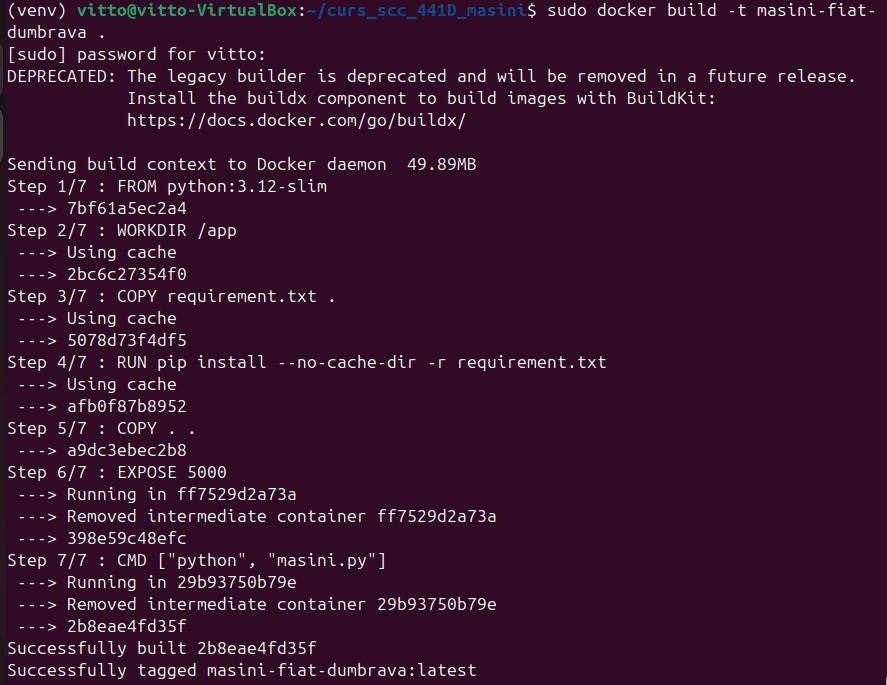

##### Container Docker pornit


##### Aplicația rulată în browser din container

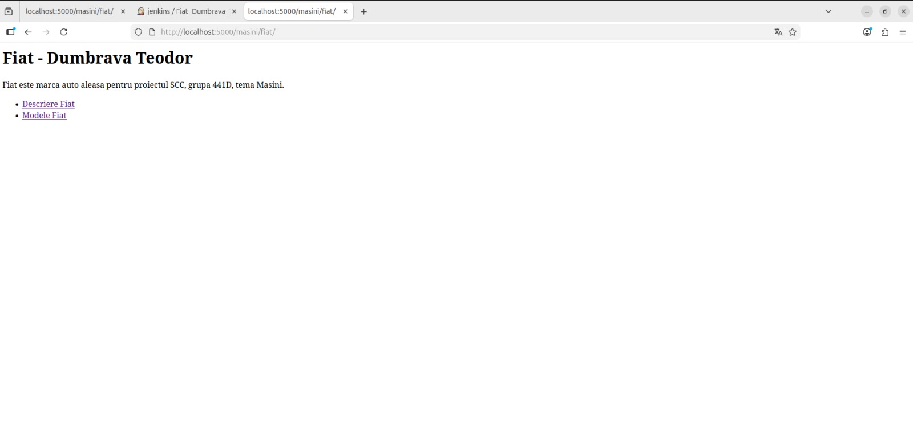

##### Logurile containerului

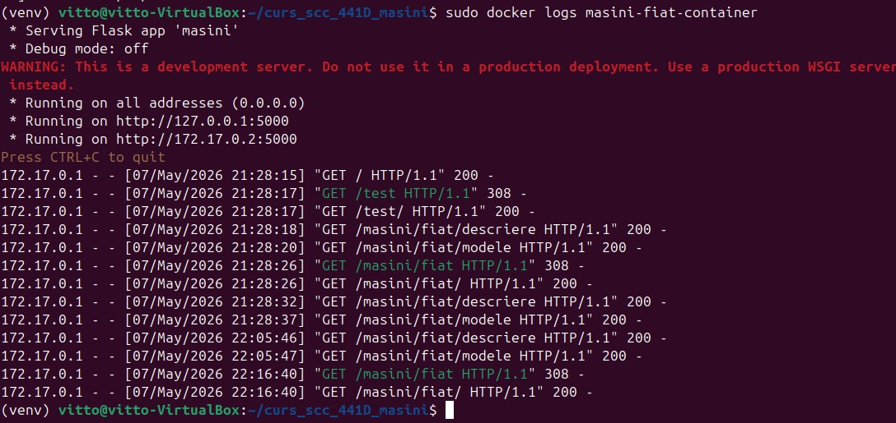

##### Jenkins build SUCCESS


---
#### Integrare GitHub

Codul a fost adăugat pe branch-ul personal de dezvoltare:

```txt
dev_dumbrava_teodor
```

A fost creat și branch-ul personal de integrare:

```txt
main_dumbrava_teodor
```

Următorul pas este crearea unui Pull Request din:

```txt
dev_dumbrava_teodor
```

către:

```txt
main_dumbrava_teodor
```

După review, modificările pot fi integrate în branch-ul principal al proiectului.

---

#### Pull Request-uri verificate

Momentan nu au fost adăugate review-uri pentru Pull Request-urile colegilor.

---

#### Stadiu proiect

| Componentă | Status |
|---|---|
| Funcționalitate Fiat | Finalizată |
| Rute Flask | Finalizate |
| Teste locale | Finalizate |
| Jenkinsfile | Finalizat |
| Jenkins build | SUCCESS |
| Dockerfile | Finalizat |
| Imagine Docker | Creată |
| Container Docker | Pornit și testat |
| Documentație README | Finalizată |
| Pull Request `dev_dumbrava_teodor -> main_dumbrava_teodor` | Finalizat |
| Review coleg | Finalizat |
| Merge în `main_dumbrava_teodor` | Finalizat |
| Pull Request `main_dumbrava_teodor -> main` | Urmează |

---
#### Ce mai este de făcut

- creare Pull Request din `main_dumbrava_teodor` către `main`;

---

## Fierea Cosmin

> Documentație preluată din branch-ul `main_fierea_cosmin`.

### curs_scc_441D_masini

### Implementare Porsche — Fierea Cosmin

#### 1. Date proiect

- Student: Fierea Cosmin
- Grupa: 441D
- Tema proiectului: Mașini
- Element ales: Porsche
- Branch dezvoltare: `dev_fierea_cosmin`
- Branch personal principal: `main_fierea_cosmin`

---

#### 2. Prezentare generală

În cadrul proiectului am ales marca **Porsche** și am implementat o secțiune web dedicată acesteia în aplicația Flask a grupei.

Partea mea din proiect conține:

- pagină principală pentru Porsche;
- pagină cu modele Porsche;
- pagină cu istoria modelului Porsche 911;
- funcții separate în biblioteca aplicației;
- teste unitare;
- configurare Docker;
- configurare Jenkins;
- documentație cu pașii de rulare și testare.

Aplicația are o interfață simplă, fără design încărcat, pentru ca informațiile să fie ușor de urmărit.

---

#### 3. Funcționalități implementate

Activarea mediului virtual Python

```bash
    source venv/bin/activate
```

Funcționalitățile pentru Porsche sunt definite în fișierul:

`app/lib/biblioteca_masini.py`

Au fost implementate următoarele funcții:

##### 3.1 `descriere_porsche()`

Această funcție returnează o scurtă descriere generală a mărcii Porsche.

Descrierea este afișată pe pagina principală Porsche.

---

##### 3.2 `modele_porsche()`

Această funcție returnează o listă de modele Porsche.

Pentru fiecare model sunt afișate informații precum:

- marca;
- modelul;
- anul;
- categoria;
- motorul;
- puterea;
- tracțiunea;
- combustibilul.

Modelele incluse în aplicație sunt:

- Porsche 911;
- Porsche Cayenne;
- Porsche Taycan.

---

##### 3.3 `istorie_porsche_911()`

Această funcție returnează informații despre mai multe generații importante ale modelului Porsche 911.

Pentru fiecare generație sunt afișate:

- numele generației;
- perioada;
- o descriere scurtă.

---

#### 4. Rute implementate

| Rută | Descriere |
|---|---|
| `/` | Default |
| `/masini` | Redirecționează către pagina Porsche |
| `/masini/porsche/` | Pagina principală Porsche |
| `/masini/porsche/modele` | Pagina cu modelele Porsche |
| `/masini/porsche/istorie-911` | Pagina cu istoria modelului Porsche 911 |

---

#### 5. Fișiere adăugate sau modificate

Pentru implementarea funcționalității Porsche au fost adăugate sau modificate următoarele fișiere:

- `masini.py`
- `app/lib/__init__.py`
- `app/lib/biblioteca_masini.py`
- `app/routes/porsche.py`
- `app/test/test_porsche_fierea_cosmin.py`
- `Dockerfile`
- `Jenkinsfile`
- `.dockerignore`
- `README.md`
- `docs/poze_readme/`

---

### Testare aplicație

#### 6. Testare locală

Testele unitare au fost create în fișierul:

`app/test/test_porsche_fierea_cosmin.py`

Comanda folosită pentru rularea testelor:

```bash
PYTHONPATH=app python3 -m unittest discover -s app/test
```

Rezultatul obținut:

```text
Ran 5 tests

OK
```

Testele verifică:

- funcția `modele_porsche()`;
- funcția `istorie_porsche_911()`;
- ruta `/masini/porsche/`;
- ruta `/masini/porsche/modele`;
- ruta `/masini/porsche/istorie-911`.

##### Captură testare locală

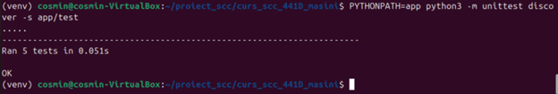

---

#### 7. Rulare locală a aplicației

Aplicația se pornește local cu următoarea comandă:

```bash
PYTHONPATH=app python3 masini.py
```

După pornire, aplicația rulează pe portul `5000`.

Rutele verificate manual au fost:

```text
http://127.0.0.1:5000/masini/porsche/
http://127.0.0.1:5000/masini/porsche/modele
http://127.0.0.1:5000/masini/porsche/istorie-911
```

##### Pagina principală Porsche

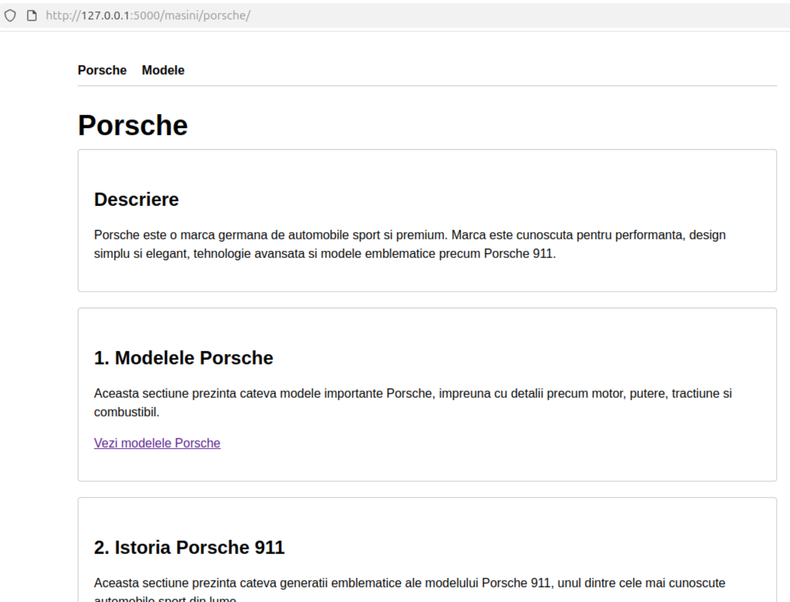

##### Pagina Modele Porsche

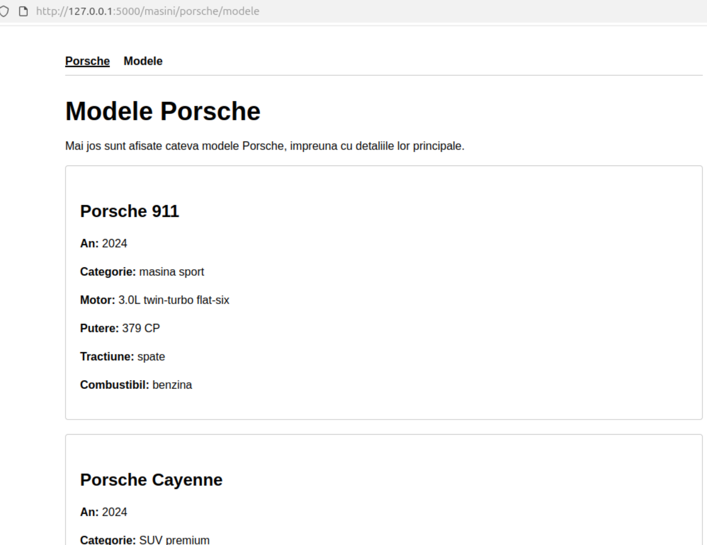

##### Pagina Istoria Porsche 911

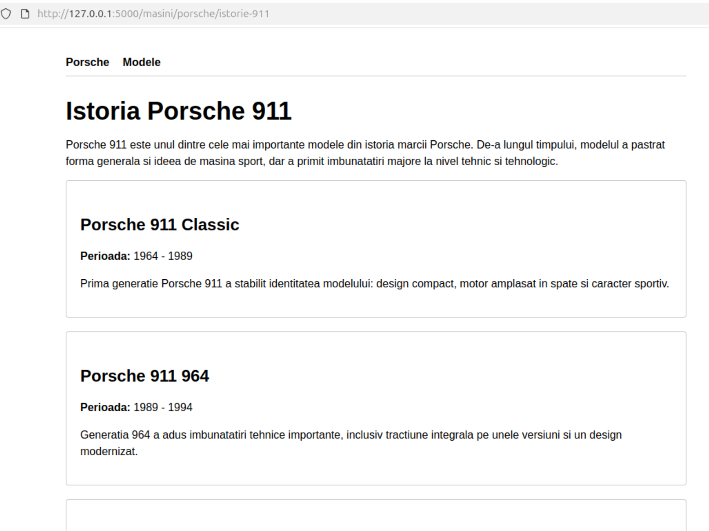

---

### Docker

#### 8. Crearea fișierului Dockerfile

Pentru containerizarea aplicației a fost creat fișierul:

`Dockerfile`

Acesta definește pașii necesari pentru rularea aplicației Flask într-un container Docker.

Fișierul Dockerfile:

- folosește o imagine Python;
- setează directorul de lucru în container;
- copiază fișierul `requirement.txt`;
- instalează dependențele;
- copiază codul aplicației;
- expune portul `5000`;
- pornește aplicația cu `python3 masini.py`.

A fost creat și fișierul:

`.dockerignore`

pentru a evita copierea fișierelor inutile în imaginea Docker.

---

#### 9. Construirea imaginii Docker

Pentru construirea imaginii Docker a fost folosită comanda:

```bash
sudo docker build -t masini-porsche-fierea .
```

În timpul construirii imaginii, Docker descarcă imaginea de bază Python și execută pașii definiți în `Dockerfile`.

##### Începerea construirii imaginii Docker

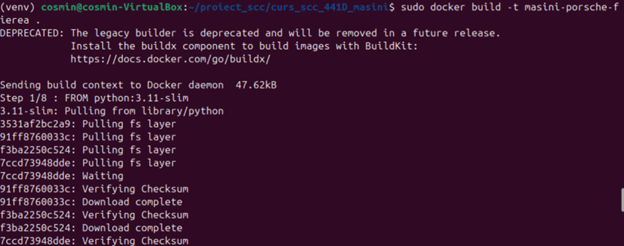

##### Imagine Docker construită cu succes

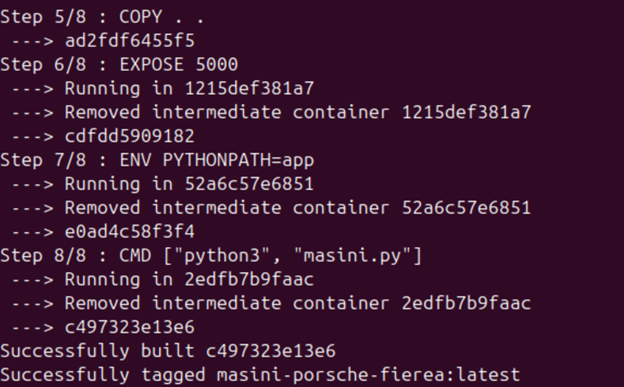

La finalul procesului apare mesajul:

```text
Successfully built
Successfully tagged masini-porsche-fierea:latest
```

Acest mesaj confirmă faptul că imaginea Docker a fost creată corect.

---

#### 10. Verificarea imaginii Docker

Pentru verificarea imaginilor Docker existente s-a folosit comanda:

```bash
sudo docker images
```

În listă apare imaginea:

```text
masini-porsche-fierea
```

##### Captură imagine Docker

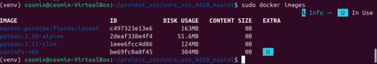

---

#### 11. Rularea containerului Docker

Containerul Docker a fost pornit cu următoarea comandă:

```bash
sudo docker run -d -p 5000:5000 --name masini-porsche-container masini-porsche-fierea
```

Pentru verificarea containerului pornit s-a folosit comanda:

```bash
sudo docker ps
```

Containerul `masini-porsche-container` a rulat cu succes și a expus aplicația pe portul `5000`.

##### Captură container pornit

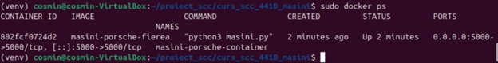

---
####12. Accesarea aplicației din container și verificarea log-urilor

După pornirea containerului, aplicația a fost accesată în browser la adresa:

```bash
    http://127.0.0.1:5000/masini/porsche/
```

 Au fost verificate și paginile:

```bash
    http://127.0.0.1:5000/masini/porsche/modele
    http://127.0.0.1:5000/masini/porsche/istorie-911
```

##### Captură aplicație rulată din container

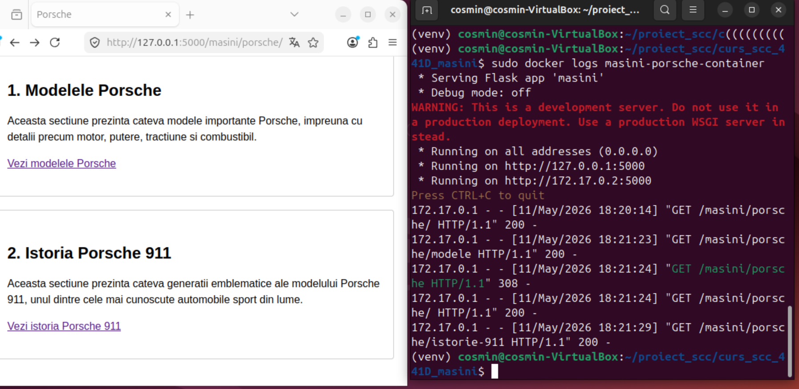

Pentru verificarea accesării aplicației din container s-a folosit comanda:

```bash
    sudo docker logs masini-porsche-container
```

Această comandă afișează log-urile containerului și arată cererile HTTP făcute din browser către aplicația Flask.

---

#### 13. Oprirea containerului Docker

După testare, containerul a fost oprit cu:

```bash
sudo docker stop masini-porsche-container
```

Apoi containerul a fost șters cu:

```bash
sudo docker rm masini-porsche-container
```

Pentru verificare s-a folosit:

```bash
sudo docker ps
```

După oprire și ștergere, containerul nu mai apare în lista containerelor active.

---

### Jenkins

#### 14. Testare automată cu Jenkins

Pornirea Jenkins

```bash
    sudo systemctl start jenkins
```

Verificarea statusului Jenkins

```bash
    sudo systemctl status jenkins
```

Pentru automatizarea testării a fost creat fișierul:

`Jenkinsfile`

Pipeline-ul Jenkins a fost configurat pe branch-ul:

`dev_fierea_cosmin`

Pipeline-ul conține următoarele etape:

| Etapă | Rol |
|---|---|
| `Checkout SCM` | Preia codul din repository |
| `Install dependencies` | Creează mediul virtual și instalează dependențele |
| `Run unit tests` | Rulează testele unitare |
| `Build Docker image` | Construiește imaginea Docker |

Pipeline-ul a rulat cu succes, iar toate etapele au fost finalizate fără erori.

##### Captură Jenkins

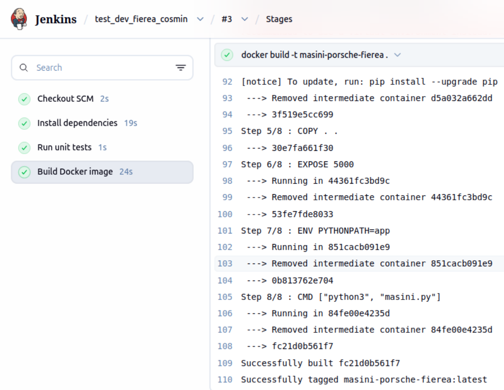

##### Pipeline Jenkins

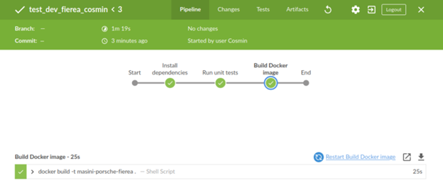

---

### Integrare GitHub

#### 15. Branch-uri folosite

Codul a fost dezvoltat pe branch-ul:

```text
dev_fierea_cosmin
```

Branch-ul personal principal este:

```text
main_fierea_cosmin
```

Fluxul de integrare este:

```text
dev_fierea_cosmin -> main_fierea_cosmin
```

După aprobarea Pull Request-ului, modificările pot fi integrate mai departe în branch-ul principal al grupei.

---

#### 16. Pull Request

Pull Request-ul va fi creat din:

```text
dev_fierea_cosmin
```

către:

```text
main_fierea_cosmin
```

##### Captură Pull Request
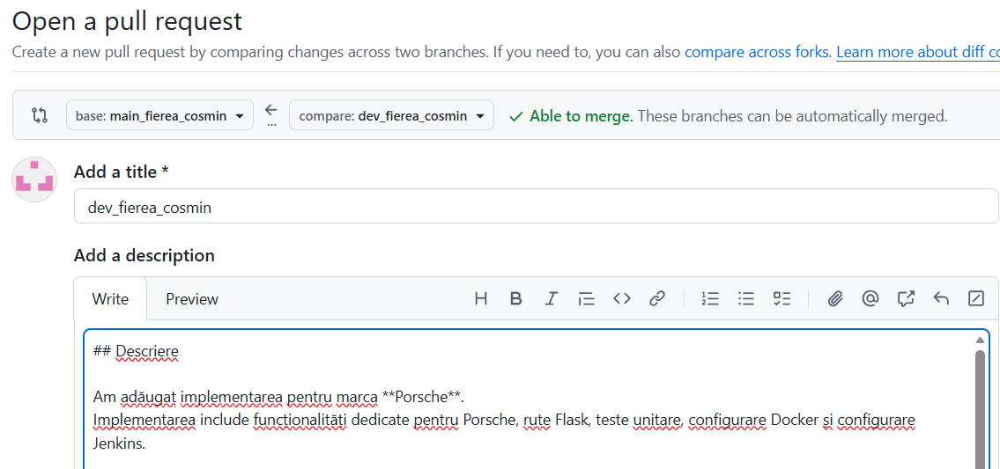

---

#### 17. Pull Request-uri la care am făcut review

```text
PR #<9> — Review pentru funcționalitatea <Neacsu Roxana / Rolls-Royce>.
PR #<10> — Review pentru funcționalitatea <Poting Stefan / McLaren>.
```

---

#### 18. Stadiu final

| Componentă | Status |
|---|---|
| Cod Porsche | Finalizat |
| Funcții în bibliotecă | Finalizat |
| Rute Flask | Finalizat |
| Teste unitare | Finalizat |
| Testare locală | Finalizată |
| Dockerfile | Finalizat |
| Imagine Docker | Creată |
| Container Docker | Testat |
| Jenkinsfile | Finalizat |
| Jenkins Pipeline | Rulat cu succes |
| README.md | Completat |
| Pull Request | Finalizat |
| Review coleg | Finalizat |

---

#### 19. Ce mai este de făcut

- crearea Pull Request-ului din `main_fierea_cosmin` către `main`;

---

## Gavra Dragos

> Documentație preluată din branch-ul `main_gavra_dragos`.

### curs_scc_441D_masini

---

## Ispas Ariana

> Documentație preluată din branch-ul `main_ispas_ariana`.

### curs_scc_441D_masini

### Funcționalitate Bentley — Ispas Ariana-Elena

#### 1. Descriere generală

În cadrul proiectului **Servicii Cloud și Containerizare — grupa 441D — tema Mașini**, am implementat funcționalitatea aferentă elementului **Bentley**.

Funcționalitatea dezvoltată respectă structura proiectului de grup și include rute Flask, funcții dedicate în biblioteca aplicației, teste unitare, containerizare cu Docker și rulare automată prin Jenkins.

---

#### 2. Funcționalitate adăugată

Funcționalitatea Bentley este compusă din:

- definirea funcțiilor `culoare_bentley()` și `descriere_bentley()` în fișierul `app/lib/biblioteca_masini.py`;
- crearea fișierului `app/routes/bentley.py`, care conține Blueprint-ul pentru rutele Bentley;
- înregistrarea Blueprint-ului Bentley în aplicația principală `masini.py`;
- adăugarea testelor unitare în `app/test/test_biblioteca_masini.py`;
- configurarea fișierului `Dockerfile` pentru containerizarea aplicației;
- configurarea fișierului `Jenkinsfile` pentru rularea pipeline-ului Jenkins;
- completarea documentației în fișierul `README.md`.

---

#### 3. Fișiere adăugate sau modificate

- `app/lib/biblioteca_masini.py`
- `app/routes/bentley.py`
- `app/test/test_biblioteca_masini.py`
- `masini.py`
- `Dockerfile`
- `Jenkinsfile`
- `requirement.txt`
- `README.md`
- `docs/screenshots/`

---

#### Structura implementării

Structura proiectului pentru funcționalitatea **Bentley** este următoarea:

```text
curs_scc_441D_masini/
│
├── masini.py
├── Dockerfile
├── Jenkinsfile
├── README.md
├── requirement.txt
├── .gitignore
│
├── app/
│   ├── routes/
│   │   ├── __init__.py
│   │   ├── test.py
│   │   └── bentley.py
│   │
│   ├── lib/
│   │   ├── __init__.py
│   │   └── biblioteca_masini.py
│   │
│   └── test/
│       ├── __init__.py
│       └── test_biblioteca_masini.py
│
└── docs/
    └── screenshots/
        ├── 00_pornire_locala.png
        ├── 01_testare_unitara.png
        ├── 02_browser_bentley.png
        ├── 03_browser_culoare.png
        ├── 04_browser_descriere.png
        ├── 05_docker_images.png
        ├── 06_docker_ps.png
        ├── 07_browser_container_bentley.png
        ├── 08_docker_logs.png
        ├── 09_jenkins_success.png
        └── 10_blue_ocean_pipeline.png
```

Fișierul `biblioteca_masini.py` conține funcțiile specifice elementului Bentley, respectiv `culoare_bentley()` și `descriere_bentley()`.

Fișierul `bentley.py` definește Blueprint-ul și rutele Flask aferente paginilor Bentley:

- `/masini`
- `/masini/bentley`
- `/masini/bentley/culoare`
- `/masini/bentley/descriere`

Fișierul `test_biblioteca_masini.py` conține testele unitare pentru funcțiile implementate în bibliotecă.

Folderul `docs/screenshots/` conține capturile utilizate în documentație pentru testarea manuală, testarea unitară, containerizarea cu Docker și rularea pipeline-ului Jenkins.

---

#### 4. Rute implementate

| Rută | Descriere |
|---|---|
| `/` | Pagina principală a aplicației |
| `/masini` | Pagina temei generale „Mașini” |
| `/masini/bentley` | Pagina principală pentru elementul Bentley |
| `/masini/bentley/culoare` | Afișează informațiile returnate de funcția `culoare_bentley()` |
| `/masini/bentley/descriere` | Afișează informațiile returnate de funcția `descriere_bentley()` |

---

#### 5. Stadiul implementării

| Componentă | Status |
|---|---|
| Cod aplicație | Implementat |
| Funcții în bibliotecă | Implementat |
| Rute Flask | Implementat |
| Teste unitare | Implementat |
| Dockerfile | Configurat |
| Jenkinsfile | Configurat |
| Containerizare | Testată |
| Pipeline Jenkins | Rulat cu succes |
| Documentație | Completată |

---

### Testare

#### 6. Testare manuală locală

Aplicația a fost pornită local, iar rutele aferente funcționalității Bentley au fost accesate din browser.

Comanda folosită pentru pornirea aplicației:

```bash
PYTHONPATH=app flask --app masini run
```

În captura următoare se observă pornirea aplicației Flask local, pe portul `5000`.


Rutele testate manual au fost:

- `http://127.0.0.1:5000/masini/bentley`
- `http://127.0.0.1:5000/masini/bentley/culoare`
- `http://127.0.0.1:5000/masini/bentley/descriere`

##### Pagina Bentley

Pagina `/masini/bentley` afișează elementul ales și butoanele către informațiile specifice.


##### Pagina „Culoare Bentley”

Pagina `/masini/bentley/culoare` afișează rezultatul funcției `culoare_bentley()`.

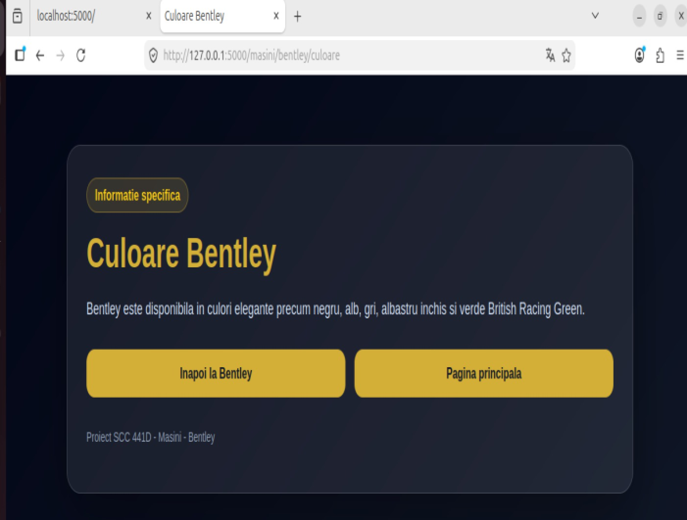

##### Pagina „Descriere Bentley”

Pagina `/masini/bentley/descriere` afișează rezultatul funcției `descriere_bentley()`.

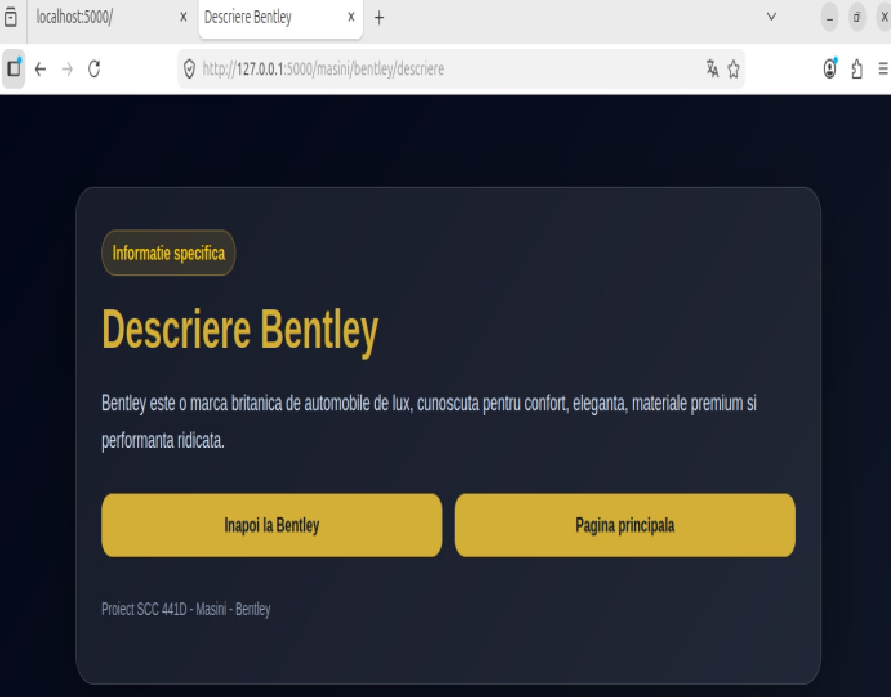

---

#### 7. Testare unitară

Testele unitare au fost implementate în fișierul:

```text
app/test/test_biblioteca_masini.py
```

Comanda folosită pentru rularea testelor unitare:

```bash
PYTHONPATH=. python -m unittest discover -s app/test
```

Rezultatul obținut a fost `OK`, fiind rulate două teste unitare pentru funcțiile Bentley.


---

#### 8. Containerizare cu Docker

Aplicația a fost containerizată folosind Docker.

Comanda folosită pentru construirea imaginii Docker:

```bash
sudo docker build -t masini-app .
```

Imaginea Docker `masini-app` a fost creată cu succes și apare în lista imaginilor locale.


Containerul a fost pornit cu următoarea comandă:

```bash
sudo docker run -d -p 5000:5000 --name masini-container masini-app
```

Containerul `masini-container` a fost pornit și a expus aplicația pe portul `5000`.


Aplicația rulată în container a fost accesată din browser la ruta:

```text
http://127.0.0.1:5000/masini/bentley
```

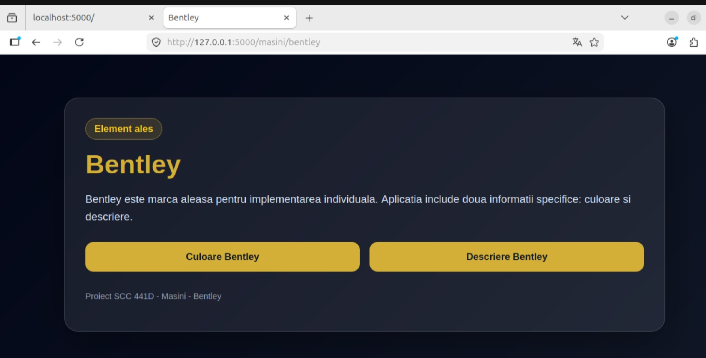

Logurile containerului confirmă accesarea rutelor Bentley din browser cu status HTTP `200`.


---

#### 9. Testare cu Jenkins

Testarea automată a fost realizată cu Jenkins, pe branch-ul:

```text
dev_ispas_ariana
```

Pipeline-ul Jenkins a rulat cu succes și a folosit fișierul `Jenkinsfile` din repository.

Rezultatul rulării a fost `SUCCESS`.

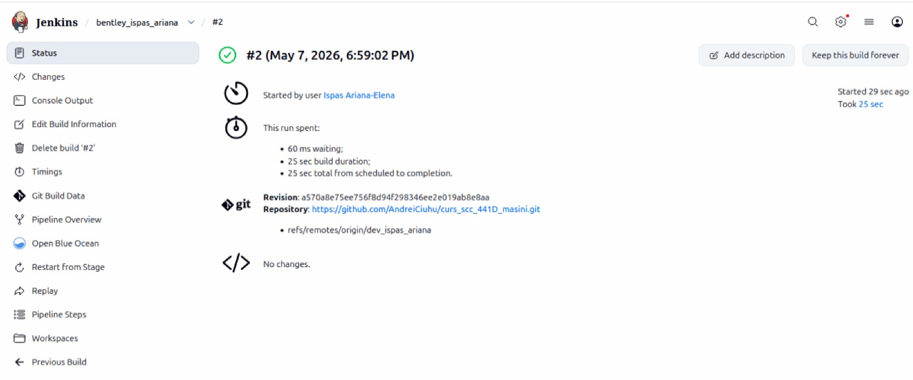

##### Vizualizare pipeline în Blue Ocean

În Blue Ocean se observă că toate etapele pipeline-ului au fost executate cu succes:

- `Install dependencies`
- `Run tests`
- `Build image`
- `Deploy`

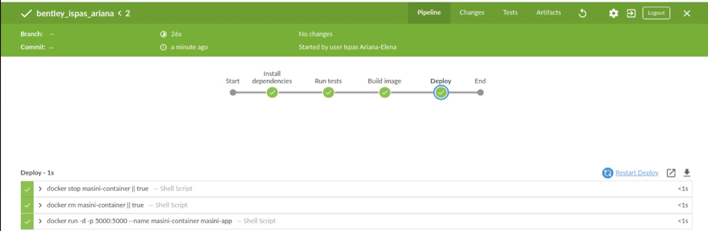

---

#### 10. Fișier Jenkins

Fișierul `Jenkinsfile` definește un pipeline declarativ pentru automatizarea testării și containerizării aplicației.

Etapele pipeline-ului sunt:

| Stage | Rol |
|---|---|
| `Install dependencies` | Creează mediul Python și instalează dependențele din `requirement.txt` |
| `Run tests` | Rulează testele unitare din `app/test` |
| `Build image` | Construiește imaginea Docker `masini-app` |
| `Deploy` | Pornește containerul `masini-container` |

---

#### 11. Integrare GitHub

Codul a fost dezvoltat pe branch-ul personal de dezvoltare:

```text
dev_ispas_ariana
```

Integrarea se va realiza prin Pull Request către branch-ul personal principal:

```text
main_ispas_ariana
```

Fluxul de integrare respectat este:

```text
dev_ispas_ariana -> main_ispas_ariana
```

După crearea Pull Request-ului, acesta va fi trimis spre review colegului:

```text
@AntonDarius921
```

Review-ul a fost stabilit în mod reciproc: colegul va verifica implementarea mea pentru funcționalitatea **Bentley**, iar eu voi verifica Pull Request-ul realizat de acesta.

Status integrare:

```text
În așteptare creare Pull Request, review și aprobare.
```

---

#### 12. Review-uri planificate și efectuate

Pentru respectarea cerinței de lucru colaborativ, a fost stabilit un review reciproc cu utilizatorul GitHub:

```text
@AntonDarius921
```

După crearea Pull Request-urilor, vor fi realizate următoarele acțiuni:

- @AntonDarius921 va realiza review pentru Pull Request-ul meu: `dev_ispas_ariana -> main_ispas_ariana`;
- eu voi realiza review pentru Pull Request-ul colegului @AntonDarius921;
- după verificare și aprobare, modificările vor putea fi integrate în branch-ul personal principal.

Status review:

```text
Review reciproc stabilit, în așteptare creare Pull Request-uri.
```


#### 13. Ce mai este de făcut

- Obținerea unui review de la un coleg;
- Efectuarea unui review pentru Pull Request-ul unui coleg;
- Integrarea modificărilor după aprobare.

---

## Malanca Gabriel

> Documentație preluată din branch-ul `main_malanca_gabriel`.

### Proiect SCC - Grupa 441D - Masini

Dezvoltarea unei aplicatii colaborative de baza in Python/Flask pentru a exersa lucrul cu Git/GitHub, Jenkins si Docker.

#### Detalii Implementare
* **Tema grupei:** Masini
* **Element individual ales:** Volvo (Modele acoperite: XC60, V50, V90)
* **Baza de date:** `app/lib/biblioteca_masini.py`.

#### Rutele Aplicatiei
Aplicatia contine rutele cerute in tema:
1. **Ruta pentru tema (Generala):** `/`
2. **Ruta pentru element:** `/masini/volvo`
3. **Ruta pentru lista de elemente:** `/masini/volvo/modele`
4. **Ruta pentru informatii specifice:** `/masini/volvo/detalii?model=XC60`

#### Containerizare (Docker)
Pentru a rula aplicatia containerizata, folositi urmatoarele comenzi in directorul unde se afla fisierul `Dockerfile`:

1. **Creare imagine Docker:**
```bash
docker build -t masini-app .
```

2. **Rulare container:**
```bash
docker run -d -p 5055:5055 --name masini-container masini-app
```
Dupa rularea comenzilor, aplicatia poate fi accesata din browser la adresa: `http://localhost:5055`

3. **Oprire si stergere container (cand doriti sa actualizati/reconstruiti):**
```bash
docker stop masini-container
docker rm masini-container
```

#### Rulare Teste (Local)
Inainte de a trimite codul pe GitHub pentru a fi rulat de Jenkins, testele pot fi rulate local (din folderul radacina) folosind:
```bash
python -m unittest discover -s app/test -p "test_*.py"
```

#### Testare si Rezultate

**1. Imaginea creata**

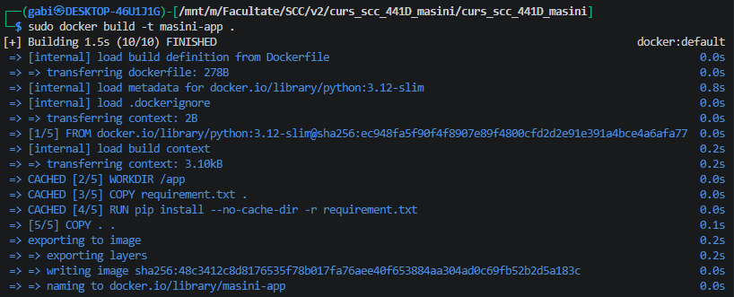

**2. Containerul ruland**

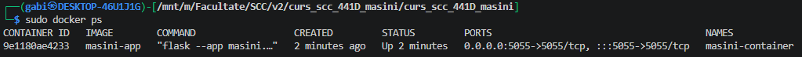

**3. Accesarea aplicatiei din browser**
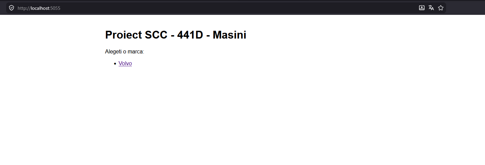
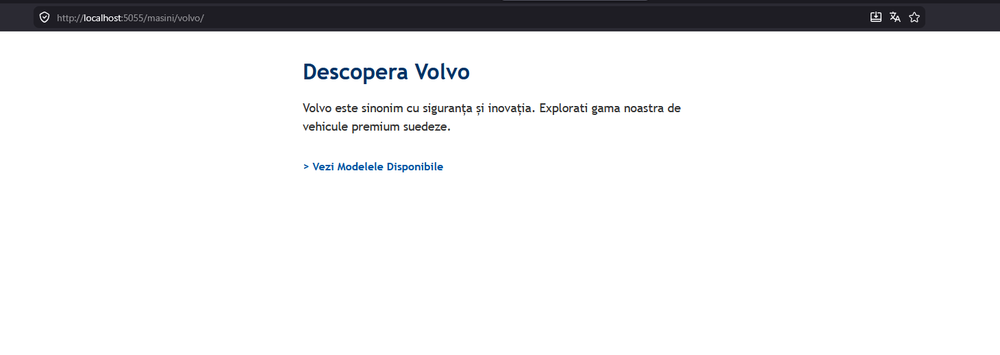
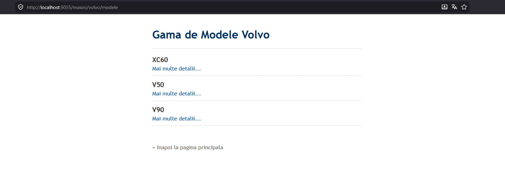
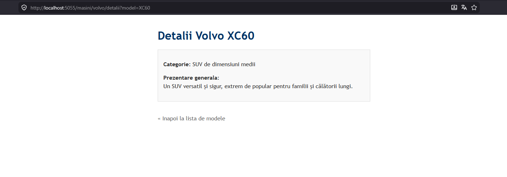

**4. Log-urile din consola care confirma accesarea**
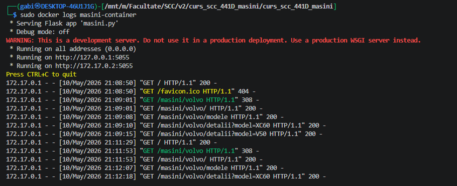

#### Pull Requests

Review:
-alexsterpan

---

## Maravela Viorel

> Documentație preluată din branch-ul `main_Maravela_Viorel`.


---

## Marinescu Silviu

> Documentație preluată din branch-ul `main_marinescu_silviu`.

### curs_scc_441D_masini

---

## Neacsu Roxana

> Documentație preluată din branch-ul `main_neacsu_roxana`.

### Proiect SCC 441D - Masini

#### Functionalitate Rolls-Royce - Neacsu Roxana

---

#### 1. Descriere generala

Acest proiect face parte din disciplina **Servicii Cloud si Containerizare**, pentru grupa **441D**, tema generala fiind **Masini**.

Pentru partea mea de proiect am implementat functionalitatea aferenta marcii **Rolls-Royce**. Functionalitatea este integrata intr-o aplicatie web realizata cu **Flask**, respectand structura proiectului de grup.

Scopul implementarii a fost adaugarea unei componente proprii in aplicatie, testarea acesteia, rularea prin Jenkins si containerizarea cu Docker.

---

#### 2. Date student

- **Student:** Neacsu Roxana
- **Grupa:** 441D
- **Tema:** Masini
- **Marca aleasa:** Rolls-Royce
- **Branch de dezvoltare:** `dev_neacsu_roxana`
- **Branch principal personal:** `main_neacsu_roxana`

---

#### 3. Functionalitate adaugata

Am adaugat o sectiune dedicata marcii **Rolls-Royce**.

Functionalitatea include:

- o pagina principala pentru Rolls-Royce;
- o pagina cu istoricul marcii;
- o pagina cu informatii despre motorizare;
- linkuri de navigare intre pagini;
- integrarea rutei Rolls-Royce in pagina principala a aplicatiei.

---

#### 4. Rute implementate

| Ruta | Descriere |
|---|---|
| `/` | Pagina principala a aplicatiei |
| `/masini/rollsroyce/` | Pagina principala Rolls-Royce |
| `/masini/rollsroyce/istoric` | Pagina cu istoricul marcii Rolls-Royce |
| `/masini/rollsroyce/motorizare` | Pagina cu informatii despre motorizare |

---

#### 5. Fisiere adaugate sau modificate

| Fisier | Rol |
|---|---|
| `masini.py` | Inregistreaza blueprint-ul Rolls-Royce si adauga linkul in pagina principala |
| `app/lib/__init__.py` | Marcheaza folderul `lib` ca pachet Python |
| `app/lib/biblioteca_masini.py` | Contine functiile pentru descriere, istoric si motorizare Rolls-Royce |
| `app/routes/rollsroyce.py` | Contine rutele Flask pentru Rolls-Royce |
| `app/test/test_rollsroyce.py` | Contine testele unitare |
| `Dockerfile` | Defineste imaginea Docker a aplicatiei |
| `Jenkinsfile` | Defineste pipeline-ul Jenkins |
| `README.md` | Documentatia proiectului |
| `docs/images/` | Contine capturile de ecran pentru documentatie |

---

#### 6. Stadiul implementarii

| Componenta | Status |
|---|---|
| Functionalitate Rolls-Royce | Implementata |
| Rute Flask | Implementate |
| Functii in biblioteca | Implementate |
| Teste unitare | Implementate si rulate cu succes |
| Rulare locala in browser | Verificata |
| Dockerfile | Creat |
| Imagine Docker | Creata |
| Container Docker | Pornit si testat |
| Jenkinsfile | Creat |
| Pipeline Jenkins | Rulat cu succes |
| Capturi de ecran | Adaugate |
| README | Completat |
| Pull Request | Urmeaza sa fie creat |
| Review coleg | Urmeaza sa fie solicitat |

---

### Testare

#### 7. Testare manuala locala

Aplicatia a fost rulata local cu:

```bash
python3 masini.py
```

Aplicatia a fost accesata in browser la:

```text
http://127.0.0.1:5000
```

Au fost testate manual urmatoarele rute:

```text
http://127.0.0.1:5000/
http://127.0.0.1:5000/masini/rollsroyce/
http://127.0.0.1:5000/masini/rollsroyce/istoric
http://127.0.0.1:5000/masini/rollsroyce/motorizare
```

Rezultat: toate paginile au fost afisate corect in browser.

---

#### 8. Testare unitara

Testele unitare se afla in fisierul:

```text
app/test/test_rollsroyce.py
```

Testele verifica:

- functia pentru descrierea Rolls-Royce;
- functia pentru istoricul Rolls-Royce;
- functia pentru motorizare;
- ruta principala Rolls-Royce;
- ruta pentru istoric;
- ruta pentru motorizare.

Comanda folosita pentru rularea testelor:

```bash
python3 -m unittest app/test/test_rollsroyce.py
```

Rezultat obtinut:

```text
Ran 6 tests
OK
```

---

### Docker

#### 9. Containerizare cu Docker

Aplicatia a fost containerizata folosind fisierul `Dockerfile`.

Imaginea Docker a fost construita cu:

```bash
sudo docker build -t masini-rollsroyce-neacsu-roxana .
```

Imaginea creata:

```text
masini-rollsroyce-neacsu-roxana:latest
```

Containerul a fost pornit cu:

```bash
sudo docker run -d -p 5000:5000 --name masini-rollsroyce-container masini-rollsroyce-neacsu-roxana
```

Containerul a fost verificat cu:

```bash
sudo docker ps
```

Aplicatia rulata in container a fost accesata in browser la:

```text
http://127.0.0.1:5000/masini/rollsroyce/
```

Logurile containerului au fost verificate cu:

```bash
sudo docker logs masini-rollsroyce-container
```

In loguri se observa cereri HTTP cu status `200`, ceea ce confirma faptul ca aplicatia din container a fost accesata corect din browser.

---

### Jenkins

#### 10. Rulare cu Jenkins

A fost creat si configurat un pipeline Jenkins pentru branch-ul:

```text
dev_neacsu_roxana
```

Pipeline-ul foloseste fisierul:

```text
Jenkinsfile
```

Stage-urile rulate in Jenkins sunt:

| Stage | Rol |
|---|---|
| Checkout | Preia codul din repository |
| Install dependencies | Instaleaza dependintele din `requirement.txt` |
| Run unit tests | Ruleaza testele unitare |
| Build Docker image | Construieste imaginea Docker |
| Run Docker container | Porneste containerul Docker |

Pipeline-ul Jenkins a rulat cu succes, iar rezultatul final a fost:

```text
Finished: SUCCESS
```

---

### Capturi de ecran

#### 11. Capturi testare in browser

##### Pagina principala

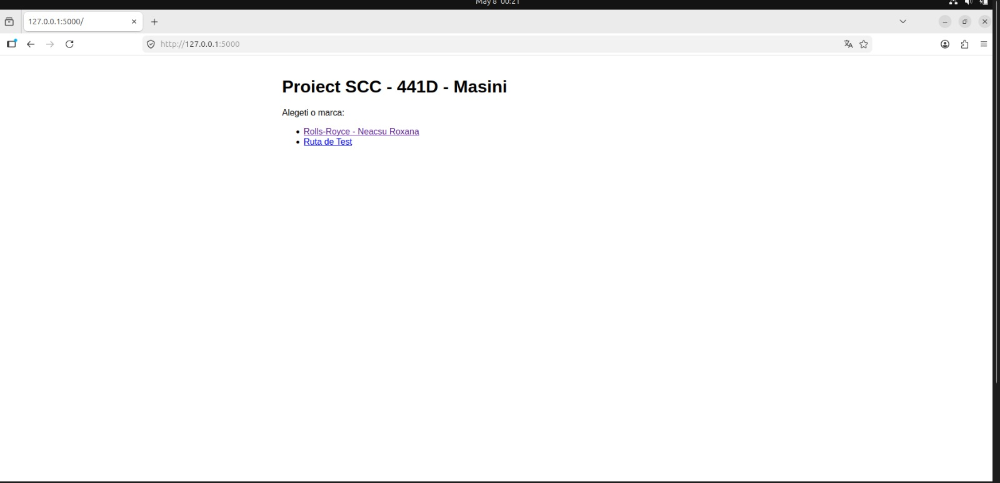

##### Pagina Rolls-Royce

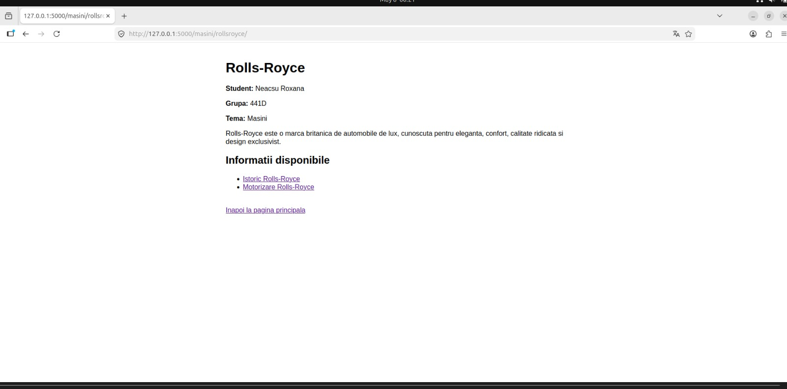

##### Pagina Istoric Rolls-Royce

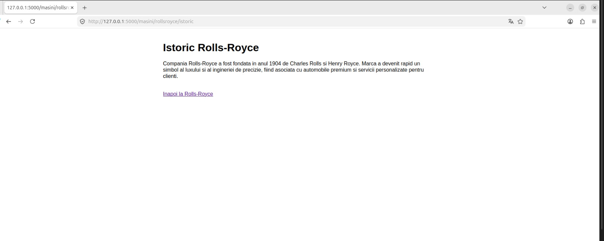

##### Pagina Motorizare Rolls-Royce

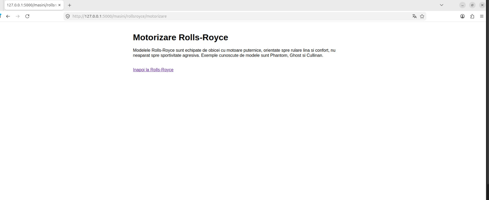

---

#### 12. Capturi Docker

##### Imagine Docker creata

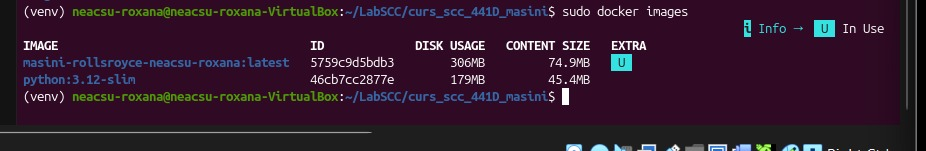

##### Container Docker pornit

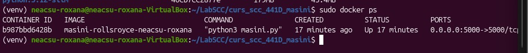

##### Loguri container Docker

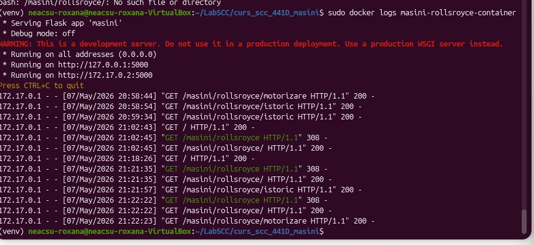

---

#### 13. Capturi Jenkins

##### Pipeline Jenkins executat cu succes

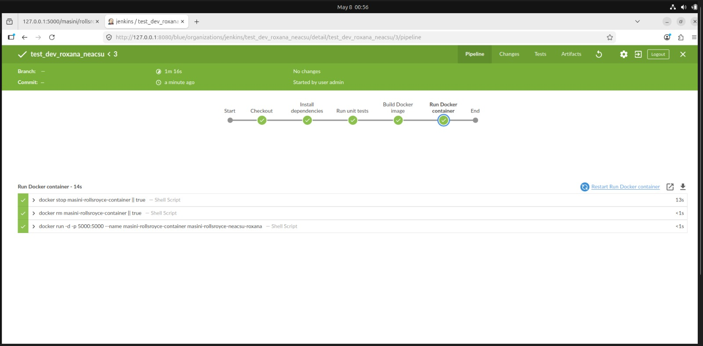

##### Console Output Jenkins

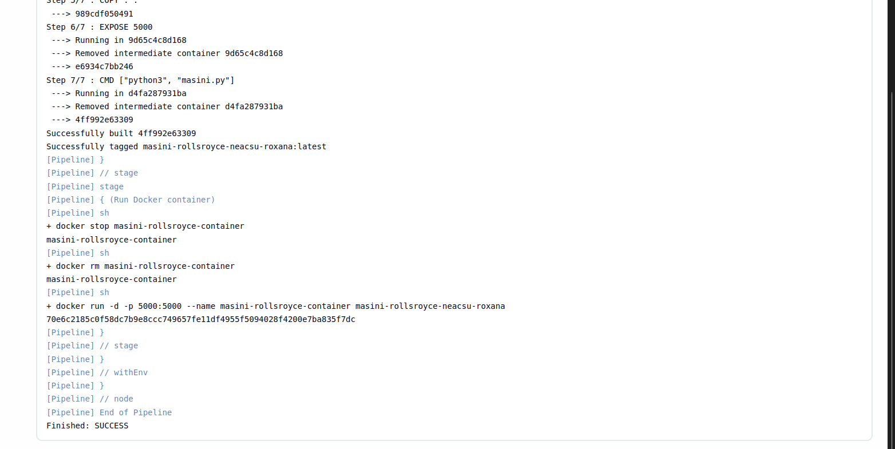

---

### Integrare GitHub

#### 14. Branch-uri folosite

Codul a fost dezvoltat pe branch-ul personal:

```text
dev_neacsu_roxana
```

Branch-ul principal personal este:

```text
main_neacsu_roxana
```

Fluxul propus pentru integrare este:

```text
dev_neacsu_roxana -> main_neacsu_roxana
```

---

#### 15. Pull Request si review

Pentru integrarea modificarilor realizate pe branch-ul de dezvoltare, a fost creat Pull Request-ul din branch-ul `dev_neacsu_roxana` catre branch-ul personal principal `main_neacsu_roxana`.

- **Pull Request:** `#9`
- **Sursa:** `dev_neacsu_roxana`
- **Destinatie:** `main_neacsu_roxana`
- **Status:** creat, verificat, aprobat si integrat cu succes
- **Review primit de la:** `stefanpoting`
- **Merge realizat de:** `CosminFierea`

Pull Request-ul nu a avut conflicte cu branch-ul de baza, iar modificarile au fost integrate cu succes in `main_neacsu_roxana`.

Status actual:

```text
PR #9 creat, aprobat si merged.
```

---

#### 16. Stadiu final si ce mai este de facut

Pentru partea personala a proiectului, functionalitatea Rolls-Royce este implementata, testata, documentata si integrata in branch-ul `main_neacsu_roxana`.

Activitati finalizate:

- implementarea functionalitatii Rolls-Royce;
- adaugarea testelor unitare;
- rularea testelor local si prin Jenkins;
- containerizarea aplicatiei cu Docker;
- rularea aplicatiei in container;
- completarea README-ului cu documentatie si capturi;
- crearea Pull Request-ului `#9`;
- obtinerea review-ului de la un coleg;
- integrarea modificarilor in `main_neacsu_roxana`;
- efectuarea/verificarea review-ului pentru Pull Request-ul unui coleg.

Activitati ramase, daca sunt solicitate in etapa finala a proiectului:

- integrarea in branch-ul principal al grupei `main`, doar daca este solicitata de coordonator/profesor;
- verificarea finala a documentatiei dupa integrarea in branch-ul principal al grupei.

  ## 17. Concluzie

Functionalitatea Rolls-Royce este implementata si testata.

Au fost realizate:

- rutele Flask pentru Rolls-Royce;
- testele unitare;
- rularea locala in browser;
- containerizarea cu Docker;
- rularea aplicatiei in container;
- pipeline Jenkins cu rezultat `SUCCESS`;
- documentatia README cu capturi de ecran;
- Pull Request-ul `#9`, aprobat si integrat in `main_neacsu_roxana`.

Proiectul este pregatit pentru etapa finala de verificare la nivelul grupei.

---

## Nistor Flaviu

> Documentație preluată din branch-ul `main_nistor_flaviu`.

### curs_scc_441D_masini

---

## Pamfir Cosmin

> Documentație preluată din branch-ul `main_pamfir_cosmin`.

### Proiect SCC 441D - Mașini

#### Dezvoltator

Pamfir Cosmin

#### Tema proiectului

Skoda

#### Descriere proiect

Acest proiect reprezintă o aplicație web realizată în Flask, având ca scop prezentarea unor informații despre marca Skoda. Aplicația conține pagini dedicate pentru informații generale, descriere și alte detalii despre mașină.

Proiectul folosește Git pentru versionare, Docker pentru containerizare și Jenkins pentru automatizarea etapelor de build, testare și verificare a codului.

#### Tehnologii folosite

- Python
- Flask
- Docker
- Jenkins
- Git / GitHub
- Pytest
- Unittest
- Pylint
- Gunicorn

#### Structura proiectului

- `masini.py` - fișierul principal al aplicației Flask
- `app/routes/` - rutele aplicației
- `app/lib/` - funcțiile folosite în proiect
- `app/test/` - testele automate
- `Dockerfile` - fișierul folosit pentru construirea imaginii Docker
- `Jenkinsfile` - fișierul care definește pipeline-ul Jenkins
- `requirement.txt` - bibliotecile necesare proiectului
- `docs/` - capturi de ecran pentru documentație

#### Rulare locală

Se creează mediul virtual:

```bash
python3 -m venv .venv
```

Se activează mediul virtual:

```bash
source .venv/bin/activate
```

Se instalează dependențele:

```bash
pip install -r requirement.txt
```

Se pornește aplicația:

```bash
python3 masini.py
```

Aplicația poate fi accesată în browser la adresa:

```text
http://127.0.0.1:5000
```

#### Rulare cu Docker

Se construiește imaginea Docker:

```bash
docker build -t masini-skoda-pamfir .
```

Se pornește containerul:

```bash
docker run --name container-skoda-pamfir -p 5000:5000 masini-skoda-pamfir
```

Aplicația poate fi accesată în browser la adresa:

```text
http://127.0.0.1:5000/masini/skoda
```

Pentru verificarea containerului pornit se folosește:

```bash
docker ps
```

#### Testare

Testele automate au fost rulate folosind Pytest:

```bash
PYTHONPATH=. pytest app/test
```

De asemenea, testele au fost rulate și cu Unittest:

```bash
PYTHONPATH=. python3 -m unittest discover -s app/test
```

Rezultatul obținut a fost trecerea cu succes a testelor.

#### Jenkins

Pentru integrare continuă a fost folosit Jenkins. Pipeline-ul conține etape pentru:

- Build;
- verificarea calității codului cu Pylint;
- rularea testelor cu Pytest;
- rularea testelor cu Unittest;
- etapa de Deploy.

Pipeline-ul s-a finalizat cu succes, ceea ce confirmă că proiectul este configurat corect.

#### Capturi de ecran

##### Teste automate rulate cu succes

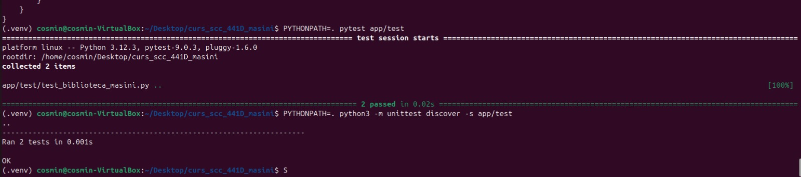

##### Container Docker pornit

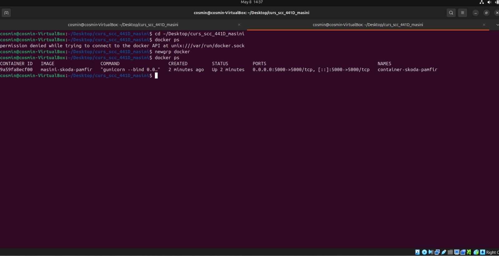

##### Build și rulare Docker

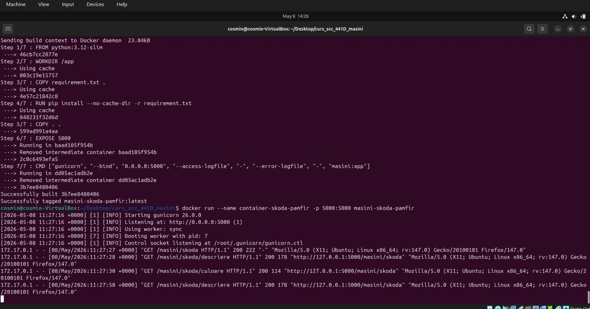

##### Consolă Jenkins

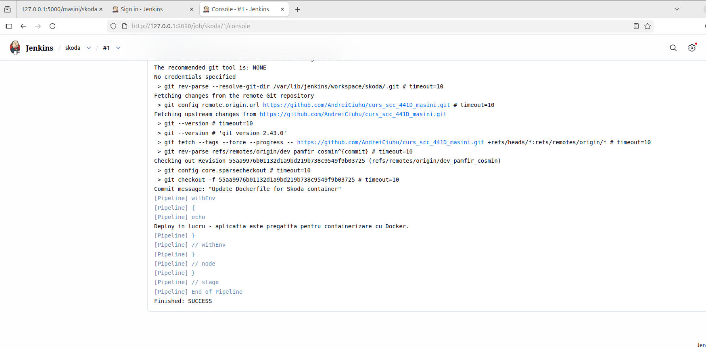

##### Pipeline Jenkins finalizat cu succes

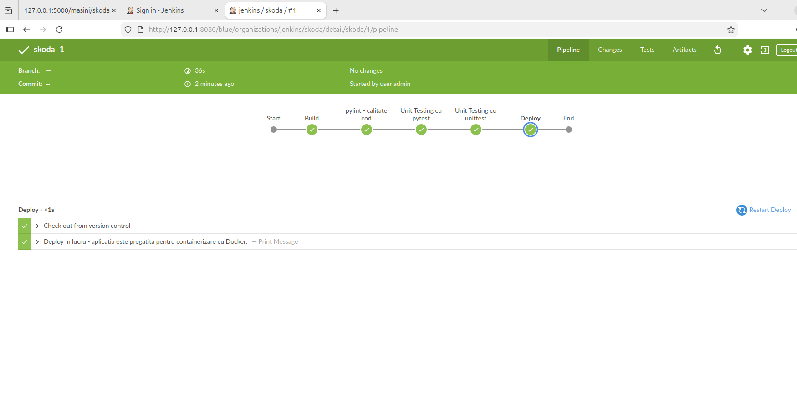

#### Concluzie

Proiectul demonstrează realizarea unei aplicații web simple folosind Flask, gestionarea codului prin Git și GitHub, rularea testelor automate, containerizarea aplicației cu Docker și automatizarea verificărilor prin Jenkins.# curs_scc_441D_masini

---

## Poting Stefan

> Documentație preluată din branch-ul `main_poting_stefan`.

### Proiect SCC 441D - Mașini

#### 1. Dezvoltator

**Ștefan Potîng**

#### 2. Tema proiectului

**Mașini**

#### 3. Element ales

**McLaren**

#### 4. Branch-uri folosite

Pentru dezvoltarea contribuției individuale au fost utilizate următoarele branch-uri:

- `dev_poting_stefan` — branch-ul de dezvoltare, unde a fost implementată funcționalitatea;
- `main_poting_stefan` — branch-ul principal individual, unde se va integra codul prin Pull Request.

Fluxul de lucru urmărit:

```text
dev_poting_stefan -> main_poting_stefan
```

---

### 5. Descriere generală

În cadrul proiectului de **Servicii Cloud și Containerizare**, grupa **441D**, tema **Mașini**, am dezvoltat o funcționalitate individuală pentru marca **McLaren**.

Scopul contribuției este integrarea unei secțiuni dedicate mărcii McLaren într-o aplicație web realizată cu Flask. Funcționalitatea include rute web, funcții separate în biblioteca aplicației, teste unitare, containerizare Docker și rulare automată a testelor prin Jenkins.

Contribuția respectă structura proiectului de grup și este organizată astfel încât codul să poată fi testat, containerizat și integrat prin GitHub Pull Request.

---

### 6. Funcționalitate adăugată

Funcționalitatea implementată pentru marca **McLaren** include:

- pagină pentru tema generală a proiectului: **Mașini**;
- pagină dedicată elementului ales: **McLaren**;
- rută pentru afișarea culorilor disponibile pentru McLaren;
- rută pentru afișarea unei descrieri despre McLaren;
- funcții Python definite separat în biblioteca aplicației;
- rute Flask organizate prin Blueprint;
- teste unitare pentru verificarea funcțiilor implementate;
- fișier `Dockerfile` pentru containerizarea aplicației;
- fișier `Jenkinsfile` pentru rularea automată a pipeline-ului;
- documentație tehnică și capturi de ecran în `README.md`.

---

### 7. Structura fișierelor adăugate/modificate

```text
app/
├── __init__.py
├── lib/
│   ├── __init__.py
│   └── biblioteca_masini.py
├── routes/
│   ├── __init__.py
│   └── mclaren.py
└── test/
    ├── __init__.py
    └── test_biblioteca_masini.py

docs/
└── screenshots/
    ├── 01_flask_home.png
    ├── 02_flask_masini.png
    ├── 03_flask_mclaren.png
    ├── 04_docker_images.png
    ├── 05_docker_ps.png
    ├── 06_docker_logs.png
    ├── 07_jenkins_success.png
    ├── 08_unittest_local.png
    └── 09_jenkins_pipeline_stages.png

Dockerfile
Jenkinsfile
.dockerignore
requirement.txt
masini.py
README.md
```

---

### 8. Arhitectura aplicației

Aplicația este organizată modular:

- `masini.py` reprezintă fișierul principal al aplicației Flask;
- `app/lib/biblioteca_masini.py` conține funcțiile specifice elementului ales;
- `app/routes/mclaren.py` conține rutele Flask pentru McLaren, definite prin Blueprint;
- `app/test/test_biblioteca_masini.py` conține testele unitare;
- `Dockerfile` definește imaginea Docker a aplicației;
- `Jenkinsfile` definește pipeline-ul de testare și deploy;
- `requirement.txt` conține dependențele necesare proiectului.

---

### 9. Funcții implementate

Fișierul în care au fost definite funcțiile este:

```text
app/lib/biblioteca_masini.py
```

Funcțiile implementate:

```python
def culoare_mclaren() -> str:
    return "McLaren este disponibila in culori precum portocaliu, negru, alb si gri."


def descriere_mclaren() -> str:
    return (
        "McLaren este o marca britanica de automobile sport si supercaruri, "
        "cunoscuta pentru performanta ridicata, design aerodinamic si tehnologii "
        "inspirate din motorsport si Formula 1."
    )
```

Rolul acestor funcții este de a separa logica aplicației de partea de rutare Flask. Astfel, informațiile despre McLaren sunt definite într-o bibliotecă, iar rutele doar apelează aceste funcții și afișează rezultatul în browser.

---

### 10. Rute Flask implementate

Rutele au fost definite în fișierul:

```text
app/routes/mclaren.py
```

Acestea sunt înregistrate în aplicația principală prin Blueprint.

| Rută | Metodă | Descriere |
|---|---|---|
| `/` | GET | Pagina principală a aplicației |
| `/masini` | GET | Pagina generală pentru tema Mașini |
| `/masini/mclaren` | GET | Pagina principală pentru marca McLaren |
| `/masini/mclaren/culoare` | GET | Afișează rezultatul funcției `culoare_mclaren()` |
| `/masini/mclaren/descriere` | GET | Afișează rezultatul funcției `descriere_mclaren()` |

---

### 11. Rulare locală

Aplicația poate fi rulată local cu următoarea comandă:

```bash
python3 masini.py
```

După pornirea aplicației, aceasta poate fi accesată în browser la:

```text
http://127.0.0.1:5000/
```

Rutele testate manual:

```text
http://127.0.0.1:5000/
http://127.0.0.1:5000/masini
http://127.0.0.1:5000/masini/mclaren
http://127.0.0.1:5000/masini/mclaren/culoare
http://127.0.0.1:5000/masini/mclaren/descriere
```

---

### 12. Testare manuală Flask

#### Pagina principală

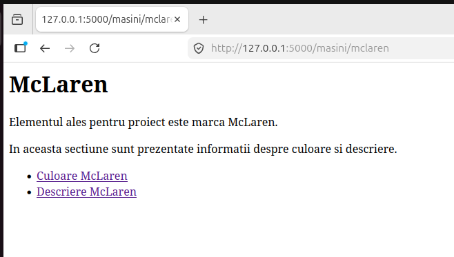

#### Pagina Culoare Mașini


#### Pagina Descriere McLaren

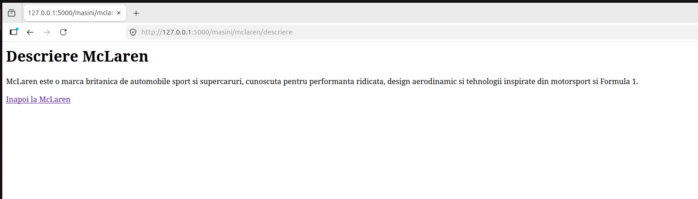

---

### 13. Teste unitare locale

Testele unitare au fost implementate în:

```text
app/test/test_biblioteca_masini.py
```

Acestea verifică dacă funcțiile definite pentru McLaren returnează texte care conțin marca **McLaren**.

Comanda folosită pentru rularea testelor locale:

```bash
PYTHONPATH=. python3 -m unittest app/test/test_biblioteca_masini.py
```

Rezultat obținut:

```text
Ran 2 tests
OK
```

#### Captură teste unitare locale


---

### 14. Dependente

Dependentele proiectului sunt definite în fișierul:

```text
requirement.txt
```

Conținutul fișierului:

```text
flask
pytest
pylint
gunicorn
```

Rolul dependențelor:

| Dependință | Rol |
|---|---|
| `flask` | Framework web folosit pentru aplicație |
| `pytest` | Bibliotecă de testare, disponibilă pentru extinderea testelor |
| `pylint` | Analiză statică a codului |
| `gunicorn` | Server WSGI pentru rulare în medii de producție/container |

---

### 15. Containerizare Docker

Aplicația a fost containerizată folosind Docker.

Fișierul folosit pentru definirea imaginii este:

```text
Dockerfile
```

#### Construirea imaginii Docker

Comanda folosită:

```bash
sudo docker build -t masini-app .
```

Imaginea rezultată:

```text
masini-app:latest
```

#### Pornirea containerului

Comanda folosită:

```bash
sudo docker run -d -p 5000:5000 --name masini-container masini-app
```

Această comandă pornește aplicația în container și mapează portul `5000` al containerului către portul `5000` al mașinii virtuale.

#### Verificarea imaginilor Docker

```bash
sudo docker images
```

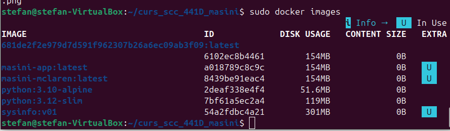

#### Verificarea containerelor active

```bash
sudo docker ps
```


#### Verificarea logurilor containerului

```bash
sudo docker logs masini-container
```

În loguri se observă accesarea rutelor Flask și răspunsurile HTTP `200`, ceea ce confirmă faptul că aplicația rulează corect în container.


---

### 16. Jenkins Pipeline

Testarea automată a fost realizată cu Jenkins, folosind fișierul:

```text
Jenkinsfile
```

Pipeline-ul a fost configurat să ruleze din repository-ul GitHub, de pe branch-ul:

```text
dev_poting_stefan
```

Configurația Jenkins:

```text
Repository URL: https://github.com/AndreiCiuhu/curs_scc_441D_masini.git
Branch Specifier: */dev_poting_stefan
Script Path: Jenkinsfile
```

---

### 17. Etapele pipeline-ului Jenkins

Pipeline-ul Jenkins include următoarele etape:

| Etapă | Rol |
|---|---|
| `Build` | Verifică versiunea Python și conținutul workspace-ului Jenkins |
| `Create virtual environment` | Creează mediul virtual Python `.venv` |
| `pylint - calitate cod` | Rulează analiza statică a codului |
| `Unit Testing cu unittest` | Rulează testele unitare din `app/test` |
| `Build image` | Construiește imaginea Docker a aplicației |
| `Deploy` | Pornește containerul Docker |
| `Verify container` | Verifică rularea containerului și logurile aplicației |

Utilizarea unui mediu virtual în Jenkins este necesară pentru izolarea dependențelor Python și pentru evitarea problemelor cauzate de instalarea pachetelor direct în mediul Python al sistemului.

---

### 18. Testare cu Jenkins

Comanda folosită în Jenkins pentru rularea testelor unitare:

```bash
PYTHONPATH=. .venv/bin/python -m unittest discover -s app/test
```

Rezultatul obținut în Jenkins:

```text
Ran 2 tests
OK
Finished: SUCCESS
```

#### Captură Jenkins Console Output


#### Captură Jenkins Pipeline Stages

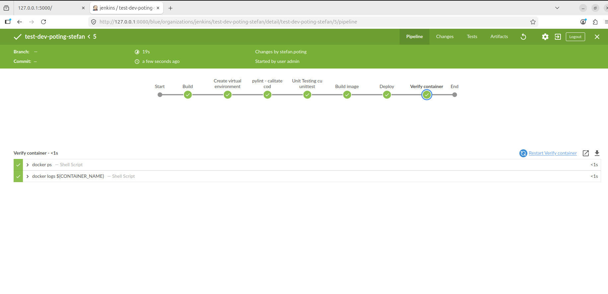

---

### 19. Analiză cod cu pylint

În pipeline a fost inclusă și etapa de analiză statică a codului cu `pylint`.

Această etapă are rolul de a verifica stilul codului și eventualele probleme de calitate. În contextul proiectului, etapa este folosită pentru validare suplimentară, fără a bloca pipeline-ul pentru avertismente minore de stil.

---

### 20. Integrare GitHub

Codul a fost dezvoltat pe branch-ul:

```text
dev_poting_stefan
```

Integrarea finală se realizează prin Pull Request către:

```text
main_poting_stefan
```

Fluxul de lucru:

```text
dev_poting_stefan -> main_poting_stefan
```

Pașii de integrare:

1. implementarea funcționalității pe `dev_poting_stefan`;
2. rularea testelor locale;
3. rularea pipeline-ului Jenkins;
4. testarea aplicației în Docker;
5. actualizarea documentației;
6. crearea Pull Request-ului către `main_poting_stefan`;
7. review din partea unui coleg;
8. integrarea modificărilor după aprobare.

---

### 21. Stadiul implementării

| Componentă | Status |
|---|---|
| Aplicație Flask | Finalizat |
| Funcții McLaren | Finalizat |
| Blueprint rute McLaren | Finalizat |
| Teste unitare locale | Finalizat |
| Dockerfile | Finalizat |
| Container Docker | Testat |
| Jenkinsfile | Finalizat |
| Pipeline Jenkins | Rulat cu succes |
| README.md | Finalizat |
| Capturi de ecran | Adăugate |
| Pull Request | Finalizat |
| Review coleg | Finalizat |

---

### 22. Pull Request-uri și review

Pull Request-ul individual va fi realizat din:

```text
dev_poting_stefan
```

către:

```text
main_poting_stefan
```

Status:

```text
Finalizat
```

Review efectuat pentru un coleg:

```text
Am efectuat review pentru PR Neacsu Roxana si PR Fierea Cosmin
```

### 23. Concluzie

Funcționalitatea pentru marca **McLaren** a fost implementată, testată local, testată automat cu Jenkins și rulată într-un container Docker. Aplicația respectă structura proiectului de grup și poate fi integrată în branch-ul principal individual prin Pull Request.

### 24. Ce mai este de făcut

crearea Pull Request-ului din main_poting_stefan către main;

---

## Sterpan Alexandru

> Documentație preluată din branch-ul `main_sterpan_alexandru`.

### curs_scc_441D_masini

#### Funcționalitate Mercedes-Benz — Sterpan Alexandru

---

#### Descriere generală

În cadrul proiectului am implementat funcționalitatea aferentă elementului **Mercedes-Benz**.

Funcționalitatea permite accesarea unor pagini dedicate mărcii Mercedes-Benz, unde sunt prezentate informații despre descrierea mărcii, originea acesteia și tipurile de motorizări folosite.

Aplicația este realizată în Flask. Logica funcționalității este separată în fișierul `mercedes.py`, rutele sunt definite separat în `app/routes/mercedes_routes.py`, iar interfața grafică este realizată prin fișiere HTML și CSS.

Proiectul include și teste unitare, un fișier `Jenkinsfile` pentru automatizarea pașilor de testare/build/deploy și un `Dockerfile` pentru rularea aplicației într-un container.

---

#### Branch-uri utilizate

Pentru realizarea proiectului au fost folosite următoarele branch-uri:

- `dev_sterpan_alexandru` - branch-ul de dezvoltare;
- `main_sterpan_alexandru` - branch-ul personal principal;
- `main` - branch-ul principal al proiectului.

Fluxul de lucru folosit:

```text
dev_sterpan_alexandru -> main_sterpan_alexandru -> main
```

Fișiere adăugate sau modificate

Pentru implementarea funcționalității Mercedes-Benz au fost adăugate sau modificate următoarele fișiere:

mercedes.py
masini.py
app/routes/mercedes_routes.py
templates/mercedes.html
static/mercedes.css
app/test/test_mercedes_functions.py
requirements.txt
Jenkinsfile
Dockerfile
.dockerignore
README.md

Funcții implementate

În fișierul mercedes.py au fost implementate următoarele funcții:

descriere_mercedes()
origine_mercedes()
motorizare_mercedes()

Rolul funcțiilor:

descriere_mercedes() returnează o descriere generală a mărcii Mercedes-Benz;
origine_mercedes() returnează informații despre originea mărcii;
motorizare_mercedes() returnează informații despre tipurile de motorizări folosite de Mercedes-Benz.


Rute implementate:

| Rută                          | Descriere                                 |
| ----------------------------- | ----------------------------------------- |
| `/`                           | Pagina principală a aplicației            |
| `/masini`                     | Pagina generală pentru tema Mașini        |
| `/masini/mercedes`            | Pagina principală Mercedes-Benz           |
| `/masini/mercedes/descriere`  | Pagina cu descrierea mărcii Mercedes-Benz |
| `/masini/mercedes/origine`    | Pagina cu originea mărcii Mercedes-Benz   |
| `/masini/mercedes/motorizare` | Pagina cu informații despre motorizare    |

Interfață grafică

Interfața grafică pentru Mercedes-Benz este realizată folosind:

templates/mercedes.html pentru structura paginii;
static/mercedes.css pentru stilizarea paginii.

Pagina are un design propriu, cu fundal închis, carduri informative și butoane de navigare către secțiunile dedicate.

Testare manuală

Au fost testate manual următoarele rute:

http://127.0.0.1:5000/masini/mercedes
http://127.0.0.1:5000/masini/mercedes/descriere
http://127.0.0.1:5000/masini/mercedes/origine
http://127.0.0.1:5000/masini/mercedes/motorizare


Testare unitară

Testele unitare au fost adăugate în fișierul:

app/test/test_mercedes_functions.py

Testele verifică funcțiile definite în mercedes.py.

Comanda pentru rularea testelor:

pytest app/test/test_mercedes_functions.py

Jenkins

A fost adăugat fișierul Jenkinsfile.

Pipeline-ul Jenkins conține următoarele stage-uri:

Install dependencies
Run unit tests
Build Docker image
Deploy container

Rolul fiecărui stage:

Install dependencies creează mediul virtual și instalează dependențele;
Run unit tests rulează testele unitare cu pytest;
Build Docker image construiește imaginea Docker a aplicației;
Deploy container pornește containerul aplicației.


---

## Varlam Cosmin

> Documentație preluată din branch-ul `main_Varlam_Cosmin`.

### curs_scc_441D_masini

---

## Vlad Alexandru

> Documentație preluată din branch-ul `main_vlad_alexandru`.

### Proiect SCC 441D - Masini

#### Dezvoltator

Vlad Alexandru

#### Branch-uri folosite

- main_vlad_alexandru
- dev_vlad_alexandru

#### Tema proiectului

Masini

#### Element ales

Mazda

#### Obiectivul proiectului

Obiectivul proiectului a fost realizarea unei aplicatii web simple in Flask si parcurgerea unui flux complet de dezvoltare software.

In proiect au fost folosite urmatoarele tehnologii si concepte:

- masina virtuala
- Git si GitHub
- Python Flask
- mediu virtual Python
- teste unitare
- Jenkins
- Docker
- Pull Request
- review de la coleg

Scopul principal nu a fost realizarea unei aplicatii complexe, ci folosirea practica a unor unelte intalnite in dezvoltare, testare, integrare si livrare software.

#### Functionalitate adaugata

A fost dezvoltata o aplicatie Flask pentru prezentarea brandului Mazda.

Aplicatia contine trei pagini principale:

- Acasa
- Istoric
- Motorizare

Pagina Acasa afiseaza mesajul:

"Va rog sa apasati pe unul dintre butoane pentru a selecta ce doriti sa aflati despre Mazda"

Pagina Istoric prezinta pe scurt brandul Mazda.

Pagina Motorizare prezinta cateva dintre cele mai importante motoare fabricate de Mazda, cu detalii tehnice scurte.

#### Rute implementate

- /
- /masini
- /masini/mazda
- /masini/mazda/istoric
- /masini/mazda/motorizare

#### Structura proiectului

Fisiere si foldere importante:

- masini.py
- app/routes/test.py
- app/lib/biblioteca_masini.py
- templates/page.html
- static/style.css
- tests/test_masini.py
- Jenkinsfile
- Dockerfile
- .dockerignore
- requirement.txt
- README.md
- docs/images

#### 1. Masina virtuala

Proiectul a fost realizat intr-o masina virtuala Ubuntu, rulata in VirtualBox.

Virtualizarea permite rularea unui sistem de operare separat fata de sistemul principal. In acest caz, Ubuntu a fost folosit ca mediu de lucru pentru Git, Python, Flask, Docker si Jenkins.

Avantajul este faptul ca proiectul ruleaza intr-un mediu Linux separat si controlat.

Comenzi folosite:

```bash
cd ~/Desktop
git clone https://github.com/AndreiCiuhu/curs_scc_441D_masini.git
cd curs_scc_441D_masini
```

#### 2. Git si GitHub

Git a fost folosit pentru versionarea codului.

GitHub a fost folosit pentru gazduirea repository-ului, crearea branch-urilor, crearea Pull Request-ului si realizarea review-ului.

Comenzi folosite pentru clonarea proiectului:

```bash
git clone https://github.com/AndreiCiuhu/curs_scc_441D_masini.git
cd curs_scc_441D_masini
```

Verificarea branch-urilor:

```bash
git branch -a
```

Crearea branch-urilor personale:

```bash
git checkout main
git pull origin main
git checkout -b main_vlad_alexandru
git push -u origin main_vlad_alexandru
git checkout -b dev_vlad_alexandru
git push -u origin dev_vlad_alexandru
```

Branch-ul folosit pentru dezvoltare:

```text
dev_vlad_alexandru
```

Branch-ul folosit pentru integrare:

```text
main_vlad_alexandru
```

Comenzi folosite pentru salvarea modificarilor:

```bash
git add .
git commit -m "Adauga functionalitate Mazda pentru Vlad Alexandru"
git push origin dev_vlad_alexandru
```

#### 3. Aplicatia Flask

Flask este framework-ul Python folosit pentru realizarea aplicatiei web.

Fisierul principal al aplicatiei este:

```text
masini.py
```

Acesta creeaza aplicatia Flask si inregistreaza rutele definite in:

```text
app/routes/test.py
```

Logica pentru informatiile despre Mazda este separata in:

```text
app/lib/biblioteca_masini.py
```

Functiile folosite sunt:

- istoric_mazda()
- motorizari_mazda()

Aceasta separare ajuta la organizarea proiectului. Rutele se ocupa de afisarea paginilor, iar biblioteca se ocupa de informatiile returnate.

#### 4. Interfata HTML si CSS

Pentru afisare au fost adaugate:

```text
templates/page.html
static/style.css
```

Fisierul page.html contine structura paginii.

Fisierul style.css contine stilizarea paginii.

Aplicatia are titlul MAZDA si trei butoane:

- Acasa
- Istoric
- Motorizare

##### Pagina Acasa

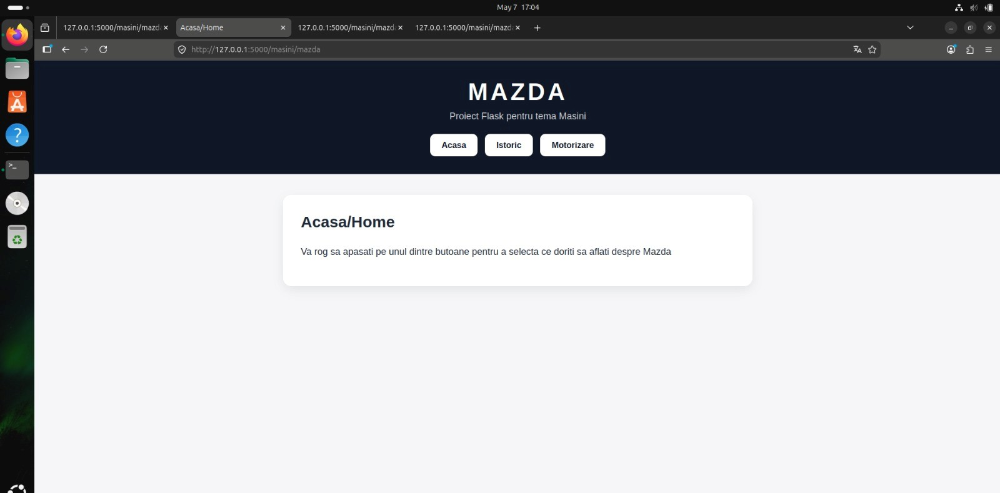

##### Pagina Istoric

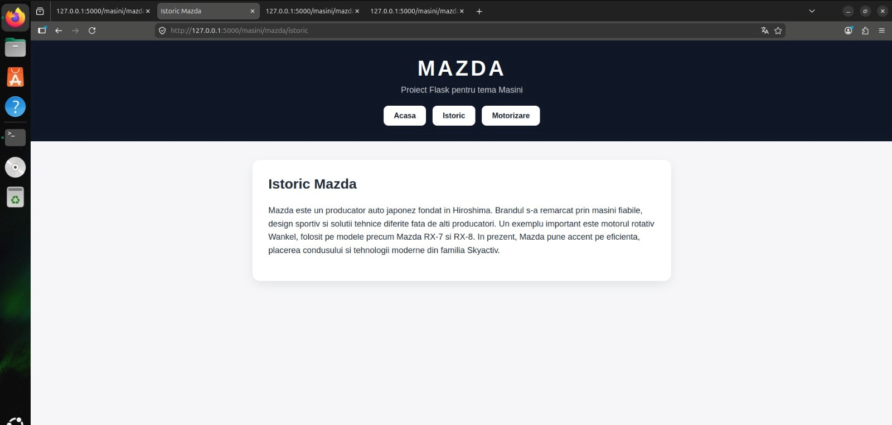

##### Pagina Motorizare

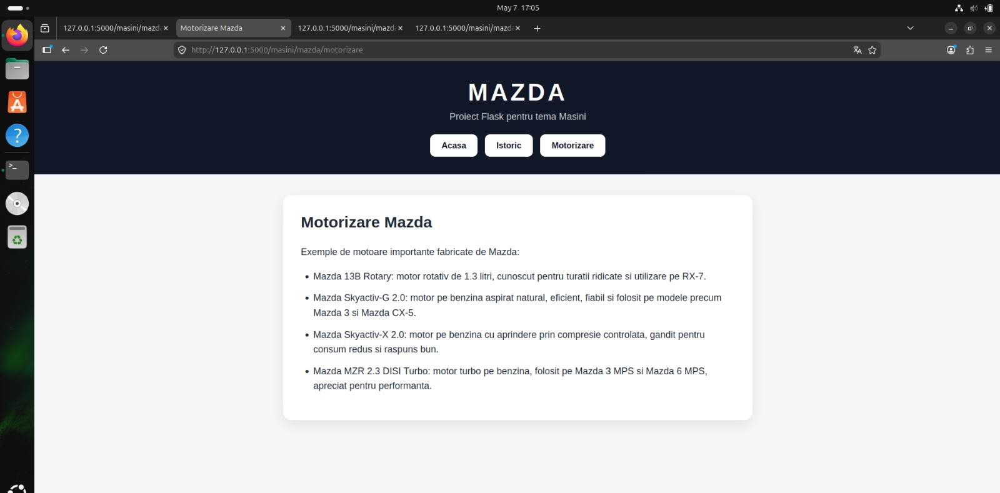

#### 5. Mediu virtual Python

A fost folosit un mediu virtual Python, numit .venv.

Mediul virtual izoleaza pachetele Python ale proiectului fata de pachetele instalate global in sistem.

Diferenta fata de masina virtuala:

- masina virtuala izoleaza un sistem de operare intreg
- venv izoleaza doar mediul Python al proiectului

Comenzi folosite:

```bash
python3 -m venv .venv
source .venv/bin/activate
python -m pip install -r requirement.txt
```

Dupa activare, in terminal apare:

```text
(.venv)
```

Dependentele proiectului sunt trecute in:

```text
requirement.txt
```

Dependente folosite:

- flask
- pytest
- pylint
- gunicorn

#### 6. Rulare locala

Aplicatia a fost rulata local cu:

```bash
python masini.py
```

Aplicatia a fost accesata din browser la:

```text
http://127.0.0.1:5000/masini/mazda
```

Au fost verificate urmatoarele rute:

```text
http://127.0.0.1:5000/masini/mazda
http://127.0.0.1:5000/masini/mazda/istoric
http://127.0.0.1:5000/masini/mazda/motorizare
```

Aplicatia a functionat corect local.

##### Dovada rulare pagina Acasa


##### Dovada rulare pagina Istoric


##### Dovada rulare pagina Motorizare


#### 7. Testare automata cu pytest

Pentru testare a fost folosit pytest.

Fisierul de test este:

```text
tests/test_masini.py
```

Testele verifica functiile din:

```text
app/lib/biblioteca_masini.py
```

Comanda folosita:

```bash
python -m pytest
```

Rezultat obtinut:

```text
2 passed
```

Acest rezultat confirma ca testele unitare au trecut.

#### 8. Verificarea codului cu pylint

pylint a fost folosit pentru verificarea calitatii codului Python.

Comanda folosita local:

```bash
python -m pylint --exit-zero app/lib/*.py app/routes/*.py tests/*.py masini.py
```

Optiunea --exit-zero permite ca procesul sa continue chiar daca pylint gaseste avertismente de stil.

In proiect, pylint este inclus si in pipeline-ul Jenkins.

#### 9. Jenkins

Jenkins a fost folosit pentru automatizarea etapelor de build, verificare, testare si deploy.

Fisierul folosit este:

```text
Jenkinsfile
```

Pipeline-ul Jenkins contine urmatoarele etape:

- Build
- Create virtual environment
- pylint - calitate cod
- Unit Testing cu pytest
- Build image
- Deploy

Rolul fiecarei etape:

Build:

- afiseaza locatia proiectului
- listeaza fisierele
- verifica versiunea Python

Create virtual environment:

- creeaza un mediu virtual nou
- instaleaza dependentele din requirement.txt

pylint - calitate cod:

- verifica fisierele Python din proiect
- verifica app/lib, app/routes, tests si masini.py

Unit Testing cu pytest:

- ruleaza testele unitare
- verifica rezultatul testelor

Build image:

- construieste imaginea Docker a aplicatiei

Deploy:

- porneste containerul Docker

Pipeline-ul Jenkins a rulat cu succes.

Toate etapele au status PASS.

##### Dovada Jenkins PASS

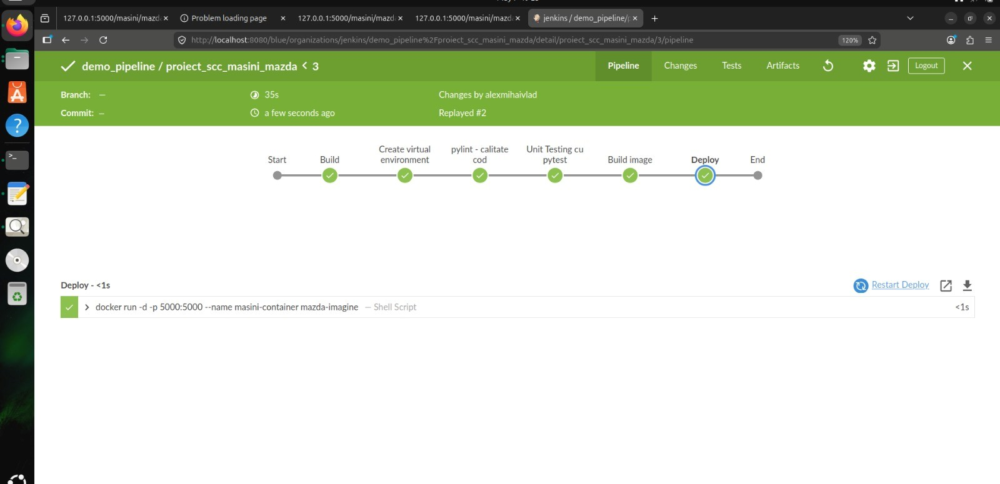

#### 10. Docker si containerizare

Docker a fost folosit pentru containerizarea aplicatiei.

Containerizarea inseamna impachetarea aplicatiei impreuna cu dependentele necesare pentru rulare.

In proiect au fost create:

```text
Dockerfile
.dockerignore
```

Dockerfile descrie pasii necesari pentru crearea imaginii Docker.

Dockerfile-ul:

- porneste de la o imagine Python
- seteaza folderul de lucru
- copiaza requirement.txt
- instaleaza dependentele
- copiaza fisierele proiectului
- expune portul 5000
- porneste aplicatia Flask

#### 11. Imagine Docker

Imaginea Docker este sablonul aplicatiei.

Ea contine:

- codul aplicatiei
- Python
- dependentele instalate
- comanda de pornire

Comanda folosita pentru construirea imaginii:

```bash
docker build -t masini-vlad-alexandru .
```

Verificarea imaginii:

```bash
docker images
```

In lista de imagini apare:

```text
masini-vlad-alexandru
```

##### Dovada imagine Docker creata

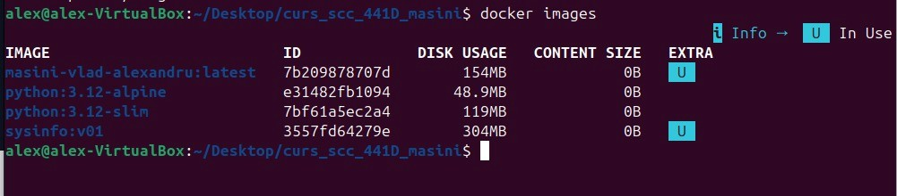

#### 12. Container Docker

Containerul este instanta pornita a imaginii Docker.

Diferenta:

- imaginea Docker este sablonul
- containerul Docker este aplicatia rulata efectiv

Comanda folosita pentru pornirea containerului:

```bash
docker run --name masini-vlad-alexandru-container -p 5000:5000 masini-vlad-alexandru
```

Portul:

```text
-p 5000:5000
```

inseamna ca portul 5000 din container este legat la portul 5000 al masinii virtuale.

Aplicatia rulata in container a fost accesata la:

```text
http://127.0.0.1:5000/masini/mazda
```

Verificarea containerului pornit:

```bash
docker ps
```

##### Dovada container Docker pornit

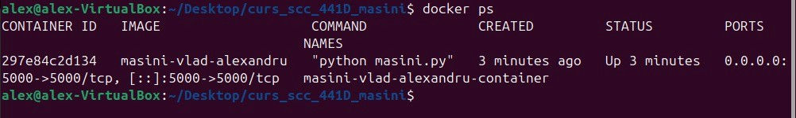

#### 13. Consola containerului

In consola containerului au aparut request-uri de tip GET cu status 200.

Exemple:

```text
GET /masini/mazda HTTP/1.1 200
GET /masini/mazda/istoric HTTP/1.1 200
GET /masini/mazda/motorizare HTTP/1.1 200
```

Acest lucru confirma ca browserul a accesat aplicatia rulata in container.

##### Dovada consola containerului


#### 14. .dockerignore

Fisierul .dockerignore exclude fisierele inutile din imaginea Docker.

Au fost excluse:

- .venv
- .git
- __pycache__
- *.pyc
- .pytest_cache

Rolul acestui fisier este sa pastreze imaginea Docker mai curata si sa nu copieze fisiere generate automat.

#### 15. Pull Request si review

Codul a fost adaugat pe branch-ul:

```text
dev_vlad_alexandru
```

A fost creat Pull Request catre branch-ul:

```text
main_vlad_alexandru
```

Pull Request-ul a primit raspuns si review.

Review-ul confirma ca modificarile au fost verificate de un coleg inainte de integrare.

##### Dovada Pull Request review


#### 16. Comenzi utile pentru prezentare

Intrare in proiect:

```bash
cd ~/Desktop/curs_scc_441D_masini
```

Verificare branch:

```bash
git branch
```

Trecere pe branch-ul de dezvoltare:

```bash
git checkout dev_vlad_alexandru
```

Verificare status Git:

```bash
git status
```

Activare mediu virtual:

```bash
source .venv/bin/activate
```

Instalare dependente:

```bash
python -m pip install -r requirement.txt
```

Rulare teste:

```bash
python -m pytest
```

Pornire aplicatie local:

```bash
python masini.py
```

Construire imagine Docker:

```bash
docker build -t masini-vlad-alexandru .
```

Verificare imagine Docker:

```bash
docker images
```

Stergere container vechi:

```bash
docker rm -f masini-vlad-alexandru-container 2>/dev/null || true
```

Pornire container:

```bash
docker run --name masini-vlad-alexandru-container -p 5000:5000 masini-vlad-alexandru
```

Verificare container pornit:

```bash
docker ps
```

Oprire container:

```bash
docker rm -f masini-vlad-alexandru-container
```

#### 17. Stadiu proiect

- functionalitate Mazda adaugata
- interfata HTML si CSS adaugata
- teste unitare adaugate
- testele pytest ruleaza cu succes
- Jenkinsfile creat
- Jenkins rulat cu succes
- Dockerfile creat
- imagine Docker construita
- container Docker pornit
- aplicatie rulata local
- aplicatie rulata in container
- capturi adaugate in README
- Pull Request creat
- review primit
