# curs_scc_441D_masini

# Functionalitate Alpine - Gheorghiu Mihai

## Functionalitate adaugata

Am implementat functionalitatea pentru marca auto Alpine, respectand structura proiectului pentru grupa 441D - Masini.

Aplicatia permite afisarea informatiilor despre marca Alpine prin intermediul unor rute Flask. Pentru elementul ales au fost implementate functii pentru culori, descriere si modele Alpine. Proiectul include teste unitare, fisier Jenkins pentru automatizarea testarii si Dockerfile pentru containerizarea aplicatiei.

Fisiere adaugate si modificate:

* `app/lib/biblioteca_masini.py` - implementarea functiilor `culoare_alpine()`, `descriere_alpine()` si `modele_alpine()`.
* `app/routes/alpine.py` - blueprint-ul Flask asociat rutelor pentru marca Alpine.
* `masini.py` - inregistrarea blueprint-ului `alpine_bp` in aplicatia principala.
* `app/test/test_biblioteca_masini.py` - teste unitare pentru functiile implementate si pentru rutele Flask.
* `Dockerfile` - instructiunile pentru construirea imaginii Docker.
* `Jenkinsfile` - pipeline-ul pentru instalarea dependintelor, rularea testelor, construirea imaginii Docker si pornirea containerului.
* `README.md` - documentatia proiectului.

Rute adaugate:

* `/` - pagina principala a aplicatiei
* `/masini` - pagina temei Masini
* `/masini/alpine` - pagina de prezentare pentru marca Alpine
* `/masini/alpine/culoare` - afiseaza culorile disponibile pentru Alpine
* `/masini/alpine/descriere` - afiseaza descrierea marcii Alpine
* `/masini/alpine/modele` - afiseaza modele reprezentative Alpine

## Stadiul implementarii

* [x] Cod adaugat
* [x] Functii implementate in `biblioteca_masini.py`
* [x] Rute Flask adaugate
* [x] Teste adaugate
* [x] Jenkinsfile configurat
* [x] Dockerfile creat
* [x] Aplicatie containerizata
* [x] Testare manuala realizata
* [x] Testare Jenkins realizata
* [x] Pull Request creat
* [x] Pull Request aprobat
* [x] Review acordat unui coleg
* [x] Merge in `main_gheorghiu_mihai`

## Testare

### Testare manuala

Aplicatia a fost pornita local si au fost accesate rutele implementate in browser. Rutele pentru pagina principala, tema Masini si functionalitatea Alpine au fost testate cu succes.

Comanda folosita pentru rularea aplicatiei:

```bash
flask --app masini.py run --host=0.0.0.0
```

Rute testate:

* `http://127.0.0.1:5000/`
* `http://127.0.0.1:5000/masini`
* `http://127.0.0.1:5000/masini/alpine`
* `http://127.0.0.1:5000/masini/alpine/culoare`
* `http://127.0.0.1:5000/masini/alpine/descriere`
* `http://127.0.0.1:5000/masini/alpine/modele`

<details>
  <summary>Vezi captura de ecran: Pagina principala</summary>
  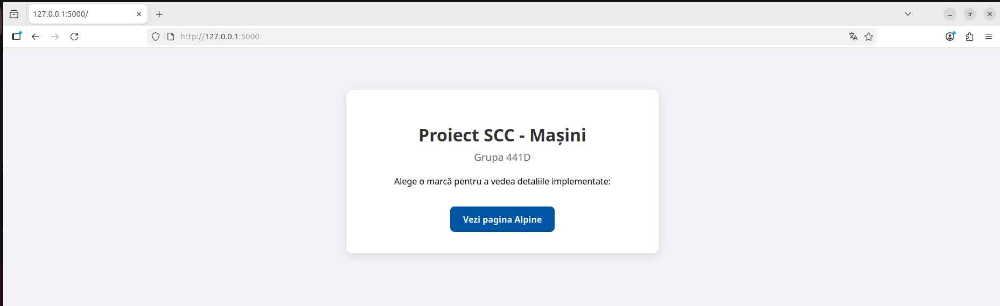
</details>

<details>
  <summary>Vezi captura de ecran: Pagina Masini</summary>
  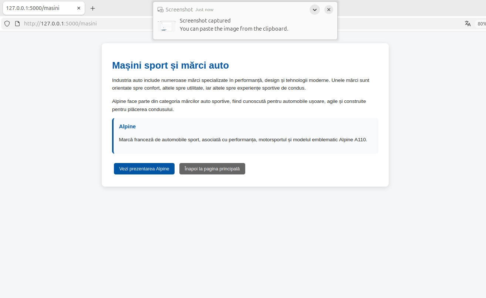
</details>

<details>
  <summary>Vezi captura de ecran: Pagina Alpine</summary>
  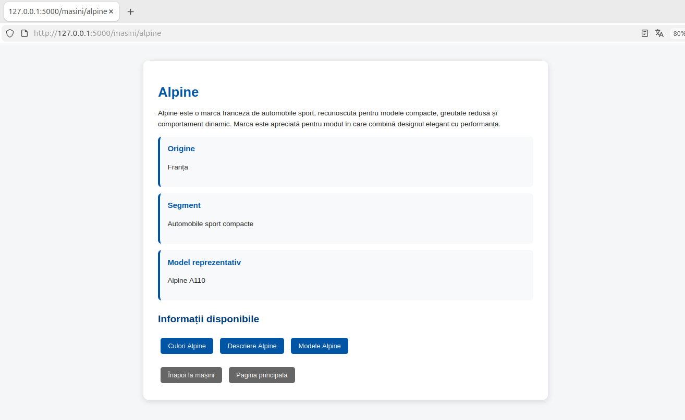
</details>

<details>
  <summary>Vezi captura de ecran: Culoare Alpine</summary>
  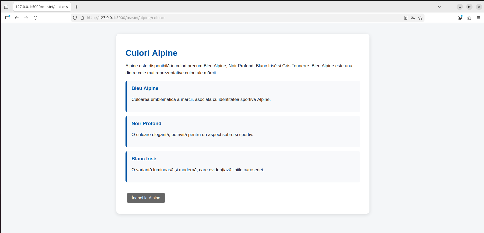
</details>

<details>
  <summary>Vezi captura de ecran: Descriere Alpine</summary>
  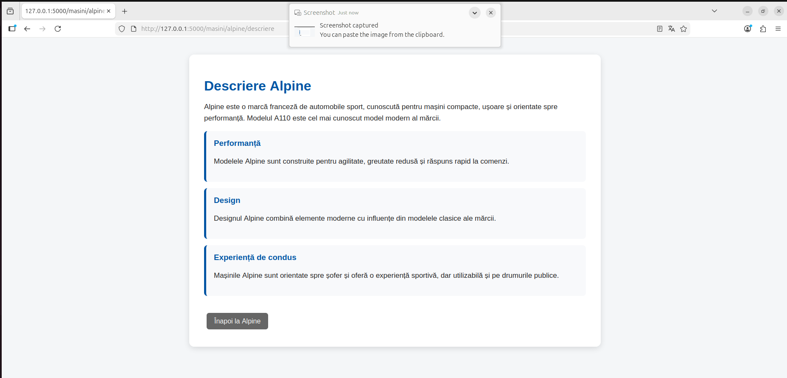
</details>

<details>
  <summary>Vezi captura de ecran: Modele Alpine</summary>
  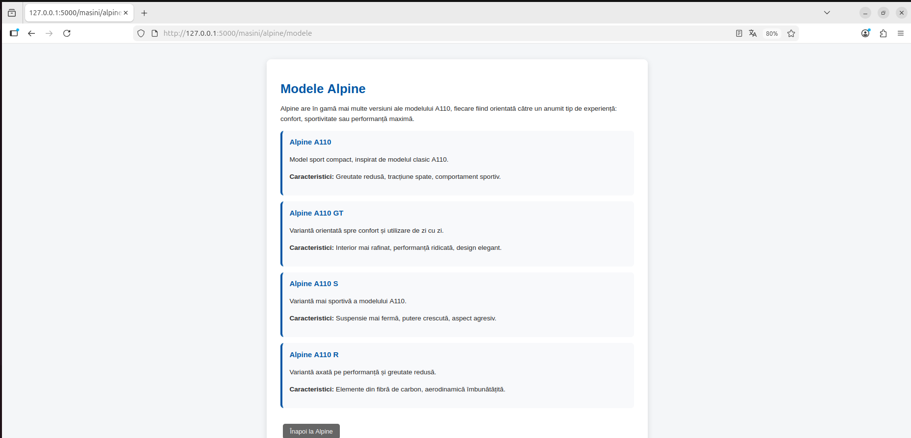
</details>

### Testare unitara

Testele unitare au fost implementate in fisierul `app/test/test_biblioteca_masini.py`.

Testele verifica:

* daca functia `culoare_alpine()` returneaza un rezultat de tip `str`;
* daca rezultatul functiei `culoare_alpine()` contine textul `Alpine`;
* daca functia `descriere_alpine()` returneaza un rezultat de tip `str`;
* daca rezultatul functiei `descriere_alpine()` contine textul `Alpine`;
* daca functia `modele_alpine()` returneaza o lista de modele;
* daca fiecare model contine campurile `nume`, `descriere` si `caracteristici`;
* daca rutele Flask pentru Alpine raspund cu status code `200`.

Comanda folosita pentru rularea testelor:

```bash
PYTHONPATH=. python -m unittest discover -s app/test
```

Rezultat: testele au rulat cu succes, status PASS.

<details>
  <summary>Vezi captura de ecran: Teste unitare rulate local</summary>
  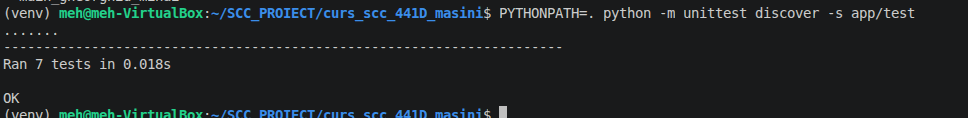
</details>

### Testare cu Jenkins

Automatizarea testarii a fost realizata prin Jenkins. Pipeline-ul a rulat cu succes, iar testele au trecut.

<details>
  <summary>Vezi captura de ecran: Executie Jenkins</summary>
  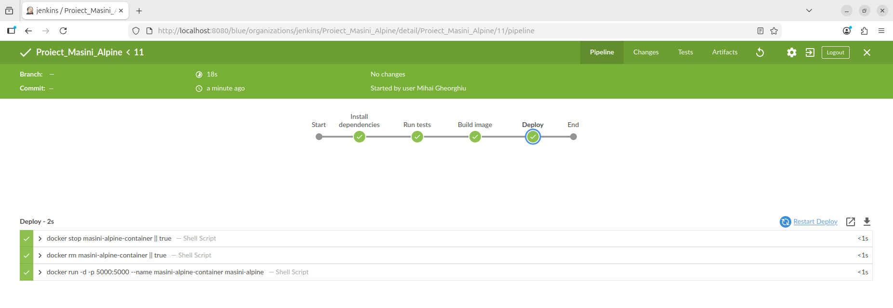
</details>

## Fisier Jenkins

A fost utilizat un pipeline declarativ definit in fisierul `Jenkinsfile`.

Pipeline-ul contine urmatoarele stage-uri:

* Install dependencies - creeaza mediul virtual Python si instaleaza dependintele din `requirement.txt`.
* Run tests - ruleaza testele din folderul `app/test`.
* Build image - construieste imaginea Docker `masini-alpine`.
* Deploy - opreste containerul vechi, il sterge si porneste un container nou pe baza imaginii create.

## Containerizare

Aplicatia a fost containerizata folosind Docker. Imaginea Docker a fost construita cu succes, iar containerul rezultat permite accesarea aplicatiei Flask din browser.

Comanda pentru construirea imaginii:

```bash
docker build -t masini-alpine .
```

Comanda pentru pornirea containerului:

```bash
docker run -d -p 5000:5000 --name masini-alpine-container masini-alpine
```

Comanda pentru verificarea imaginilor:

```bash
docker images
```

Comanda pentru verificarea containerului:

```bash
docker ps
```

Comanda pentru verificarea log-urilor containerului:

```bash
docker logs masini-alpine-container
```

<details>
  <summary>Vezi captura de ecran: Imagine Docker creata</summary>
  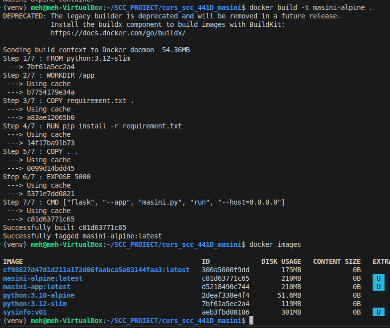
</details>

<details>
  <summary>Vezi captura de ecran: Container Docker creat si functional</summary>
  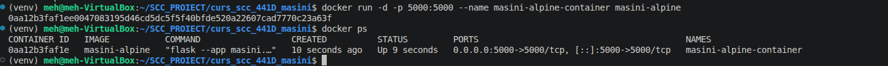
</details>

<details>
  <summary>Vezi captura de ecran: Browser accesand aplicatia din container</summary>
  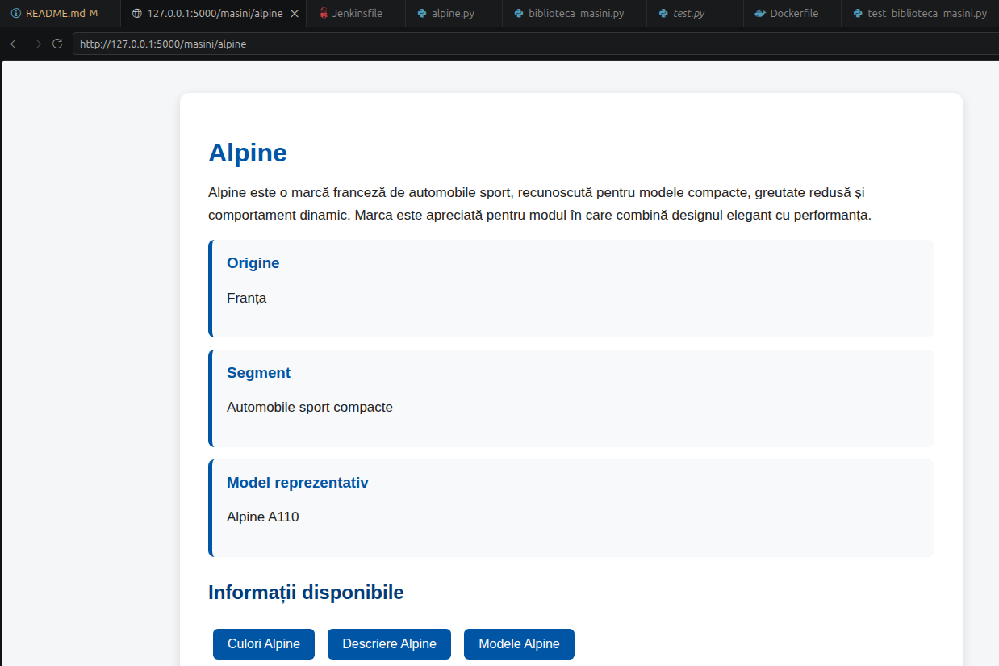
</details>

<details>
  <summary>Vezi captura de ecran: Consola cu log-uri</summary>
  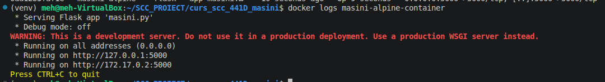
</details>

## Integrare

Pull Request-ul va fi creat din branch-ul:

```text
dev_gheorghiu_mihai
```

catre branch-ul:

```text
main_gheorghiu_mihai
```

Status actual: Pull Request aprobat si integrat cu succes in `main_gheorghiu_mihai`.

Dupa verificarea functionalitatii, PR-ul va fi trimis pentru review catre un coleg din grupa. Dupa aprobare, modificarile vor fi integrate in branch-ul principal personal.

## Pull Request-uri la care am facut review

Urmeaza sa acord review pentru PR-ul unui coleg din grupa, conform cerintelor proiectului.

| PR | Descriere | Status |
|---|---|---|
| PR #... | Review pentru functionalitatea unui coleg | Aprobat |

## Ce mai este de facut

Proiectul este finalizat. Nu mai exista task-uri restante.
