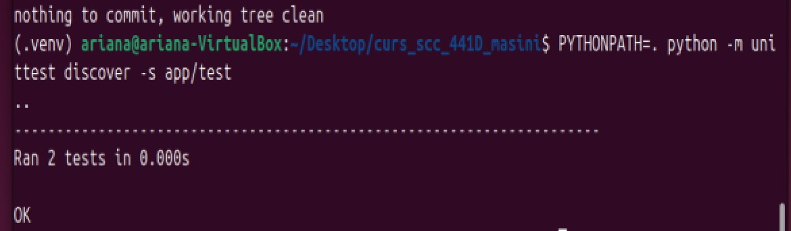
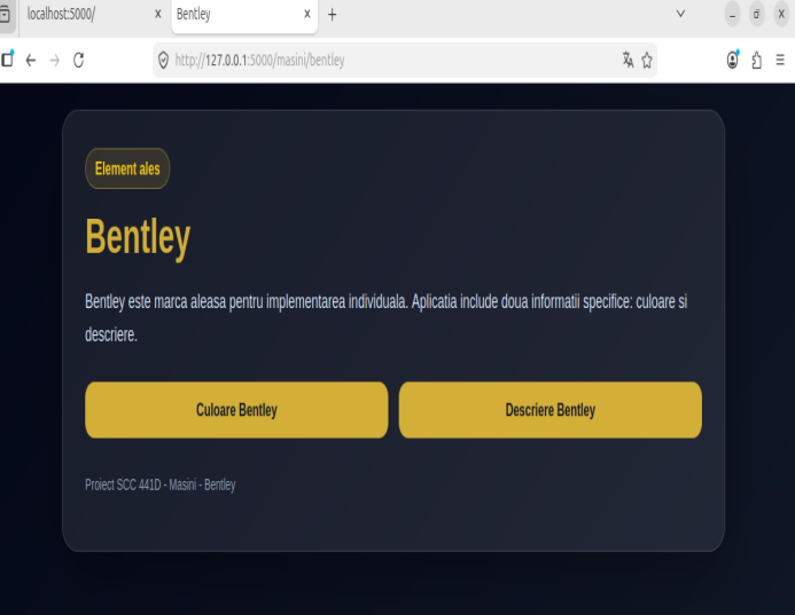
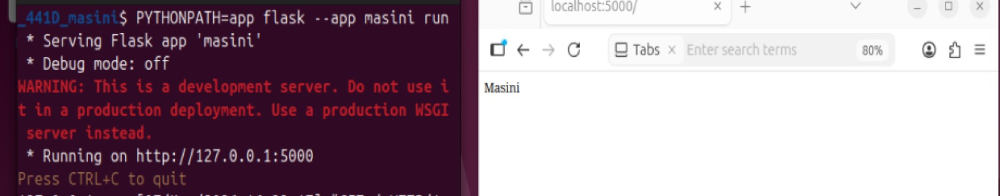
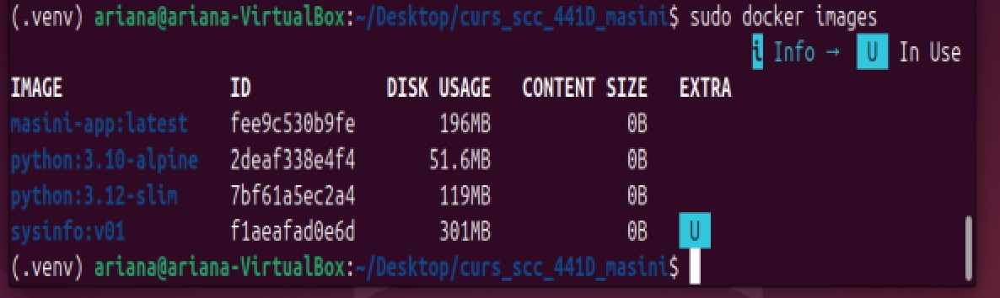
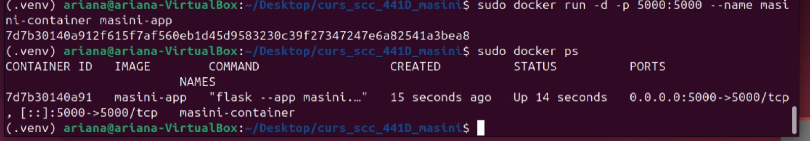
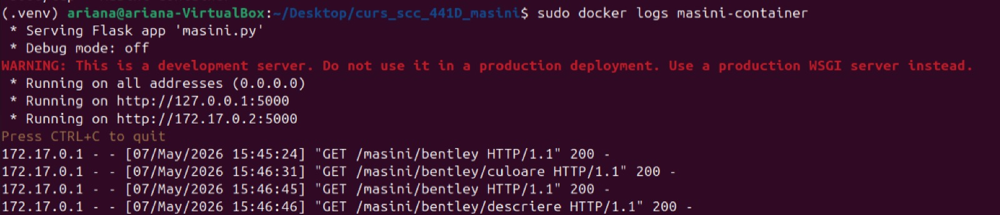

# curs_scc_441D_masini
# curs_scc_441D_masini

# Funcționalitate Bentley — Ispas Ariana-Elena

## 1. Descriere generală

În cadrul proiectului **Servicii Cloud și Containerizare — grupa 441D — tema Mașini**, am implementat funcționalitatea aferentă elementului **Bentley**.

Funcționalitatea dezvoltată respectă structura proiectului de grup și include rute Flask, funcții dedicate în biblioteca aplicației, teste unitare, containerizare cu Docker și rulare automată prin Jenkins.

---

## 2. Funcționalitate adăugată

Funcționalitatea Bentley este compusă din:

- definirea funcțiilor `culoare_bentley()` și `descriere_bentley()` în fișierul `app/lib/biblioteca_masini.py`;
- crearea fișierului `app/routes/bentley.py`, care conține Blueprint-ul pentru rutele Bentley;
- înregistrarea Blueprint-ului Bentley în aplicația principală `masini.py`;
- adăugarea testelor unitare în `app/test/test_biblioteca_masini.py`;
- configurarea fișierului `Dockerfile` pentru containerizarea aplicației;
- configurarea fișierului `Jenkinsfile` pentru rularea pipeline-ului Jenkins;
- completarea documentației în `README.md`.

---

## 3. Fișiere adăugate sau modificate

- `app/lib/biblioteca_masini.py`
- `app/routes/bentley.py`
- `app/test/test_biblioteca_masini.py`
- `masini.py`
- `Dockerfile`
- `Jenkinsfile`
- `requirement.txt`
- `README.md`
- `docs/screenshots/`

---

## 4. Rute implementate

| Rută | Descriere |
|---|---|
| `/` | Pagina principală a aplicației |
| `/masini` | Pagina temei generale „Mașini” |
| `/masini/bentley` | Pagina principală pentru elementul Bentley |
| `/masini/bentley/culoare` | Afișează informațiile returnate de funcția `culoare_bentley()` |
| `/masini/bentley/descriere` | Afișează informațiile returnate de funcția `descriere_bentley()` |

---

## 5. Stadiul implementării

| Componentă | Status |
|---|---|
| Cod aplicație | Implementat |
| Funcții în bibliotecă | Implementat |
| Rute Flask | Implementat |
| Teste unitare | Implementat |
| Dockerfile | Configurat |
| Jenkinsfile | Configurat |
| Containerizare | Testată |
| Pipeline Jenkins | Rulat cu succes |
| Documentație | Completată |

---

# Testare

## 6. Testare manuală locală

Aplicația a fost pornită local, iar rutele aferente funcționalității Bentley au fost accesate din browser.

Comanda folosită pentru pornirea aplicației:

```bash
PYTHONPATH=. python3 masini.py
```

Rute testate manual:

- `http://127.0.0.1:5000/masini/bentley`
- `http://127.0.0.1:5000/masini/bentley/culoare`
- `http://127.0.0.1:5000/masini/bentley/descriere`

În consola aplicației se observă accesarea rutelor Bentley cu status HTTP `200`, ceea ce confirmă funcționarea corectă a paginilor implementate.



### Pagina Bentley



### Pagina „Culoare Bentley”


### Pagina „Descriere Bentley”


---

## 7. Testare unitară

Testele unitare au fost implementate în fișierul:

```text
app/test/test_biblioteca_masini.py
```

Comanda folosită pentru rularea testelor unitare:

```bash
PYTHONPATH=. python -m unittest discover -s app/test
```

Rezultatul obținut a fost `OK`, fiind rulate două teste unitare pentru funcțiile Bentley.



---

## 8. Containerizare cu Docker

Aplicația a fost containerizată folosind Docker.

Comanda folosită pentru construirea imaginii:

```bash
sudo docker build -t masini-app .
```

Imaginea Docker `masini-app` a fost creată cu succes.



Containerul a fost pornit cu următoarea comandă:

```bash
sudo docker run -d -p 5000:5000 --name masini-container masini-app
```

Containerul `masini-container` a fost pornit și a expus aplicația pe portul `5000`.



Aplicația rulată în container a fost accesată din browser la ruta:

```text
http://127.0.0.1:5000/masini/bentley
```


Logurile containerului confirmă accesarea rutelor Bentley din browser cu status HTTP `200`.



---

## 9. Testare cu Jenkins

Testarea automată a fost realizată cu Jenkins, pe branch-ul:

```text
dev_ispas_ariana
```

Pipeline-ul Jenkins a rulat cu succes și a folosit fișierul `Jenkinsfile` din repository.

Rezultatul rulării a fost `SUCCESS`.


### Vizualizare pipeline în Blue Ocean

Pipeline-ul conține următoarele etape:

- `Install dependencies`
- `Run tests`
- `Build image`
- `Deploy`

Toate etapele au fost executate cu succes.


---

## 10. Fișier Jenkins

Fișierul `Jenkinsfile` definește un pipeline declarativ pentru automatizarea testării și containerizării aplicației.

Etapele pipeline-ului sunt:

| Stage | Rol |
|---|---|
| `Install dependencies` | Creează mediul Python și instalează dependențele din `requirement.txt` |
| `Run tests` | Rulează testele unitare din `app/test` |
| `Build image` | Construiește imaginea Docker `masini-app` |
| `Deploy` | Pornește containerul `masini-container` |

---

## 11. Integrare GitHub

Codul a fost dezvoltat pe branch-ul personal de dezvoltare:

```text
dev_ispas_ariana
```

Integrarea se va realiza prin Pull Request către branch-ul personal principal:

```text
main_ispas_ariana
```

Fluxul respectat este:

```text
dev_ispas_ariana -> main_ispas_ariana
```

Status:

```text
În așteptare review și aprobare.
```

---

## 12. Pull Request-uri la care am făcut review

Momentan nu a fost completat review-ul pentru un Pull Request al unui coleg.

După efectuarea review-ului, această secțiune va fi actualizată astfel:

```text
PR #<id> — Review pentru funcționalitatea <elementului>.
```

---

## 13. Ce mai este de făcut

- Crearea Pull Request-ului din `dev_ispas_ariana` în `main_ispas_ariana`;
- Atașarea capturilor de ecran în descrierea Pull Request-ului;
- Obținerea unui review de la un coleg;
- Efectuarea unui review pentru Pull Request-ul unui coleg;
- Integrarea modificărilor după aprobare.
