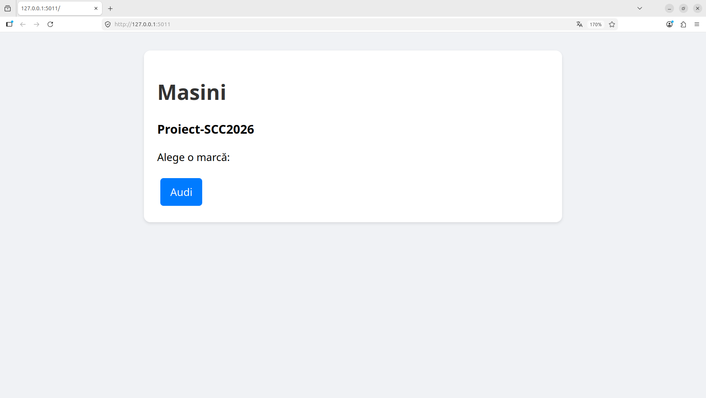
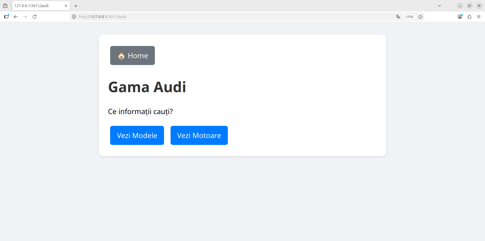
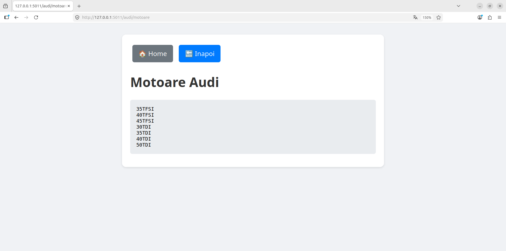
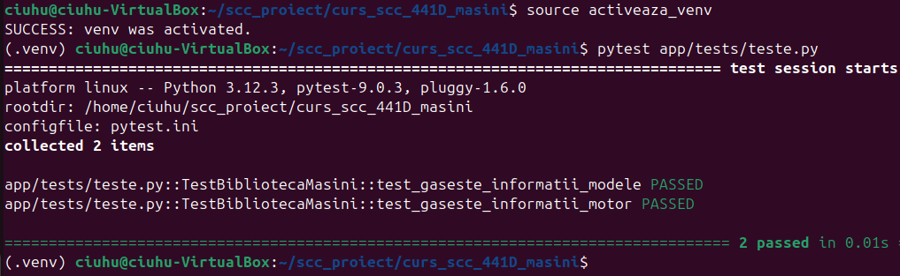
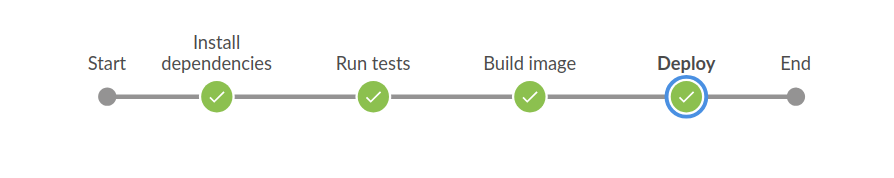
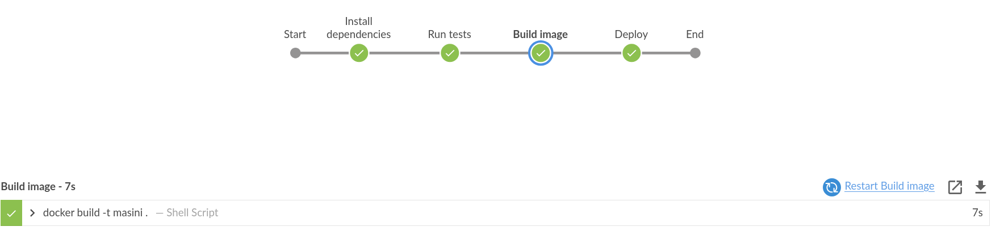
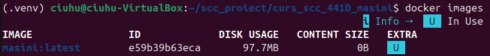
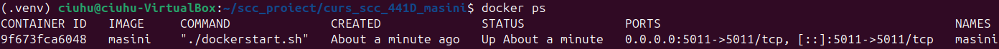

# curs_scc_441D_masini

## Documentație

## 1. Informații generale

Repository: `curs_scc_441D_masini`  
Grupă: `441D`  
Temă proiect: `Mașini`  
Dezvoltator: `Andrei Ciuhureanu`  
Branch dezvoltare: `dev_ciuhureanu_andrei`  
Element ales: `Audi`  

Aplicația este realizată în Python, folosind framework-ul Flask. Scopul proiectului este dezvoltarea unei aplicații web simple, colaborative, în care fiecare student adaugă o funcționalitate proprie, teste unitare, configurare Jenkins și containerizare Docker.

Funcționalitatea implementată este legată de marca auto **Audi**. Aplicația permite afișarea unei pagini dedicate mărcii Audi, precum și afișarea unor informații despre modele și motorizări.

---

## 2. Funcționalitatea adăugată

În cadrul branch-ului `dev_ciuhureanu_andrei`, a fost adăugată funcționalitate pentru elementul **Audi**, corespunzător temei generale **Mașini**.

Funcționalitatea constă în:

- adăugarea unei pagini principale pentru aplicația de mașini;
- adăugarea unei pagini dedicate mărcii Audi;
- adăugarea unei pagini pentru afișarea modelelor Audi;
- adăugarea unei pagini pentru afișarea motorizărilor Audi;
- implementarea funcțiilor specifice în fișierul `app/lib/biblioteca_masini.py`;
- adăugarea testelor unitare pentru funcțiile implementate;
- configurarea fișierului `Jenkinsfile`;
- adăugarea fișierului `Dockerfile` pentru containerizarea aplicației;
- documentarea funcționalității în acest fișier `README.md`.

---

## 3. Structura proiectului

Structura principală a proiectului este:

```text
curs_scc_441D_masini/
│
├── app/
│   ├── lib/
│   │   ├── biblioteca_masini.py
│   │   └── teste.py
│   │
│   └── tests/
│       └── teste.py
│
├── masini.py
├── Dockerfile
├── Jenkinsfile
├── quickrequirements.txt
├── pytest.ini
├── activeaza_venv
├── activeaza_venv_jenkins
├── dockerstart.sh
├── ruleaza_aplicatia
└── README.md
```

Fișierul principal al aplicației este:

```text
masini.py
```

Fișierul în care sunt definite funcțiile specifice temei este:

```text
app/lib/biblioteca_masini.py
```

Fișierul de testare este:

```text
app/tests/teste.py
```

---

## 4. Rute implementate

Aplicația Flask conține următoarele rute:

| Rută | Descriere |
|---|---|
| `/` | Pagina principală a aplicației |
| `/audi` | Pagina dedicată mărcii Audi |
| `/audi/model` | Pagina care afișează modelele Audi |
| `/audi/motoare` | Pagina care afișează motorizările Audi |

Exemple de accesare în browser:

```text
http://127.0.0.1:5011/
http://127.0.0.1:5011/audi
http://127.0.0.1:5011/audi/model
http://127.0.0.1:5011/audi/motoare
```

---

## 5. Funcțiile implementate

Funcțiile specifice elementului Audi sunt definite în fișierul:

```text
app/lib/biblioteca_masini.py
```

Funcțiile implementate sunt:

```text
gaseste_informatii_modele()
gaseste_informatii_motor()
```

Funcția `gaseste_informatii_modele()` returnează o listă cu modele Audi.

Funcția `gaseste_informatii_motor()` returnează o listă cu motorizări Audi.

Aceste funcții sunt apelate în aplicația principală, în rutele dedicate:

```text
/audi/model
/audi/motoare
```

---

## 6. Stadiul implementării

| Cerință | Status |
|---|---|
| Branch-urile personale create | Realizat |
| Fișierul principal Flask `masini.py` | Realizat |
| Funcționalitate pentru mașina Audi | Realizat |
| Două funcții specifice temei alese | Realizat |
| Patru rute Flask | Realizat |
| Teste unitare | Realizat |
| Fișier `Jenkinsfile` | Realizat |
| Fișier `Dockerfile` | Realizat |
| Containerizare Docker | Realizat |
| Testare manuală | Realizat |
| Testare cu Jenkins | Realizat |
| README.md completat | Realizat |
| Pull Request către branch-ul personal main | De completat |
| Review Pull Request de la coleg | De completat |

---

## 7. Rularea locală a aplicației

Pentru rularea locală a aplicației se creează și se activează mediul virtual Python.

Comenzi pentru activarea mediului virtual:

```bash
chmod +x activeaza_venv
source activeaza_venv
```

După activarea mediului virtual, aplicația se poate porni cu:

```bash
chmod +x ruleaza_aplicatia
./ruleaza_aplicatia
```

Alternativ, aplicația poate fi pornită direct cu Flask:

```bash
export FLASK_APP=masini
flask run -p 5011 --reload
```

Aplicația va fi disponibilă în browser la adresa:

```text
http://127.0.0.1:5011
```

### Capturi verificare manuală


<p align="center">Figura 7.1 Rularea comenzilor în terminalul local</p>


<p align="center">Figura 7.2 Ruta principală</p>


<p align="center">Figura 7.3 Ruta /audi</p>


<p align="center">Figura 7.4 Ruta /audi/model</p>


<p align="center">Figura 7.5 Ruta /audi/motoare</p>

---

## 8. Testele făcute

Testele unitare sunt definite în fișierul:

```text
app/tests/teste.py
```

Acestea verifică funcțiile implementate în biblioteca aplicației.

Comandă pentru rularea testelor:

```bash
pytest app/tests/teste.py
```

Rezultatul așteptat este:

```text
PASS
```

Testele verifică dacă funcțiile returnează datele așteptate pentru modelele și motorizările Audi.


<p align="center">Figura 8.1 Testarea locală cu pytest</p>

---

## 9. Fișierul Jenkins configurat

Pentru automatizarea testării și a procesului de build, branch-ul conține fișierul:

```text
Jenkinsfile
```

Pipeline-ul Jenkins conține următoarele etape:

1. instalarea dependențelor;
2. rularea testelor unitare;
3. construirea imaginii Docker;
4. pornirea containerului Docker.

Fișierul Jenkins este folosit pentru validarea automată a codului adăugat pe branch-ul de dezvoltare.

### Capturi Jenkins


<p align="center">Figura 9.1 Pipeline-ul Jenkins configurat</p>


<p align="center">Figura 9.2 Instalarea dependențelor</p>


<p align="center">Figura 9.3 Rularea testelor in Jenkins</p>


<p align="center">Figura 9.4 Construirea imaginii Docker</p>


<p align="center">Figura 9.5 Pornire container</p>

---

## 10. Containerizarea aplicației

Pentru containerizarea aplicației a fost adăugat fișierul:

```text
Dockerfile
```

Imaginea Docker se construiește cu:

```bash
docker build -t masini .
```

Containerul se pornește cu:

```bash
docker run -d -p 5011:5011 --name masini masini
```

Dacă există deja un container cu același nume, acesta poate fi oprit și șters cu:

```bash
docker stop masini
docker rm masini
```

După aceea, containerul poate fi pornit din nou:

```bash
docker run -d -p 5011:5011 --name masini masini
```

Pentru verificarea imaginilor Docker:

```bash
docker images
```

Pentru verificarea containerelor active:

```bash
docker ps
```

Pentru verificarea logurilor containerului:

```bash
docker logs masini
```

Aplicația rulată în container se accesează în browser la:

```text
http://127.0.0.1:5011
```

### Capturi containerizare


<p align="center">Figura 10.1 Imaginea Docker</p>


<p align="center">Figura 10.2 Creare și pornire container</p>


<p align="center">Figura 10.3 Mesajele afișate în consola containerului</p>


<p align="center">Figura 10.4 Accesarea aplicației rulate din container</p>

---

## 11. Integrarea prin Git și Pull Request

Codul a fost adăugat în branch-ul personal de dezvoltare:

```text
dev_ciuhureanu_andrei
```

Integrarea trebuie realizată prin Pull Request din branch-ul:

```text
dev_ciuhureanu_andrei
```

către branch-ul:

```text
main_ciuhureanu_andrei
```

După verificare și aprobare, documentația și proiectul vor fi integrate în branch-ul `main_ciuhureanu_andrei`.

### Status integrare

| Element | Status |
|---|---|
| Cod adăugat în branch-ul de dezvoltare | Realizat |
| README.md adăugat/completat | Realizat |
| Pull Request către branch-ul personal main | De completat |
| Review de la coleg | De completat |

---

## 12. Pull Request-uri la care am făcut review


| ID Pull Request | Autor | Branch sursă | Branch destinație | Status |
|---|---|---|---|---|
| #6 | kubitz1 | dev_Cubic_Vlad | main_Cubic_Vlad | Aprobat |
| #15 | gavradragos | dev_gavra_dragos | main_gavra_dragos | Aprobat |

---

## 13. Ce mai este de făcut

Pentru finalizarea completă a proiectului mai trebuie realizate următoarele acțiuni:

- [ ] Crearea Pull Request-ului din `dev_ciuhureanu_andrei` către `main_ciuhureanu_andrei`;
- [ ] Obținerea review-ului de la cel puțin un coleg;