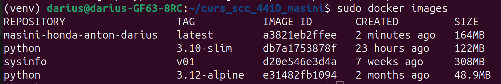
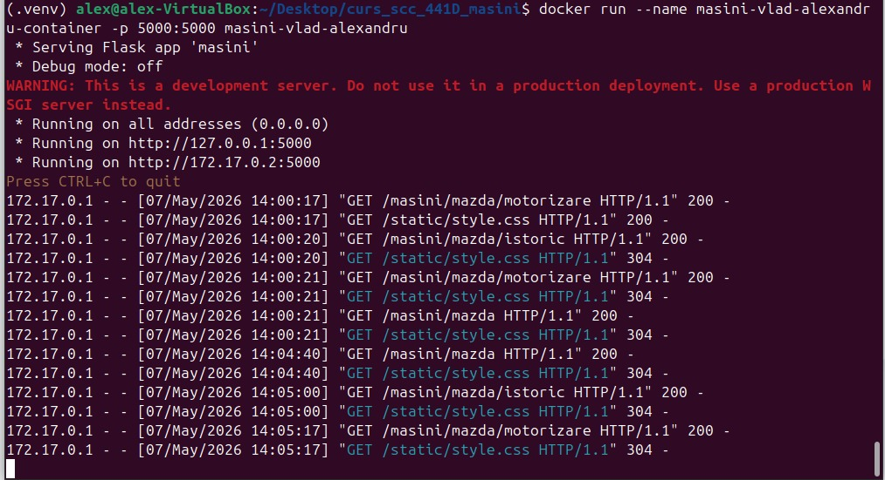
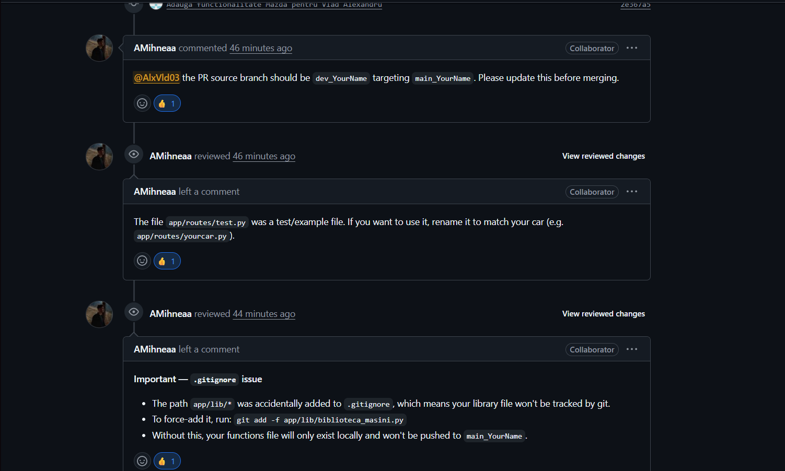

# Proiect SCC 441D - Masini

## Dezvoltator

Vlad Alexandru

## Branch-uri folosite

- main_vlad_alexandru
- dev_vlad_alexandru

## Tema proiectului

Masini

## Element ales

Mazda

## Functionalitate adaugata

A fost dezvoltata o aplicatie Flask pentru prezentarea brandului Mazda.

Aplicatia contine trei pagini principale:

- Acasa
- Istoric
- Motorizare

Pagina Acasa afiseaza mesajul:

"Va rog sa apasati pe unul dintre butoane pentru a selecta ce doriti sa aflati despre Mazda"

Pagina Istoric prezinta pe scurt brandul Mazda.

Pagina Motorizare prezinta cateva dintre cele mai importante motoare fabricate de Mazda, cu detalii tehnice scurte.

## Rute implementate

- /
- /masini
- /masini/mazda
- /masini/mazda/istoric
- /masini/mazda/motorizare

## Fisiere adaugate sau modificate

- masini.py
- app/routes/test.py
- app/lib/biblioteca_masini.py
- templates/page.html
- static/style.css
- tests/test_masini.py
- Jenkinsfile
- Dockerfile
- .dockerignore
- requirement.txt
- README.md

## Testare manuala

Aplicatia a fost rulata local cu:

python masini.py

Au fost verificate in browser urmatoarele rute:

http://127.0.0.1:5000/masini/mazda

http://127.0.0.1:5000/masini/mazda/istoric

http://127.0.0.1:5000/masini/mazda/motorizare

Aplicatia a functionat corect local.

## Testare automata

Testele unitare au fost rulate cu pytest:

python -m pytest

Rezultat obtinut:

2 passed

## Jenkins

A fost creat fisierul Jenkinsfile.

Pipeline-ul Jenkins contine urmatoarele etape:

- Build
- Create virtual environment
- pylint - calitate cod
- Unit Testing cu pytest
- Build image
- Deploy

Pipeline-ul Jenkins a rulat cu succes.

Toate etapele au status PASS.

## Docker

A fost creat fisierul Dockerfile pentru containerizarea aplicatiei.

Imaginea Docker a fost construita cu:

docker build -t masini-vlad-alexandru .

Containerul a fost pornit cu:

docker run --name masini-vlad-alexandru-container -p 5000:5000 masini-vlad-alexandru

Aplicatia rulata in container a fost accesata din browser la:

http://127.0.0.1:5000/masini/mazda

Aplicatia a functionat corect in container.

## Capturi de ecran

### Imagine Docker creata

### Container Docker pornit

### Pagina Acasa

### Pagina Istoric

### Pagina Motorizare

### Consola containerului

### Jenkins PASS

### Pull Request review

## Integrare

Codul a fost adaugat pe branch-ul:

dev_vlad_alexandru

A fost creat Pull Request catre branch-ul:

main_vlad_alexandru

Pull Request-ul a primit raspuns/review.

## Review

Pull Request-ul a fost verificat de un coleg.

## Stadiu proiect

- functionalitate adaugata
- interfata HTML si CSS adaugata
- teste unitare adaugate
- testele pytest ruleaza cu succes
- Jenkinsfile creat
- Jenkins rulat cu succes
- Dockerfile creat
- imagine Docker construita
- container Docker pornit
- aplicatie rulata local
- aplicatie rulata in container
- capturi adaugate in README
- Pull Request creat
- review primit

