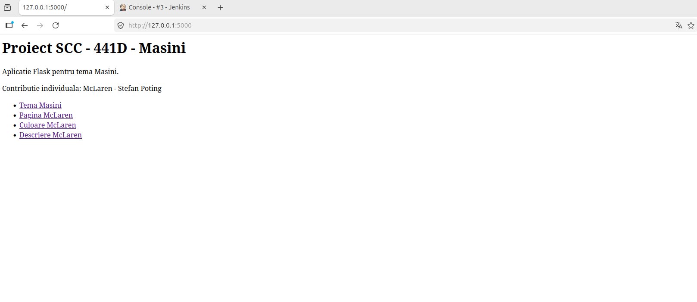
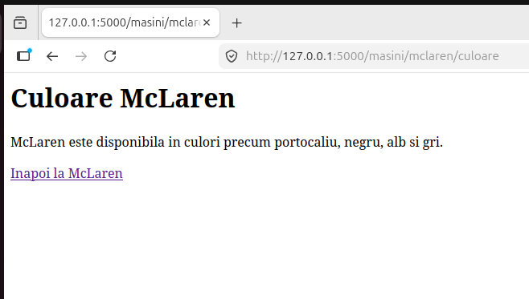
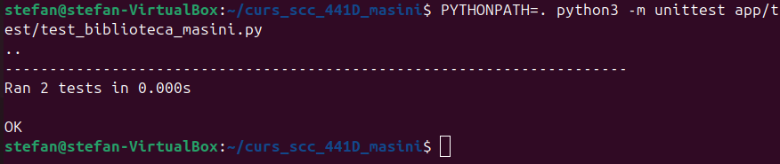
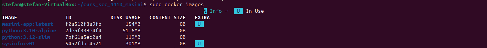
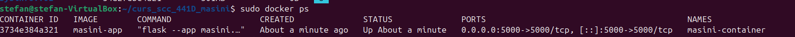
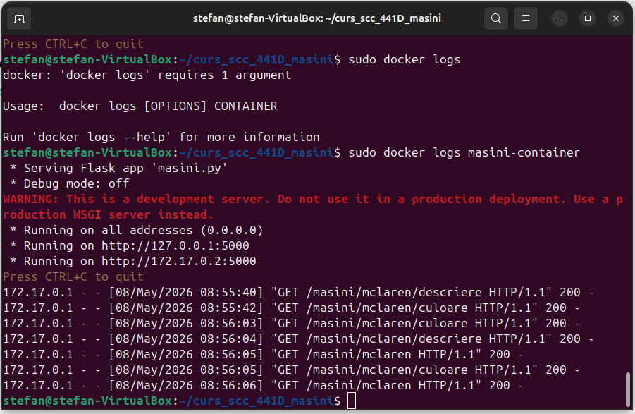
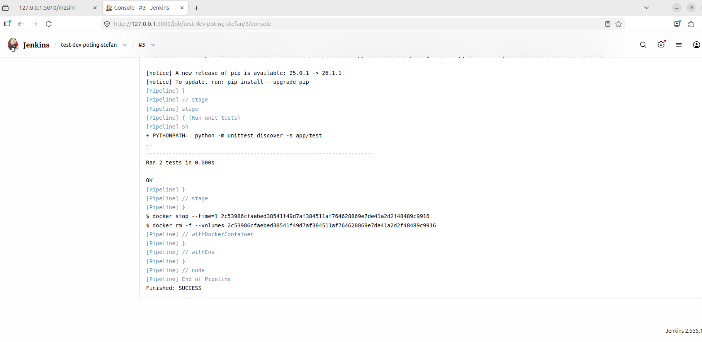

# Proiect SCC 441D - Mașini

## 1. Dezvoltator

**Ștefan Potîng**

## 2. Tema proiectului

**Mașini**

## 3. Element ales

**McLaren**

## 4. Branch-uri folosite

Pentru dezvoltarea contribuției individuale au fost utilizate următoarele branch-uri:

- `dev_poting_stefan` — branch-ul de dezvoltare, unde a fost implementată funcționalitatea;
- `main_poting_stefan` — branch-ul principal individual, unde se va integra codul prin Pull Request.

Fluxul de lucru urmărit:

```text
dev_poting_stefan -> main_poting_stefan
```

---

# 5. Descriere generală

În cadrul proiectului de **Servicii Cloud și Containerizare**, grupa **441D**, tema **Mașini**, am dezvoltat o funcționalitate individuală pentru marca **McLaren**.

Scopul contribuției este integrarea unei secțiuni dedicate mărcii McLaren într-o aplicație web realizată cu Flask. Funcționalitatea include rute web, funcții separate în biblioteca aplicației, teste unitare, containerizare Docker și rulare automată a testelor prin Jenkins.

Contribuția respectă structura proiectului de grup și este organizată astfel încât codul să poată fi testat, containerizat și integrat prin GitHub Pull Request.

---

# 6. Funcționalitate adăugată

Funcționalitatea implementată pentru marca **McLaren** include:

- pagină pentru tema generală a proiectului: **Mașini**;
- pagină dedicată elementului ales: **McLaren**;
- rută pentru afișarea culorilor disponibile pentru McLaren;
- rută pentru afișarea unei descrieri despre McLaren;
- funcții Python definite separat în biblioteca aplicației;
- rute Flask organizate prin Blueprint;
- teste unitare pentru verificarea funcțiilor implementate;
- fișier `Dockerfile` pentru containerizarea aplicației;
- fișier `Jenkinsfile` pentru rularea automată a pipeline-ului;
- documentație tehnică și capturi de ecran în `README.md`.

---

# 7. Structura fișierelor adăugate/modificate

```text
app/
├── __init__.py
├── lib/
│   ├── __init__.py
│   └── biblioteca_masini.py
├── routes/
│   ├── __init__.py
│   └── mclaren.py
└── test/
    ├── __init__.py
    └── test_biblioteca_masini.py

docs/
└── screenshots/
    ├── 01_flask_home.png
    ├── 02_flask_masini.png
    ├── 03_flask_mclaren.png
    ├── 04_docker_images.png
    ├── 05_docker_ps.png
    ├── 06_docker_logs.png
    ├── 07_jenkins_success.png
    ├── 08_unittest_local.png
    └── 09_jenkins_pipeline_stages.png

Dockerfile
Jenkinsfile
.dockerignore
requirement.txt
masini.py
README.md
```

---

# 8. Arhitectura aplicației

Aplicația este organizată modular:

- `masini.py` reprezintă fișierul principal al aplicației Flask;
- `app/lib/biblioteca_masini.py` conține funcțiile specifice elementului ales;
- `app/routes/mclaren.py` conține rutele Flask pentru McLaren, definite prin Blueprint;
- `app/test/test_biblioteca_masini.py` conține testele unitare;
- `Dockerfile` definește imaginea Docker a aplicației;
- `Jenkinsfile` definește pipeline-ul de testare și deploy;
- `requirement.txt` conține dependențele necesare proiectului.

---

# 9. Funcții implementate

Fișierul în care au fost definite funcțiile este:

```text
app/lib/biblioteca_masini.py
```

Funcțiile implementate:

```python
def culoare_mclaren() -> str:
    return "McLaren este disponibila in culori precum portocaliu, negru, alb si gri."


def descriere_mclaren() -> str:
    return (
        "McLaren este o marca britanica de automobile sport si supercaruri, "
        "cunoscuta pentru performanta ridicata, design aerodinamic si tehnologii "
        "inspirate din motorsport si Formula 1."
    )
```

Rolul acestor funcții este de a separa logica aplicației de partea de rutare Flask. Astfel, informațiile despre McLaren sunt definite într-o bibliotecă, iar rutele doar apelează aceste funcții și afișează rezultatul în browser.

---

# 10. Rute Flask implementate

Rutele au fost definite în fișierul:

```text
app/routes/mclaren.py
```

Acestea sunt înregistrate în aplicația principală prin Blueprint.

| Rută | Metodă | Descriere |
|---|---|---|
| `/` | GET | Pagina principală a aplicației |
| `/masini` | GET | Pagina generală pentru tema Mașini |
| `/masini/mclaren` | GET | Pagina principală pentru marca McLaren |
| `/masini/mclaren/culoare` | GET | Afișează rezultatul funcției `culoare_mclaren()` |
| `/masini/mclaren/descriere` | GET | Afișează rezultatul funcției `descriere_mclaren()` |

---

# 11. Rulare locală

Aplicația poate fi rulată local cu următoarea comandă:

```bash
python3 masini.py
```

După pornirea aplicației, aceasta poate fi accesată în browser la:

```text
http://127.0.0.1:5000/
```

Rutele testate manual:

```text
http://127.0.0.1:5000/
http://127.0.0.1:5000/masini
http://127.0.0.1:5000/masini/mclaren
http://127.0.0.1:5000/masini/mclaren/culoare
http://127.0.0.1:5000/masini/mclaren/descriere
```

---

# 12. Testare manuală Flask

## Pagina principală



## Pagina Culoare Mașini



## Pagina Descriere McLaren


---

# 13. Teste unitare locale

Testele unitare au fost implementate în:

```text
app/test/test_biblioteca_masini.py
```

Acestea verifică dacă funcțiile definite pentru McLaren returnează texte care conțin marca **McLaren**.

Comanda folosită pentru rularea testelor locale:

```bash
PYTHONPATH=. python3 -m unittest app/test/test_biblioteca_masini.py
```

Rezultat obținut:

```text
Ran 2 tests
OK
```

## Captură teste unitare locale



---

# 14. Dependente

Dependentele proiectului sunt definite în fișierul:

```text
requirement.txt
```

Conținutul fișierului:

```text
flask
pytest
pylint
gunicorn
```

Rolul dependențelor:

| Dependință | Rol |
|---|---|
| `flask` | Framework web folosit pentru aplicație |
| `pytest` | Bibliotecă de testare, disponibilă pentru extinderea testelor |
| `pylint` | Analiză statică a codului |
| `gunicorn` | Server WSGI pentru rulare în medii de producție/container |

---

# 15. Containerizare Docker

Aplicația a fost containerizată folosind Docker.

Fișierul folosit pentru definirea imaginii este:

```text
Dockerfile
```

## Construirea imaginii Docker

Comanda folosită:

```bash
sudo docker build -t masini-app .
```

Imaginea rezultată:

```text
masini-app:latest
```

## Pornirea containerului

Comanda folosită:

```bash
sudo docker run -d -p 5000:5000 --name masini-container masini-app
```

Această comandă pornește aplicația în container și mapează portul `5000` al containerului către portul `5000` al mașinii virtuale.

## Verificarea imaginilor Docker

```bash
sudo docker images
```



## Verificarea containerelor active

```bash
sudo docker ps
```



## Verificarea logurilor containerului

```bash
sudo docker logs masini-container
```

În loguri se observă accesarea rutelor Flask și răspunsurile HTTP `200`, ceea ce confirmă faptul că aplicația rulează corect în container.



---

# 16. Jenkins Pipeline

Testarea automată a fost realizată cu Jenkins, folosind fișierul:

```text
Jenkinsfile
```

Pipeline-ul a fost configurat să ruleze din repository-ul GitHub, de pe branch-ul:

```text
dev_poting_stefan
```

Configurația Jenkins:

```text
Repository URL: https://github.com/AndreiCiuhu/curs_scc_441D_masini.git
Branch Specifier: */dev_poting_stefan
Script Path: Jenkinsfile
```

---

# 17. Etapele pipeline-ului Jenkins

Pipeline-ul Jenkins include următoarele etape:

| Etapă | Rol |
|---|---|
| `Build` | Verifică versiunea Python și conținutul workspace-ului Jenkins |
| `Create virtual environment` | Creează mediul virtual Python `.venv` |
| `pylint - calitate cod` | Rulează analiza statică a codului |
| `Unit Testing cu unittest` | Rulează testele unitare din `app/test` |
| `Build image` | Construiește imaginea Docker a aplicației |
| `Deploy` | Pornește containerul Docker |
| `Verify container` | Verifică rularea containerului și logurile aplicației |

Utilizarea unui mediu virtual în Jenkins este necesară pentru izolarea dependențelor Python și pentru evitarea problemelor cauzate de instalarea pachetelor direct în mediul Python al sistemului.

---

# 18. Testare cu Jenkins

Comanda folosită în Jenkins pentru rularea testelor unitare:

```bash
PYTHONPATH=. .venv/bin/python -m unittest discover -s app/test
```

Rezultatul obținut în Jenkins:

```text
Ran 2 tests
OK
Finished: SUCCESS
```

## Captură Jenkins Console Output



## Captură Jenkins Pipeline Stages


---

# 19. Analiză cod cu pylint

În pipeline a fost inclusă și etapa de analiză statică a codului cu `pylint`.

Această etapă are rolul de a verifica stilul codului și eventualele probleme de calitate. În contextul proiectului, etapa este folosită pentru validare suplimentară, fără a bloca pipeline-ul pentru avertismente minore de stil.

---

# 20. Integrare GitHub

Codul a fost dezvoltat pe branch-ul:

```text
dev_poting_stefan
```

Integrarea finală se realizează prin Pull Request către:

```text
main_poting_stefan
```

Fluxul de lucru:

```text
dev_poting_stefan -> main_poting_stefan
```

Pașii de integrare:

1. implementarea funcționalității pe `dev_poting_stefan`;
2. rularea testelor locale;
3. rularea pipeline-ului Jenkins;
4. testarea aplicației în Docker;
5. actualizarea documentației;
6. crearea Pull Request-ului către `main_poting_stefan`;
7. review din partea unui coleg;
8. integrarea modificărilor după aprobare.

---

# 21. Stadiul implementării

| Componentă | Status |
|---|---|
| Aplicație Flask | Finalizat |
| Funcții McLaren | Finalizat |
| Blueprint rute McLaren | Finalizat |
| Teste unitare locale | Finalizat |
| Dockerfile | Finalizat |
| Container Docker | Testat |
| Jenkinsfile | Finalizat |
| Pipeline Jenkins | Rulat cu succes |
| README.md | Finalizat |
| Capturi de ecran | Adăugate |
| Pull Request | In Desfasurare |
| Review coleg | In Desfasurare |

---

# 22. Pull Request-uri și review

Pull Request-ul individual va fi realizat din:

```text
dev_poting_stefan
```

către:

```text
main_poting_stefan
```

Status:

```text
In desfasurare
```

Review efectuat pentru un coleg:

```text
In desfasurare
```

---

# 23. Ce mai este de făcut

- crearea Pull Request-ului din `dev_poting_stefan` către `main_poting_stefan`;
- obținerea unui review de la un coleg;
- realizarea unui review pentru Pull Request-ul unui coleg;
- integrarea modificărilor după aprobare;
- actualizarea secțiunii de review, dacă este necesar.

---

# 24. Concluzie

Funcționalitatea pentru marca **McLaren** a fost implementată, testată local, testată automat cu Jenkins și rulată într-un container Docker. Aplicația respectă structura proiectului de grup și poate fi integrată în branch-ul principal individual prin Pull Request.
